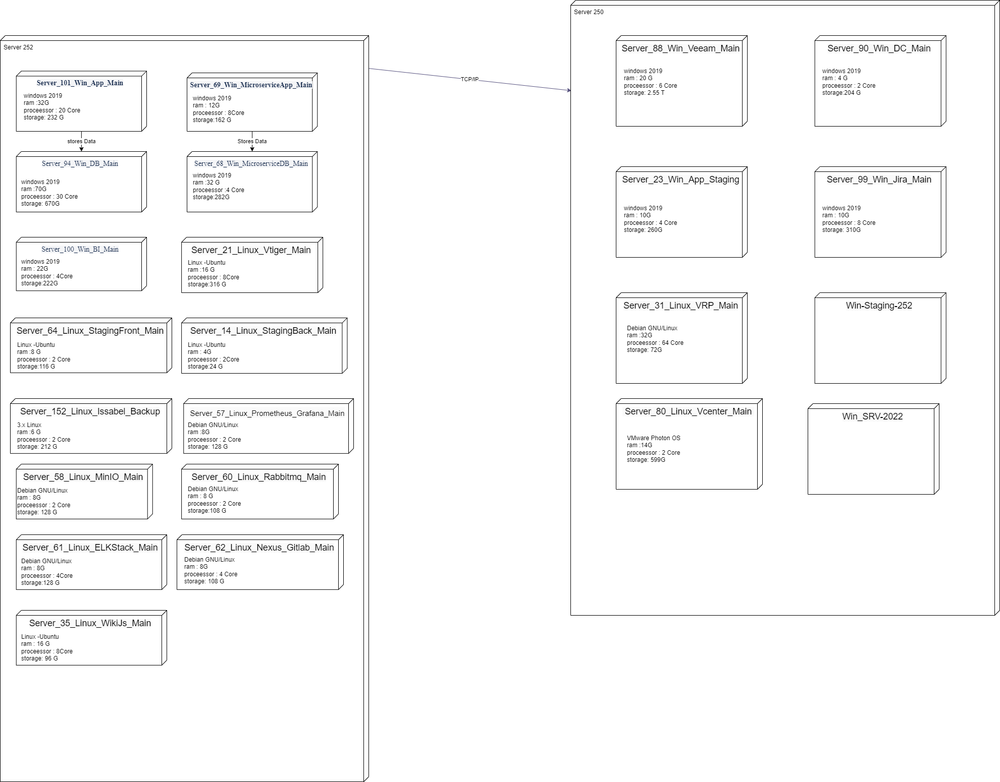

# مستندات کلی زیرساخت 

## بررسی کلی

برای ایجاد یک  زیرساخت قوی و مقیاس پذیر، ما این مستندات را به عنوان یک مرجع متمرکز برای همه ماشین‌های مجازی ، نقش‌های خاص، پیکربندی‌ها و منطق پشت تصمیم‌های معماری خود ساخته‌ایم. هدف ما این است که زیرساخت های خود را برای همه، از اعضای جدید تیم گرفته تا مهندسان نرم افزار ، شفاف و قابل درک کنیم.

## ماشین های مجازی و نقش آنها

در اینجا، ما یک نمای کلی مختصر و در عین حال دقیق از هر ماشین مجازی در شبکه خود ارائه می دهیم و نقش و پیکربندی آنها را برجسته می کنیم:

- **App-microservice (Server_252):** A یک سرور برنامه کاربردی میکروسرویس اختصاصی، آماده و آماده برای استقرار (IP: 192.168.10.69)
- **DB-microservice (Server_252):**  سرور پایگاه داده که از برنامه های میکروسرویس ما پشتیبانی می کند. (IP: 192.168.10.68)
- ... (similar concise descriptions for each VM)

## مدیریت

برای شفاف سازی تنظیمات پیچیده ، از پلتفرم هایی مانند Nomnoml یا Structurizr DSL استفاده می کنیم. این ابزارها ما را قادر می سازند تا روابط بین سرورها، کانتینرها و سرویس ها را تجسم کنیم و نمای روشن و به روزی از طرح زیرساخت خود ارائه دهیم.

## تصمیمات معماری

چرا ماشین های مجازی را برای سرویس هایی مانند PostEx-Rabbitmq-01، PostEx-Nexus-Gitlab-01 و PostEx-MinIO-01 جدا کنید؟ این مسئله تعادل است - تخصیص منابع متعادل، جداسازی خطا و مقیاس پذیری. با اختصاص ماشین‌های مجازی به سرویس‌های خاص، انعطاف‌پذیری سیستم خود را افزایش می‌دهیم و مقیاس‌بندی اجزای جداگانه را آسان می‌کنیم.

## قابلیت حمل و انتقال ابری

نقشه راه ما شامل افزایش قابلیت حمل و نقل سرویس هایمان و تبدیل آن ها به فضای ابری است. این استراتژی به ما امکان می دهد از پلتفرم های ابری برای مقیاس پذیری، قابلیت اطمینان و عملکرد بهتر استفاده کنیم.

## نقاط قوت و زمینه های بهبود

هر معماری قله ها و دره های خود را دارد. ما به قابلیت اطمینان و مقیاس پذیری فعلی سیستم خود افتخار می کنیم. با این حال، ما همیشه به دنبال راه هایی برای بهبود هستیم، به خصوص در زمینه هایی مانند پشتیبان گیری خودکار و استراتژی های بازیابی بلایا.

## طرح استقرار

با تکامل ما، برنامه استقرار ما نیز رشد می کند. ما دائماً در حال اصلاح رویکرد خود هستیم تا اطمینان حاصل کنیم که زیرساخت‌های ما نه تنها خواسته‌های فعلی را برآورده می‌کند، بلکه در برابر چالش‌های آینده نیز مقاوم است.

## نتیجه

ما برای بهبود مستمر و ارتباطات شفاف عمل میکنیم. این مخزن یک سنداست که با رشد و تطبیق زیرساخت های ما در حال تکامل است. ما هر یک از اعضای تیم را تشویق می‌کنیم که مشارکت کنند، سؤال بپرسند و پیشرفت‌هایی را پیشنهاد کنند.

---

### بررسی اجمالی اولیه زیرساخت ESXi

در زیر یک نمای شماتیک مقدماتی از ماشین های مجازی که در دو سرور ESXi مدیریت می کنیم، ارائه شده است. این نمودار یک درک اساسی از آرایش VM و ساختار شبکه ما ارائه می دهد.

  

**توضیح نمودار:**

- تصویر بالا ماشین های مجازی ما را تحت دو سرور ESXi مجزا نشان می دهد.
- هر VM با نقش خاص خود و آدرس IP تعیین شده نشان داده می شود.
- هر VM با نقش خاص خود و آدرس IP تعیین شده نشان داده می شود.

---

### جزئیات و توضیحات VM

#### App-microservice (Server_252)

- **Description:** Microservice application server, non-clustered, dockerized.
- **Status:** Ready but not currently under load.
- **IP Address:** 192.168.10.69.

#### DB-microservice (Server_252)

- **Description:** Database server for microservices, non-clustered, dockerized.
- **Status:** Operational with no current load.
- **IP Address:** 192.168.10.68.

#### PostEx-ELKStack-01 (Server_252)

- **Description:** Hosts all components of the ELK stack, dockerized.
- **Status:** Active, not currently collecting metrics.
- **IP Address:** 192.168.10.61.

#### PostEx-MinIO-01 (Server_252)

- **Description:** Non-clustered, dockerized MinIO server.
- **Status:** Active, ready but not under load.
- **IP Address:** 192.168.10.58.

#### PostEx-Nexus-Gitlab-01 (Server_252)

- **Description:** Contains GitLab CE, GitLab Runner, Nexus Repository containers.
- **Status:** Utilizes latest images, operational.
- **IP Address:** 192.168.10.62.

#### PostEx-Prometheus-Grafana-01 (Server_252)

- **Description:** For monitoring and visualization with Prometheus and Grafana, dockerized.
- **Status:** Fully operational.
- **IP Address:** 192.168.10.57.

#### PostEx-Rabbitmq-01 (Server_252)

- **Description:** Non-clustered, dockerized RabbitMQ server.
- **Status:** Ready for use, currently no load.
- **IP Address:** 192.168.10.60.

#### PostEx-Vtiger-01 (Server_252)

- **Description:** Non-dockerized vtiger CRM server.
- **Status:** Active and operational.
- **IP Address:** 192.168.10.21.

#### Linux-Staging (Server_252)

- **Description:** Linux-based staging environment for testing applications.
- **IP Address:** 192.168.10.64.

#### Wiki.js-srv-01 (Server_252)

- **Description:** Server hosting Wiki.js, a modern wiki platform.
- **IP Address:** 192.168.10.35.

#### Win-app-252 (Server_252)

- **Description:** Primary server hosting PostEx and other services.
- **IP Address:** 192.168.10.101.

#### Win-BI (Server_252)

- **Description:** Business Intelligence server for data analysis and reporting.
- **IP Address:** 192.168.10.100.

#### Win-DB-252 (Server_252)

- **Description:** Database server for Win-app-252.
- **IP Address:** 192.168.10.94.

#### Server_252_Linux_Issabel_Production (Server_252)

- **Description:** Hosts Issabel VOIP service.
- **IP Address:** 192.168.10.200.

#### DC (Vcenter) - Server_250

- **Description:** Domain Controller for managing Windows servers.
- **IP Address:** 192.168.10.90.

#### Linux-wiki (Vcenter) - Server_250

- **Description:** Linux server hosting Wiki.js platform.
- **IP Address:** 192.168.10.63.

#### UbuntuMini-VRP-PostExVM (Vcenter) - Server_250

- **Description:** Virtualized Ubuntu server for specific purposes.
- **IP Address:** 192.168.10.31.

#### Vcenter (Vcenter) - Server_250

- **Description:** Central management server for VMware vSphere environments.
- **IP Address:** 192.168.10.80.

#### Veeam-Backup (Vcenter) - Server_250

- **Description:** Backup server using Veeam software.
- **IP Address:** 192.168.10.88.

#### Win-JiraAndMail-252 (Vcenter) - Server_250

- **Description:** Hosts Jira for project management and essential email server.
- **IP Address:** 192.168.10.99.

#### Win-Staging-252 (Vcenter) - Server_250

- **Description:** Windows-based staging server for testing.
- **IP Address:** 192.168.10.85.

#### Linux-Staging (Server_252)

- **Description:** Linux-based staging server for application testing.
- **IP Address:** 192.168.10.64.

#### Server_252_Linux_Issabel_Production (Server_252)

- **Description:** Hosts Issabel VOIP backup service.
- **IP Address:** 192.168.10.200.

#### Win-app-252 (1) (Server_252)

- **Description:** Main server hosting PostEx and other critical services.
- **IP Address:** 192.168.10.101.

#### Win-BI (Server_252)

- **Description:** Server for Business Intelligence and reporting.
- **IP Address:** 192.168.10.100.

#### Win-DB-252 (Server_252)

- **Description:** Database server for Win-app-252 services.
- **IP Address:** 192.168.10.94.

#### Win-JiraAndMail-252 (Vcenter)

- **Description:** Hosts Jira application and essential email server.
- **IP Address:** 192.168.10.99.

#### Win-Staging-252 (Vcenter)

- **Description:** Windows-based staging server for high read/write operations.
- **IP Address:** 192.168.10.85.

### بررسی اجمالی زیرساخت سرور ESXi و Vcenter VM

این نمودار Mermaid ساختار شبکه ما را با تمرکز بر دو سرور ESXi و یک Vcenter VM نشان می‌دهد. در اینجا خلاصه ای از نمودار آمده است:

- **Vcenter VM:** این ماشین مجازی با نام "Vcenter VM" هر دو سرور ESXi را مدیریت می کند و بر روی ESXi 192.168.10.250 میزبانی می شود. با آدرس IP آن 192.168.10.XX شناسایی شده است.
- **ESXi Servers:** دو سرور ESXi با برچسب "ESXi 192.168.10.250" و "ESXi 192.168.10.252" توسط Vcenter VM مدیریت می شوند. Vcenter VM بخشی از اولین سرور ESXi است.

این تنظیمات به طور موثر مدیریت و سازمان ماشین مجازی ما را به تصویر می کشد.

<!-- Diagram in HTML for Center Alignment with Smaller Size -->

    

## مزایا و معایب استفاده از Vcenter به عنوان یک VM برای مدیریت سرورهای ESXi

### مزایا

1. **مقرون به صرفه بودن:** 
   استفاده از Vcenter به عنوان یک VM می تواند هزینه های سخت افزاری را کاهش دهد، زیرا نیاز به سرور فیزیکی اختصاصی برای Vcenter را از بین می برد.
2. **انعطاف پذیری و مقیاس پذیری:** 
   مجازی سازی Vcenter انعطاف پذیری را در تخصیص منابع و مقیاس پذیری فراهم می کند. با تغییر تقاضاها، منابع را می توان راحت تر در مقایسه با تنظیمات فیزیکی تنظیم کرد.
3. **بازیابی  ساده:**
    داشتن Vcenter به عنوان یک VM فرآیندهای بازیابی  را ساده می کند. برای بازیابی سریع می توان از عکس های فوری و پشتیبان گیری VM استفاده کرد.
4. **تعمیر و نگهداری آسان تر و ارتقاء:** 
   مدیریت Vcenter به عنوان یک VM اجازه می دهد تا فرآیندهای نگهداری و ارتقای ساده تری را انجام دهید، زیرا می توان آن را مانند هر ماشین مجازی دیگری مدیریت کرد.

### معایب

1. **تنها نقطه شکست بالقوه:**
   اگر میزبان ESXi حاوی Vcenter VM از کار بیفتد، ممکن است منجر به مشکلات مدیریتی برای هر دو سرور  شود.

2. **عملکرد**
  اجرای Vcenter به عنوان یک VM به دلیل مجازی سازی مقداری سربار عملکرد را معرفی می کند که ممکن است بر کارایی آن تأثیر بگذارد.
3. **راه اندازی و وابستگی پیچیده:**
    راه اندازی پیچیده تر می شود زیرا خود Vcenter به عملکرد مناسب میزبان ESXi که در آن قرار دارد بستگی دارد.

4. **تخصیص منابع:**
   باید منابع کافی به Vcenter VM تخصیص داده شود تا از عملکرد روان اطمینان حاصل شود، که ممکن است منابع سرور ESXi میزبان را تحت فشار قرار دهد.

## بخش امنیت

### تنظیم رمز عبور

تنظیم کردن پسورد ها باید از استاندارد برخوردار باشد و تغییر پسورد توسط ادمین سیستم انجام گیرد.  

برای تنظیم پسورد باید از عدد و حروف و کاراکتر استفاده شود و از پیچیدگی خاصی برخوردار باشد .

به صورت کلی پسورد ها لایه های مختلفی دارند که شامل زیر می باشد  

- پسورد سرور ها  

- پسورد دیتابیس  

- پسورد ایمیل ها  

- پسورد وندور ها

### تغییر رمز عبور

زمان انقضای پسورد ها شش ماهه می باشد و هرشش ماه یک بار باید پسورد ها لایه های مختلف باید تغییر کند

در صئرتی که نیاز بود قبل از شش ماه پسورد تغییر کند باید با توجه به حساسیت موضوع و بخش و توسط ادمین این کار انجام گیرد .  

---
