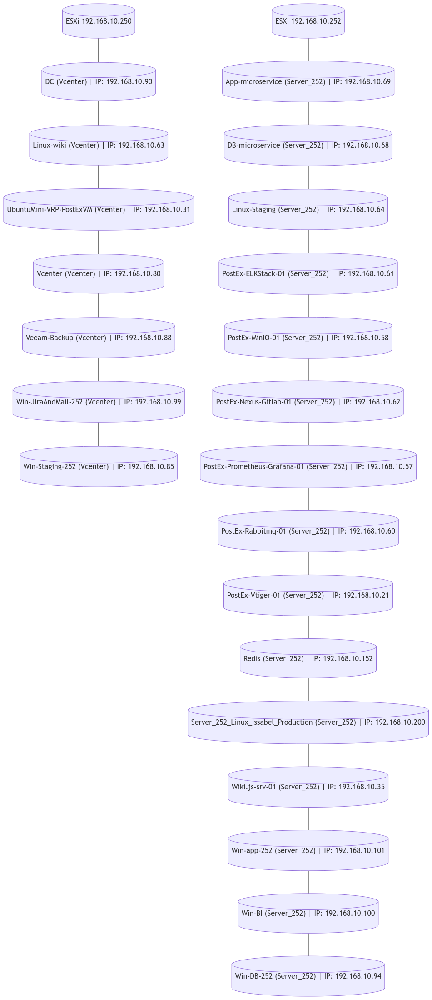
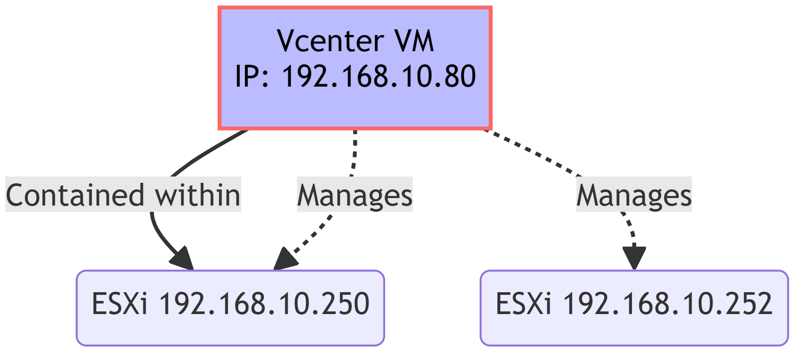

# TL;DR PostEx Infrastructure Documentation

Welcome to the PostEx Infrastructure Documentation repository! This space is dedicated to meticulously documenting and managing our IT infrastructure, ensuring every team member can quickly understand our system's layout and deployment strategy.

## Overview

In our journey to maintain a robust and scalable infrastructure, we've crafted this repository as a centralized reference for all our virtual machines (VMs), their specific roles, configurations, and the rationale behind our architectural decisions. Our goal is to make our infrastructure transparent and understandable for everyone, from new team members to our seasoned engineers.

## Virtual Machines and Their Roles

Here, we provide a brief yet precise overview of each VM in our network, highlighting their roles and configurations:

- **App-microservice (Server_252):** A dedicated microservice application server, poised and ready for deployment. (IP: 192.168.10.69)
- **DB-microservice (Server_252):** The backbone database server, supporting our microservice applications. (IP: 192.168.10.68)
- ... (similar concise descriptions for each VM)

## Visualization and Management

To bring clarity to our complex setup, we utilize platforms like Nomnoml or Structurizr DSL. These tools enable us to visualize the relationships between servers, containers, and services, offering a clear and up-to-date view of our infrastructure layout.

## Architectural Decisions

Why separate VMs for services like PostEx-Rabbitmq-01, PostEx-Nexus-Gitlab-01, and PostEx-MinIO-01? It's a question of balance - balancing resource allocation, fault isolation, and scalability. By dedicating VMs to specific services, we enhance our system's resilience and make scaling individual components a breeze.

## Portability and Cloud Migration

Our roadmap includes enhancing the portability of our services, making them cloud-ready. This strategy will allow us to leverage cloud platforms for better scalability, reliability, and performance.

## Strengths and Areas for Improvement

Every architecture has its peaks and valleys. We're proud of our system's current reliability and scalability. However, we're always on the lookout for ways to improve, especially in areas like automated backups and disaster recovery strategies.

## Deployment Plan

As we evolve, so does our deployment plan. We're constantly refining our approach to ensure that our infrastructure not only meets the current demands but is also future-proofed against upcoming challenges.

## Conclusion

We believe in continuous improvement and transparent communication. This repository is a living document, evolving as our infrastructure grows and adapts. We encourage every team member to contribute, ask questions, and suggest improvements.

---

### Initial ESXi Infrastructure Overview

Below is an introductory schematic view of the VMs we manage across two ESXi servers. This diagram provides a foundational understanding of our VM arrangement and network structure.

  

**Description of the Diagram:**

- The image above illustrates our VMs under two distinct ESXi servers.
- Each VM is represented with its specific role and designated IP address.
- This visual aid is designed to offer a quick grasp of our infrastructure, highlighting the distribution and function of each VM within our network.

---

### Detailed VM Descriptions

#### App-microservice (Server_252)

- **Description:** Microservice application server, non-clustered, dockerized.
- **Status:** Ready but not currently under load.
- **IP Address:** 192.168.10.69.

#### DB-microservice (Server_252)

- **Description:** Database server for microservices, non-clustered, dockerized.
- **Status:** Operational with no current load.
- **IP Address:** 192.168.10.68.

#### PostEx-ELKStack-01 (Server_252)

- **Description:** Hosts all components of the ELK stack, dockerized.
- **Status:** Active, not currently collecting metrics.
- **IP Address:** 192.168.10.61.

#### PostEx-MinIO-01 (Server_252)

- **Description:** Non-clustered, dockerized MinIO server.
- **Status:** Active, ready but not under load.
- **IP Address:** 192.168.10.58.

#### PostEx-Nexus-Gitlab-01 (Server_252)

- **Description:** Contains GitLab CE, GitLab Runner, Nexus Repository containers.
- **Status:** Utilizes latest images, operational.
- **IP Address:** 192.168.10.62.

#### PostEx-Prometheus-Grafana-01 (Server_252)

- **Description:** For monitoring and visualization with Prometheus and Grafana, dockerized.
- **Status:** Fully operational.
- **IP Address:** 192.168.10.57.

#### PostEx-Rabbitmq-01 (Server_252)

- **Description:** Non-clustered, dockerized RabbitMQ server.
- **Status:** Ready for use, currently no load.
- **IP Address:** 192.168.10.60.

#### PostEx-Vtiger-01 (Server_252)

- **Description:** Non-dockerized vtiger CRM server.
- **Status:** Active and operational.
- **IP Address:** 192.168.10.21.

#### Linux-Staging (Server_252)

- **Description:** Linux-based staging environment for testing applications.
- **IP Address:** 192.168.10.64.

#### Wiki.js-srv-01 (Server_252)

- **Description:** Server hosting Wiki.js, a modern wiki platform.
- **IP Address:** 192.168.10.35.

#### Win-app-252 (Server_252)

- **Description:** Primary server hosting PostEx and other services.
- **IP Address:** 192.168.10.101.

#### Win-BI (Server_252)

- **Description:** Business Intelligence server for data analysis and reporting.
- **IP Address:** 192.168.10.100.

#### Win-DB-252 (Server_252)

- **Description:** Database server for Win-app-252.
- **IP Address:** 192.168.10.94.

#### Server_252_Linux_Issabel_Production (Server_252)

- **Description:** Hosts Issabel VOIP service.
- **IP Address:** 192.168.10.200.

#### DC (Vcenter) - Server_250

- **Description:** Domain Controller for managing Windows servers.
- **IP Address:** 192.168.10.90.

#### Linux-wiki (Vcenter) - Server_250

- **Description:** Linux server hosting Wiki.js platform.
- **IP Address:** 192.168.10.63.

#### UbuntuMini-VRP-PostExVM (Vcenter) - Server_250

- **Description:** Virtualized Ubuntu server for specific purposes.
- **IP Address:** 192.168.10.31.

#### Vcenter (Vcenter) - Server_250

- **Description:** Central management server for VMware vSphere environments.
- **IP Address:** 192.168.10.80.

#### Veeam-Backup (Vcenter) - Server_250

- **Description:** Backup server using Veeam software.
- **IP Address:** 192.168.10.88.

#### Win-JiraAndMail-252 (Vcenter) - Server_250

- **Description:** Hosts Jira for project management and essential email server.
- **IP Address:** 192.168.10.99.

#### Win-Staging-252 (Vcenter) - Server_250

- **Description:** Windows-based staging server for testing.
- **IP Address:** 192.168.10.85.

#### Linux-Staging (Server_252)

- **Description:** Linux-based staging server for application testing.
- **IP Address:** 192.168.10.64.

#### Server_252_Linux_Issabel_Production (Server_252)

- **Description:** Hosts Issabel VOIP backup service.
- **IP Address:** 192.168.10.200.

#### Win-app-252 (1) (Server_252)

- **Description:** Main server hosting PostEx and other critical services.
- **IP Address:** 192.168.10.101.

#### Win-BI (Server_252)

- **Description:** Server for Business Intelligence and reporting.
- **IP Address:** 192.168.10.100.

#### Win-DB-252 (Server_252)

- **Description:** Database server for Win-app-252 services.
- **IP Address:** 192.168.10.94.

#### Win-JiraAndMail-252 (Vcenter)

- **Description:** Hosts Jira application and essential email server.
- **IP Address:** 192.168.10.99.

#### Win-Staging-252 (Vcenter)

- **Description:** Windows-based staging server for high read/write operations.
- **IP Address:** 192.168.10.85.

### ESXi Server and Vcenter VM Infrastructure Overview

This Mermaid diagram illustrates the structure of our network, focusing on two ESXi servers and a Vcenter VM. Here's a breakdown of the diagram:

- **Vcenter VM:** Represented as 'Vcenter VM', this virtual machine manages both ESXi servers and is hosted on ESXi 192.168.10.250. It's identified with its IP address `192.168.10.XX`.
- **ESXi Servers:** Two ESXi servers, labeled 'ESXi 192.168.10.250' and 'ESXi 192.168.10.252', are managed by the Vcenter VM. The Vcenter VM is part of the first ESXi server.

This setup effectively depicts our virtual machine management and organization.

<!-- Diagram in HTML for Center Alignment with Smaller Size -->

    

## Pros and Cons of Using Vcenter as a VM to Manage ESXi Servers

### Pros

1. **Cost-Effectiveness:** Utilizing Vcenter as a VM can reduce hardware costs, as it eliminates the need for a dedicated physical server for Vcenter.
2. **Flexibility and Scalability:** Virtualizing Vcenter provides flexibility in resource allocation and scalability. As demands change, resources can be adjusted more easily compared to a physical setup.
3. **Simplified Disaster Recovery:** Having Vcenter as a VM simplifies disaster recovery processes. VM snapshots and backups can be utilized for quick recovery.
4. **Easier Maintenance and Upgrades:** Managing Vcenter as a VM allows for more straightforward maintenance and upgrade processes, as it can be managed like any other virtual machine.

### Cons

1. **Potential Single Point of Failure:** If the ESXi host containing the Vcenter VM fails, it may lead to management difficulties for both ESXi servers.
2. **Performance Overhead:** Running Vcenter as a VM introduces some performance overhead due to virtualization, which might impact its efficiency.
3. **Complex Setup and Dependency:** The setup becomes more complex as Vcenter itself depends on the proper functioning of the ESXi host it resides on.
4. **Resource Allocation:** Adequate resources must be allocated to the Vcenter VM to ensure smooth operation, which might strain the host ESXi server’s resources.

---
