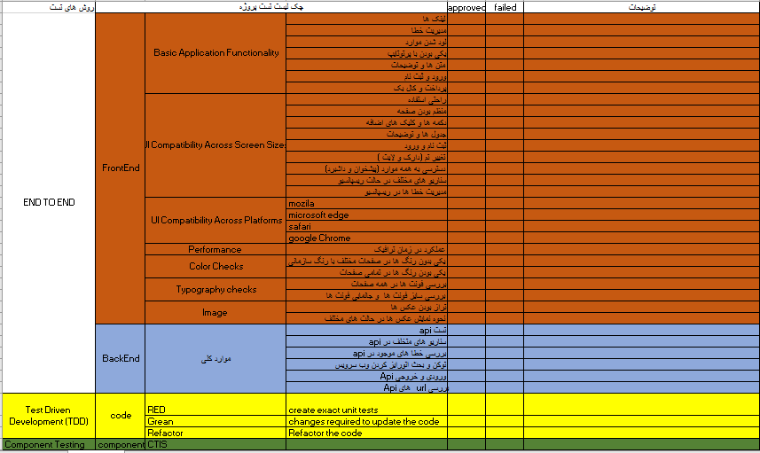

# داکیومنت تست پروژه و سناریو های مختلف تست 

## تست عملکردی

### هدف تست عملکردی چیست؟

هدف از تست عملکردی این است که تأیید کند آیا محصول شما با مشخصات کاربردی مورد نظر ذکر شده در اسناد توسعه شما مطابقت دارد یا خیر.
نمونه ای از سناریوهای تست عملکردی:

- تست تمامی لینک های داخل پروژه به صفحات درست هدایت شده باشند 
- عملکرد دکمه های موجود را تست کنید
- بررسی اینکه لینک ها در صفحه خودشان باز میشوند یا در یک صفحه جدید، در این تست اگر لینک مراحل باشد باید در صفحه خودش باز شود ولی اگر به صفحه دیگری مانند سایت دیگری لینک شود باید در صفحه جدید باز شود
- تست مدیریت خطا به این گونه میباشد که شما به صورت دستی خطایی تولید میکنید و باید به روی آن خطا فکوس شود و متن به درستی راهنمایی کند اگر خطا از سمت بک اند می آید باید ترجمه  شود 
- تست علامت ستاره باید برای تمام فیلدهای اجباری نمایش داده شود.
- تست سیستم نباید پیام خطا را برای فیلدهای اختیاری نمایش دهد.
- تست فیلدهای عددی نباید حروف الفبا را قبول کند و پیام خطای مناسب نمایش داده شود.
- اگر برای فیلدهای عددی مجاز است، اعداد منفی را آزمایش کنید
- تست فارسی و انگلیسی بودن فیلد ها در و باید خطا مناسب نمایش دهد مانند حروف فارسی در پسورد که نباید قبول کند
- اگر داده ها به حداکثر اندازه فیلد رسیدند، پیام خطا را آزمایش کنید ("این فیلد به 500 کاراکتر محدود است") باید نمایش داده شود
- تست لود شدن موارد  که همه موارد به درستی لود شوند و با اینترنت های مختلف تست شود که در زمان کندی به چه صورت لود می شود
- مرتب سازی صفحات تست شود 
- یکی بودن طراحی انجام شده با پرتوتایپ بررسی شود 
- تست ورود و ثبت نام : برای اینجام این تست سناریو هایمختلفی وجود دارد در ابتدا شما همه موارد را حقیقی وارد کنید باید به درستی ثبت نام یا ورود انجام شود 
- تست فراموشی رمز عبور که کد درست ارسال شود و تست کد ارسال شده 
- تست اشتباه وارد کردن پترن شماره همراه 
- تست اشتباه وارد کردن کد ملی 
- تست عدم وارد کردن موارد اجباری مقلا نام کاربری وارد نکنید  یا در پسورد حروف فارسی تایپ کنید 
- تست ثبتنام اکانت تکراری
- تست ثبت سفارش در حالت های مختلف : مثلا آدرس ها یکی وارد شود 
  شماره همراه فرستنده و گیرنده یکی باشد 
  انتخاب موارد اضافه ثبت سفارش مانند جمع آوری و عدم جمع آوری و یا پیامک ،بسته بندی یا سایر موارد برای بررسی اینکه قیمت به درستی درج می شود یا خیر 
  تست ویرایش و حذف یک سفارش از مرحله بازبینی 
  تست عدم پرداخت سفارش و بررسی وضعیت سفارش 
  تست پرداخت سفارش و دریافت بارکد و فاکتور که به درستی انجام شود
  بررسی کالبک پرداخت 
  تست درگاه 
  تست کیف پول و بررسی اینکه اگر کیف پول شارژ نداشت می شود در همانجا شارژ انجام داد یا خیر 
- محتوای صفحه وب باید صحیح و بدون هیچ گونه خطای املایی یا گرامری باشد

## تست قابلیت در حالت های مختلف نمایش  چیست؟

تست قابلیت ها در حالت های مختلف نمایش چیزی جز بررسی کاربرپسندی نیست.
در این تست برنامه در حالت های مختلف نمایش تست می شود

#### نمونه موارد تست کاربر پذیری

- تمام متن باید به درستی تراز شود.
- همه فیلدها باید به درستی تراز شوند.
- باید فضای کافی بین برچسب‌های فیلد، ستون‌ها، ردیف‌ها و پیام‌های خطا در نظر گرفته شود.
- بررسی حالت دارک مود و لایت مود در مود های مختلف نمایش 
- بررسی دکمه ها که در حالت مختلف مشخص و دسترسی خود داشته باشد مثلا دکمه ثبت سفارش در مود موبایل و یا دکمه مراحل قبل و بعد در مود موبایل تست شود که کاربر به درستی قادر به تشخیص آن ها باشد 
- بررسی کلیک های اضافه و حذف ان ها تا جای ممکن مثلا در ثبت سفارش کاربر بتواند با کمترین کلیک سفارش خود را ثبت کند و یا در رهگیری با کمترین زمان ممکن این کار انجام گیرد.
- بررسی روند های مختلف در حالت های مختلف نمایش مانند روند ثبت نام و ورود در مود موبایل و یا ثبت سفارش در مود موبایل 
- بررسی ظاهر سایت و لینک ها ودسترسی به همه موارد در مود موبایل مثلا دسترسی به پیشخوان و یا داشبرد در مود موبایل و انجام عملیات مختلف در آن
- بررسی مدیریت خطا ها و پیام های خطا در مود موبایل 
- بررسی جداول و توضیحات در همه صفحات در مود موبایل و بررسی عدم بهمریختگی آن ها

## تست سازگاری

### تست سازگاری چیست؟

تست سازگاری برای تعیین اینکه آیا نرم افزار شما با سایر عناصر سیستمی که باید با آن کار کند، مانند مرورگرها، سیستم عامل ها یا سخت افزار سازگار است یا خیر، استفاده می شود.

### نمونه سناریوهای تست سازگاری:

- وب سایت را در مرورگرهای مختلف (IE، فایرفاکس، کروم، سافاری و اپرا) آزمایش کنید و مطمئن شوید که وب سایت به درستی نمایش داده می شود.
- آزمایش کنید که نسخه HTML مورد استفاده با نسخه های مرورگر مناسب سازگار است.
- نمایش تصاویر را به درستی در مرورگرهای مختلف تست کنید.
- تست فونت های قابل استفاده در مرورگرهای مختلف.
- تست کد جاوااسکریپت  در مرورگرهای مختلف قابل استفاده است.
- گیف های متحرک را در مرورگرهای مختلف تست کنید.

### سناریوهای تست عملکرد:

- برای تعیین عملکرد، پایداری و مقیاس پذیری یک برنامه کاربردی تحت شرایط بار مختلف.
- برای تعیین اینکه آیا معماری فعلی می تواند برنامه را در سطوح اوج کاربر پشتیبانی کند یا خیر.
- برای تعیین اینکه کدام اندازه پیکربندی بهترین سطح عملکرد را ارائه می دهد.
- برای شناسایی تنگناهای برنامه و زیرساخت.
- برای تعیین اینکه آیا نسخه جدید نرم افزار تأثیر نامطلوبی بر زمان پاسخگویی داشته است یا خیر.
- برای ارزیابی محصول و/یا سخت افزار برای تعیین اینکه آیا می تواند حجم بار پیش بینی شده را تحمل کند یا خیر.
- تست کنید تا ببینید اگر کاربر در حین حضور در سایت کوکی ها را حذف کند چه اتفاقی می افتد.
- تست کنید تا ببینید اگر کاربر پس از بازدید از یک سایت، کوکی ها را حذف کند چه اتفاقی می افتد

## تست رنگ سایت

در این تست شما به رنگ های سایت توجه می کنید که با رنگ سازمانی تفاوت دارد یا خیر و اینکه این رنگ ها هارمونی مورد نظر را در صفحه ایجاد میکند یا خیر 

### سناریوهای تست رنگ:

- رنگ کلی سایت را بررسی کنید 
- رنگ دکمه ها را بررسی کنید 
- رنگ دکمه ها در زمانی موس روی آن ها قرار میگیرد بررسی شود 
- رنگ متن های صفحه در با رنگ بک گراند متمایز هست و خستگی ایجاد نمیکند
- رنگ منو ها در زمان انتخاب با رنگ بک گراند تداخل دارد یا خیر 
- بررسی رنگ متن ها که با عناوین تفاوت داشته باشد 
- 

## تست فونت سایت

بررسی نوع فونت و رنگ فونت و سایز فونت در ان تست انجام می شود که به زیبایی سایت مربوط می شود

### سناریوهای تست فونت:

- در همه صفحات از یک فونت استفاده شده باشد 
- فونت استفاده شده با فونت به کاررفته در پرتوتایپ یکی باشد 
- سایز فونت در تگ های مختلف استاندارد و در همه صفحات یکی باشد 

## تست عکس های سایت

بررسی عکس های  سایت یکی از موارد مهم در تست سایت می باشد 
زیرا که هم در زیبایی و هم در عملکرد سایت تاثیر دارد 

### سناریوهای تست عکس:

- بررسی تراز بودن عکس ها 
- بررسی نحوه نمایش عکس ها در حالت های متخلف نمایش مانند گوشی 
- بررسی درست لود شدن عکس ها 
- بررسی لینک تصاور 
- بررسی حجم عکس ها که در زمان لود سایت تاثیر دارد 

## تست API

تست وبسرویس ها برای بررسی اینکه برنامه به درستی کار میکند الزامی می باشد

### سناریوهای تست API:

- تست وب سرویس های موجود 
- بررسی لینک وب سرویس 
- برررسی خطا های مختلف و هدنل کردن آن ها در وب سرویس 
- تست ورودی و خروجی وب سرویس 
- تست توکنو نحوه آتورایز کردن وب سرویس

## تست پایگاه داده

### تست پایگاه داده چیست؟

در تست پایگاه داده، سوابق باطنی که از طریق وب یا برنامه های موبایل درج شده اند، تست می شوند. داده هایی که در برنامه وب نمایش داده می شوند باید با داده های ذخیره شده در پایگاه داده مطابقت داشته باشند.
برای انجام تست پایگاه داده، تستر باید به نکات زیر توجه داشته باشد :

- آزمایش کننده باید الزامات عملکردی، منطق تجاری، جریان برنامه و طراحی پایگاه داده را به طور کامل درک کند.
- آزمایش‌ کننده باید جداول، راه‌اندازها، رویه‌های ذخیره، نماها و نشانگرهای مورد استفاده برای برنامه را مشخص کند.
- آزمایش‌کننده باید منطق محرک‌ها، رویه‌های ذخیره، نماها و نشانگرهای ایجاد شده را درک کند.
- آزمایش‌کننده باید جداولی را که هنگام درج عملیات به‌روزرسانی و حذف (DML) از طریق وب یا برنامه‌های دسکتاپ انجام می‌شود، تحت تأثیر قرار دهد.
با کمک نکات ذکر شده در بالا، تستر می تواند به راحتی سناریوهای تست برای تست پایگاه داده را بنویسد.

### نمونه موارد تست برای تست پایگاه داده:

- تأیید نام پایگاه داده: نام پایگاه داده باید با مشخصات مطابقت داشته باشد.
- بررسی جداول، ستون‌ها، انواع ستون‌ها و پیش‌فرض‌ها: همه چیز باید با مشخصات مطابقت داشته باشد.
- بررسی کنید که آیا ستون اجازه تهی را می دهد یا خیر.
- کلید اصلی و خارجی هر جدول را تأیید کنید.
- رویه ذخیره شده را تأیید کنید:
- تست کنید که آیا رویه Stored نصب شده است یا خیر.
- نام روش ذخیره شده را تأیید کنید
- نام پارامترها، انواع و تعداد پارامترها را بررسی کنید.
- پارامترها را در صورت نیاز یا عدم نیاز تست کنید.
- روش ذخیره شده را با حذف برخی از پارامترها آزمایش کنید
- زمانی که خروجی صفر است آزمایش کنید، رکوردهای صفر باید تحت تأثیر قرار گیرند.
- روش ذخیره شده را با نوشتن پرس و جوهای ساده SQL آزمایش کنید.
- تست کنید که آیا رویه ذخیره شده مقادیر را برمی گرداند یا خیر
- روش ذخیره شده را با داده های ورودی نمونه آزمایش کنید.
- بررسی رفتار هر پرچم در جدول.
- بررسی کنید که پس از ارسال هر صفحه، داده ها به درستی در پایگاه داده ذخیره شوند.
- اگر عملیات DML (به روز رسانی، حذف و درج) انجام شده است، داده ها را تأیید کنید.
- طول هر فیلد را بررسی کنید: طول میدان در انتهای پشت و انتهای جلو باید یکسان باشد.
- بررسی داده های رمزگذاری شده در پایگاه داده
- اندازه پایگاه داده را بررسی کنید. همچنین زمان پاسخ هر کوئری اجرا شده را تست کنید.
- داده های نمایش داده شده در قسمت جلویی را بررسی کنید و مطمئن شوید که در قسمت پشتی یکسان است.
- اعتبار داده ها را با درج داده های نامعتبر در پایگاه داده بررسی کنید.
- محرک ها را تأیید کنید.

## چک لیست تست پروژه

در فرایند تست پروژه از روش ها End to End(E2E) ، Test Driven Development (TDD) ، Component Testing  استفاده می شود که هر کدام شامل مواردی هست که در جدول زیر ذکر شده است.

