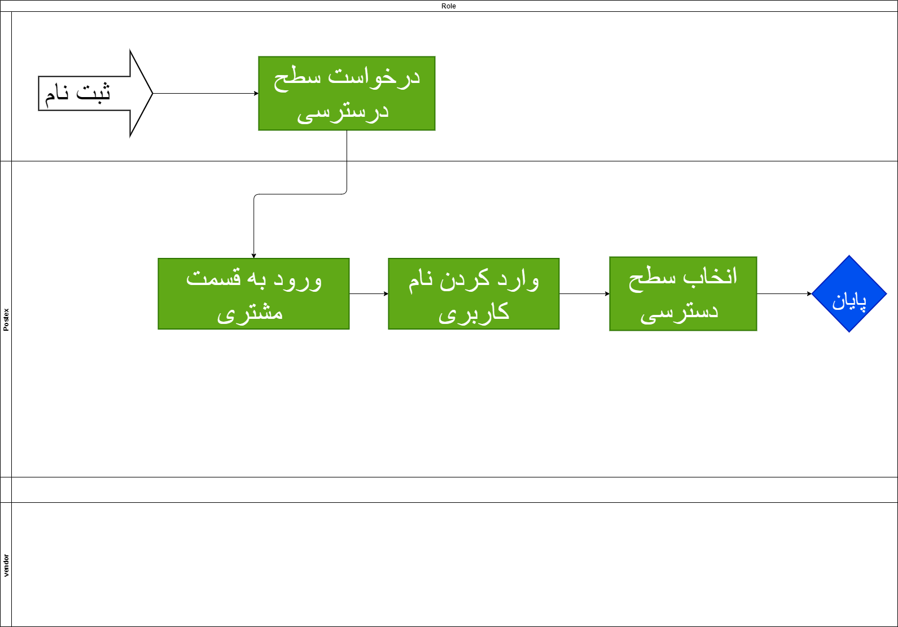
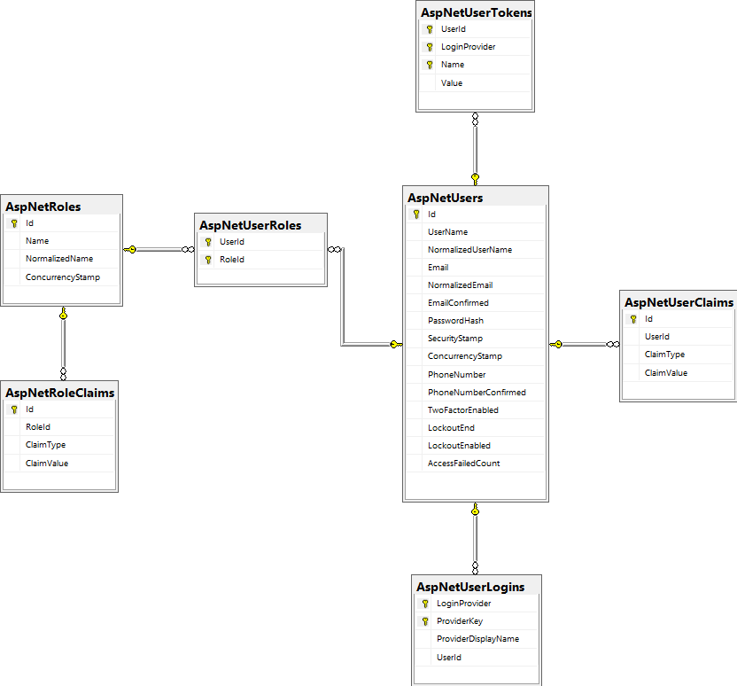

# Authentication And Authroziation

 این سرویس وظیفه لاگین و رجیستر کاربران و تعاریف  نقشها، سطوح دسترسی و گروهای کاربری را بر عهده خواهد داشت

## ثبت نام

 در وحله اول برای استفاده از امکانات سیستم شما باید ثبت نام انجام دهید شما بعد از ثبت نام به عنوان کاربر عادی وارد سیستم می شوید و در ادامه میتوانید با استفاده از رول های خاص سطح دسترسی خود را افزایش دهید.
 برای ثبت نام شما نیاز به وارد کردن اطلاعات زیر هستید

 1. کد ملی (درصورتی که جزء اتباع می باشید باید کد اتباع و یا شماره پاسپورت خود را وارد کنید  )
 2. شماره موبایل
 3. رمز عبور دلخواه
  
  &#x202b;بعد از وارد کردن این موارد نیاز به تایید قوانین دارید

  
  
  در ادامه ثبت نام کد ارسالی به تلفن همراه شما را باید وارد کنید

## دیاگرام بخش ثبت نام

[دیاگرام ثبت نام](Diagrams/BL1-logIn.drawio)
 
---

## ورود

برای ورود به حساب کاربری از  شماره همراه و رمز تعیین شده در ثبت نام استفاده میکنیم و وارد پنل کاربری می شویم

  دیاگرام ورود
  [دیاگرام ورود](Diagrams/BL1-logIn.drawio)
  

## سطح دسترسی

در این قسمت شما سطح دسترسی و نقش هر کاربر را تایین می کنید که به کدوم قسمت ها دسترسی داشته باشد یا خیر با این عمل شما می توانید مشتری ها را در سطح های مختلف طبقه بندی کنید

  دیاگرام سطح دسترسی
  [دیاگرام سطح دسترسی](Diagrams/BR-CustumerRole.drawio)
  

## ERD دیتابیس

[ERD Database](Diagrams/Authentication.drawio)

## ERD Microsoft Identity

## Methods

[Method](Diagrams/AuthenticationAndRoleMethod.drawio)

- SignUp
  متد برای ثبت نام در سیستم
- SignOut
  ثبت نام در سیستم
- ChangePassword
  تغییر رمز کاربری
- AssignRole
  اختصاص سطح دسترسی خاص به کاربر
- IsInRole
  کاربرانی که از یک سطح دسترسی استفاده می کنند
- RegisterExtraUserData
  اضافه اطلاعات بیشتر برای کاربر  
- AssignContract
  تعریف قرارداد برای کاربر
- EditUser
  ویرایش کاربران
- SignIn
  ورود به حساب کاربری
- SaveUserSetting
   ذخیره تغییرات حساب کاربری
- AssignAccessRole
  اختصاص سطح دسترسی
- DefineRole
  تعریف سطح دسترسی
- GenerateToken
  ساخت توکن
- GetUserSetting
  دریافت تنظیمات کاربر
  