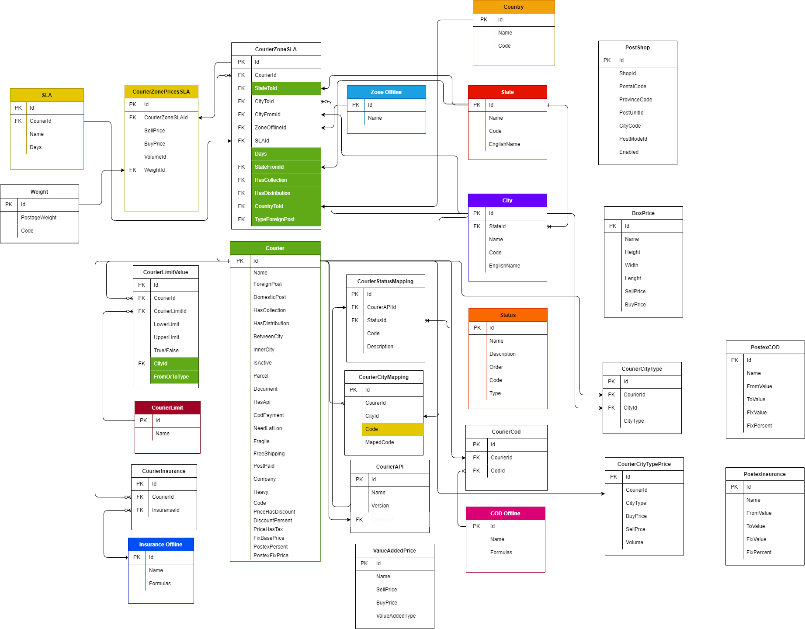

# تعریف سرویس ها (Product servise)  

- [تعریف سرویس ها (Product servise)](#تعریف-سرویس-ها-product-servise)
  - [مقدمه](#مقدمه)
  - [Feature](#feature)
    - [Getwaye Price](#getwaye-price)
    - [Add service provider](#add-service-provider)
    - [Bulk Service](#bulk-service)
    - [Price Service](#price-service)
    - [Tracking Service](#tracking-service)
    - [نیازمندی ها پروداکت سرویس](#نیازمندی-ها-پروداکت-سرویس)
    - [قواعد کسب و کار برای سرویس پروداکت](#قواعد-کسب-و-کار-برای-سرویس-پروداکت)
  - [موجودیت ها](#موجودیت-ها)
    - [Courier](#courier)
    - [company](#company)
    - [CourierLimit](#courierlimit)
    - [CourierLimitValue](#courierlimitvalue)
    - [CourierZoneSLA](#courierzonesla)
    - [CourierZonePriceSLA](#courierzonepricesla)
    - [ZoneOffline](#zoneoffline)
    - [CourierCity](#couriercity)
    - [City](#city)
    - [State](#state)
    - [CourierStatusMapping](#courierstatusmapping)
    - [Status](#status)
    - [CourierCityMapping](#couriercitymapping)
    - [CODOffline](#codoffline)
    - [CourierCOD](#couriercod)
    - [CourierInsurance](#courierinsurance)
    - [InsuranceOffline](#insuranceoffline)
    - [Country](#country)
    - [SLA](#sla)
    - [Weight](#weight)
    - [valueAddedPrce](#valueaddedprce)
    - [PostShop](#postshop)
    - [BoxPrice](#boxprice)
    - [CourierCityType](#couriercitytype)
    - [CourierCityTypePrice](#couriercitytypeprice)
    - [PostexCOD](#postexcod)
    - [PostexInsurance](#postexinsurance)
  - [Methods](#methods)
  - [فرایند ها](#فرایند-ها)
  - [دیاگرام ها](#دیاگرام-ها)
    - [متد های , انتیتی های موجود در بخش تعریف سرویس ها](#متد-های--انتیتی-های-موجود-در-بخش-تعریف-سرویس-ها)

---

## مقدمه

وظیقه اصلی این سرویس تعریف کوریر های پستی مثل کالا رسان ، پست پیشتاز و ... همچنین اعمال محدودیت ها و قیمت گزاری به صورت آنلاین و آفلاین برای هر سرویس را برعهده دارد.
این سرویس وظیفه ساخت , اتصال به سرویس های پستی خارجی را بر عهده دارد ، هر سرویسی که ثبت می شود به دو صورت می توان آن را پیاده سازی کرد یا به صورت آنلاین که از طریق ای پی آی پیاده سازی می شود یا به صورت آفلاین است. همچنین سرویسی مانند رهگیری در این بخش تعریف می شود که وظیفه ترکینگ و مپ کردن استاتوس ها را برعهده دارد.

---

## Feature

### Getwaye Price

- Define Product
- Define Product Attr
- Define Discont

### Add service provider

### Bulk Service

- Bulk Service

### Price Service

- ValidateInputbyContract
- Get Price
- Calc Price
- Log Price

### Tracking Service

- Bulk Tracking
- Single Tracking

### نیازمندی ها پروداکت سرویس

- تعریف سرویس دهنده ها و لیست قیمت ها
- لیست قیمت ها
- تعریف شهر ها
- امکان تغریف تخفیف
- دریافت کد رهگیری از هر سرویس به صورت مجزا
- امکان ثبت سفارش از دو درگاه بانکی شامل بانک ملت و بانک سامان وجود داشته باشد

### قواعد کسب و کار برای سرویس پروداکت

 در تعریف سرویس دهنده ها باید به نکاتی توجه کرد که از مهمترین آن ها میتوان به ارسال داخلی یا خارجی کوریر ، بین شهری یا درون شهری بودن آن ، جمع  که آوری دارد یا خیر و... اشاره کرد که میتوانید لیست موارد قابل تعریف برای هر سرویس دهنده را در زیر مشاهده کنید

- شرکت های کرویر پستی
  - محدویت داخلی یا خارجی (ForighnPost and DomesticPost Limit)
  - جمع آوری دارد (HasCollection)
  - بین شهری یا داخل شهری (InnerCity and BetweenCity)
  - توزیع دارد (HasDistribution)
  - فعال یا غیر فعال بودن (IsActive)
  - قیمت دهی (CourierZonePricesSLA)
    - تعریف زون (CourierZone)
    - اختصاص شهر یا استان به زون
    - تعریف قیمت براساس زون مبدا و مقصد و وزن و حجم
    - مدت زمان ارسال براساس زون مبدا و مقصد SLA تعریف(SLA)
  - نوع مرسوله ( داکیومنت و نان داکیومنت )
  - نوع بسته بندی (شکستنی و غیر  شکستنی)
  - ای پی آی دارد یا خیر (HasApi)
  - نوع پرداخت (cod,پس کرایه ,پیش کرایه)
  - COD دارد یا خیر (CodPayment)
  - مکان جغرافیایی (NeedLatLon)
  - رهگیری کوریر ها (CourierStatusMapping)
  - محدودبت کرویر ها (CourierLimit)
    - محدویت های وزنی (حداقل و حداکثر وزنی که ارسال میکنند) (WeightLimit)
    - محدودیت های ابعادی (VolumeLimit)
    - محدودیت تعداد جمع آوری و توزیع (NumOfCollectionAdnDistribution)
    - محدودیت در سیستم توزیع (DistributionLimit)
    - محدودیت در سیستم جمع آوری (CollectionLimit)
    - بیمه کوریر ها (حداکثر و حداقل) (LowerLimit and UpperLimit)
- توزیع پستکس (HasDistribution)
- جمع آوری پستکس (HasCollection)
- شهر فرستنده و گیرنده برای هر کوریر(CourierCity)

- هر سرویسی یک مدت زمان رسیدن دارد که باید پیاده سازی شود

- اعمال تخیف کوریر ها بر روی هر سرویس
- اعمال محدودیت های هر کرویر
  - محدویت های وزنی
      محدویت وزنی برای سرویس ها مختلف می باشند
      برای پیشتاز : 30 کیلوگرم
      برای چاپار: حداکثر 70 کیلوگرم
      ماهکس : حداکثر 100 کیلو گرم
      کالارسان : حداکثر 100 کیلوگرم
      یارباکس : 50 کیلوگرم
      پیک هاب : حداکثر 20 کیلوگرم
  - محدویت ابعادی
     پست پیشتاز : 1 متر
     چاپار : ابعاد 120 سانتی متر
     ماهکس : 150 سانتی متر
     کالارسان : 816625 سانتی متر مکعب
     یارباکس : 120 سانتی متر
     پیک هاب : بسته سایز 9
  - محدویت قیمت
    پسشتاز قیمت بر اساس منطقه پستی فرسنتده و گیرنده تایین می شود و به  مناطق همجوار ،همجوار کلانشهر، درون استانی ،و غیر همجوار تقسیم می شودو نسبت به هر یک از موقعیت های زیر قیمت تغییر می کند
    سرویس چاپار : قیمت گزاری بر بر اساس وجود نماینده در هر دو منتطقه می باشد
    ماهکس هم به همیبن صورت و بر اساس وجود نماینده در آن مناقط بارکد صادر می کند
    در قیمت گزاری کالارسان تهنا چیزی که اهمیت دارد حجم مرسوله می باشد
  - محدودیت SLA
   محدودیت در زمان ارسال مرسوله 
   پست پیشتاز : بین 3 تا 9 روز
   کالارسان : بین 18 تا36 ساعت
   چاپار : بین 24 تا 72 ساعت
   ماهکس:بین 24 تا48 ساعت
   پیک هاب : 8تا 24 ساعت

  - نوع سرویس
    در مورد نوع سرویس ها منطور داشتن سرویس پسکرایه و پرداخت در محل می باشد

   از جمله محدویت های کالارسان میتوان به  یک سری از مسیر ها دو مسیره هستند مثلا برای ارسال بار از یزد به مشهد ابتدا بار به از یزد به تهران میرود و در نهایت از تهران برای مشهد ارسال می شود و نیاز است دو بار نامه تهیه شود و روی بسته قرار گیرد.
   از جمله محدودیت های دیگر یارباکس :  
    یارباکس سیستمی است که از مقصد تهران به مراکز استان ها ارسال بار انجام می شود

    از جمله محدودیت های پیک هاب توزیع این می باشد که درون تهران نمایش داده نشود ولی در شهرستان ها نمایش داده شود
    میزان ارجاع بار و ثبت سفارش بستهگی به ظرفیت آن شهر دارد و در صورتی که ظرفیت شهری پر شد دیگر ثبت سفارش انجام نگیرد
- در شهر هایی که نماینده نداریم سرویس نوتیفیکیشن کال شود و به فرد ثبت کننده پیامی مبنی بر آدرس سرویس دهنده پستی ارسال شود 
- امکان تعریف سیستم پیشکرایه پس کرایه و پرداخت رایگان 
- امکان تعریف فیلتر های مختلف برای محصول
- آپدیت استاتوس مرسولات به صورت خودکار
- عدم ثبت پس کرایه برای افرادی که در گیت وی پنل ندارند
- محاسبه COD
  - مدل مبلغ ثابت 
   در این مدل عددی ثابت به کل مبلغ فاکتور و ارزش کالا اضافه می شود
 مثلا 6000 تومان هر مبلغی که ارزش کالا باشد به فاکتور و خدمات پستی اضافه می شود
 ارزش کالا + خدمات پستی + 6000 = جمع فاکتور پرداخت در محل
 - مدل درصد ثابت از کل 
   درصدی ثابت به کل مبلغ فاکتور به نسیت ارزش کالا اضافه می شود
   مثلا درصد پرداخت در محل 2 درصد می باشد
   ارزش کالا + خدمات پستی + (ارزشکالا* 2 درصد  ) = فاکتور 
 - مدل درصد پلکانی
  در این مدل درصدی مخصوص به ازای هر رده قیمتی کالا اضافه می شود 
  رده های قیمتنی :
  صفر تا صد هزار توان = 2.5 درصد
  صد هزار تا چهارصد هزار تومان = 4.5 درصد 
  بالاتر از چهارصد معادل 6 درصد
در تمامی مدل های خدمات پرداخت در محل مبلغی سی او دی و خدمات پستی به مبلغ کالا اافه می شود و در زمان تحویل کالا از مشتری اخذ می شود

اما در ارسال رایگان همانند پرداخت در محل عمل می کنیم اما در این روش خدمات پستی از اصل مبلغ کسر می شود

- تعریف بیمه در شرکت های پستی :

  - روش اول : در این روش مبلغ اظهار شده از کالا فراخوانی می شود و با توجه به ارزش کالا درصدی جهت بیمه اخذ می شود (درصد از کل)
   ارزش کالا *a% = b مبلغ بیمه
800000* ./1 % = 800
  - روش دوم : در این روش ارزش اظهار شده کالا پلکانی در نظر گرفته می شود و سپس درصد اعمال میگردد
   رده صفر تا صد هزار تومان : 0/3 درصد
   رده صد تا سیصد هزار تومان : %0/2
  - نوع سوم : در این روش مبلغ اظهار شده پلکانی است 
   رده صفر تا 100 هزار تومان : %0/3
   رده 100 تا 300 هزار تومان : %0/2
  - نوع چهارم : تلفیقی پلکانی و درصدی ، در این روش تا مبلغی مشخص هزینه بیمه ثابت است پس از آن درصدی از مبلغ
   مثلا 0 تا 800 هزار تومان مبلغ 800 تومان و پس از 800 هزار تومان یک دهم درصد ارزش کالا
  - نوع پنجم : عدد ثابت همراه با یکی از 4 حالت قبلی 
   مثلا 1000 تومان به علاوه روش مبلغ نهایی پلکانی 
   یا مثلا 500 تومان بلاعوه روش مبلغ نهایی تلفیق پلکانی درصدی

- محاسبه هزینه های پستی
  - باید فیلد های زیر را برای هر شرکت درنظر گرفته شود
1-	مبلغ اعلامی با کسر تخفیف است یا خیر 
2-	درصد تخفیف 
3-	قیمت اعلامی با مالیات است یا خیر
4-	عدد ثابتی که به عدد پایه پستی اضافه میگردد ( مثلا در ثبت 5460 بابت ثبت)
5-	درصد اضافه به مبلغ نهایی ( توسط پستکس )
6-	عدد ثابت اضافه شده به مبلغ
A – درصد تخفیف شرکت
B – قیمت اعلام شده
C – قیمت بیمه
	بر اساس نحوه محاسبه بیمه در هر شرکت باید محاسبه شود
D – عدد ثابت
E -  قیمت خدمات پستی بدون مالیات افزوده
	در صورتی که قیمت اعلام شده بدون مالیات باشد E = B
	در غیر این صورت E = B \ 1.09
F – قیمت خدمات پستی
	F = E – C – D
G – قیمت خدمات پس از اضافه کردن تخفیف 
در صورتی که قیمت با کسر درصد تخفیف اعلام شود قیمت باجه با فرمول زیر محاسبه میشود
G = (100 / (100 – A)) * F
در صورتی که قیمت بدون کسر درصد تخفیف باشد
G = F	
I – درصد اضافه قیمت (درصد پستکس)
J – عدد ثابت اضافه شده به مبلغ نهایی
X – مبلغ نهایی
X = ((G + (G*I/100) + C + D) * 0.09) + J 
مثال
مبلغ اعلام شده با کسر تخفیف است 
درصد تخفیف 20
عدد اعلام شده بدون مالیات است
عدد ثابت 5460
درصد اضافه شده به مبلغ نهایی صفر است
عدد اضافه شده به مبلغ نهایی صفر است.

A = 20
B = 99100
C = 10000
D = 5460
E = 99100 
F = 99100 – 10000 – 54600 = 83640
G = (100 / (100 – 20)) * 83640 = 104550
I = 0
J = 0
X = ((104550 + (104550 * 0 / 100) + 10000 + 5460) * 1.09) + 0  = 130811

---

## موجودیت ها

### Courier

- Id
 شناسه 
- Name
  نام کوریر
- ForeignPost
  سرویس داخلی دارد یا خیر
- DomesticPost
  سرویس بین شهری دارد یا خیر
- HasCollection
  جمع آوری دارد یا خیر
- HasDistribution
  سیستم توزیع دارد یا خیر
- BetweenCity
  ارسال بین شهری دارد یا خیر
- InnerCity
  ارسال درون شهری دارد یا خیر
- IsActive
  فعال می باشد یا خیر
- SLA
  دارای SLA هست یا خیر مثلا سیستم ملی پست دارای پست پیشتاژ ، سفارشی می باشد 
- Parcel
  امکان ثبت سفارش دارد 
- Document
  ارسال نامه انجام می دهد ؟
- HasApi
  ای پی آی دارد یا خیر 
- CodPeyment
  پرداخت در محل دارد یا خیر
- NeedLatLong
  نیاز به طول و عرض جغرافایی
- Fragile
  ارسال مرسولات شکستنی را قبول می کند
- FreeShipping
- PostPaid
  پسکرایه
- CourierContractPercent
  درصد قرارداد کوریر
- Company
  شناسه نام کمپانی
- Heavy
  حمل سنگین دارد یا خیر

### company

- id
  شناسه
- Name
  نام 

### CourierLimit

- id
  شناسه کوریر
- Name
  نام کوریر
در این قسمت ما محدودیت هایی از جمله ابعادی ، وزن ، بسته بندی محدودیت توزیع و محدویت جمع آوری ،حد بالا و حد پایین ، محدودیت تعداد ارسال و آواتار را تعریف می کنید و در جدول بعدی به هر کدام از این محدودیت ها مقدار می دهیم
در محدویت وزنی شرکت ملی پست حد پایین 30 گرم و حد بالا 30 کیلوگرم می باشد

### CourierLimitValue

- id
  شناسه 
- CourierId
  شناسه کوریر
- CourierLimitId
  شناسه کوریر
- LowerLimit
  حد پایین
- UpperLimit
  حد بالا
- True/false
  دارد یا ندارد

### CourierZoneSLA

- id
  شناسه 
- CourierId
  شناسه کوریر
- stateId
  شناسه استان مرکز
- CityToId
  شناسه شهر مبدا
- CityFromId
  شناسه شهر مقصد
- ZoneId
  شناسه جدول زون ها شامل همجوار و غیر همجوار مراکز استان 
- SLAId
  شناسه SLA

### CourierZonePriceSLA

- id
  شناسه
- Courier id
  شناسه کوریر 
- SellPrice
  قیمت فروش خدمات
- BuyPrise
  قیمت خرید خدمات
- VolumeId
  شناسه ابعاد مختلف در یک سرویس
- weighti
  شناسه وزن مخلف در یک سرویس

### ZoneOffline

- id
  شناسه منطقه
- Name
 نام منطقه 

### CourierCity

- id
  شناسه
- CourierId
  شناسه کوریر
- CityFromId
  شناسه شهر فرستنده
- CityToId
  شناسه شهر گیرنده
- HasCollection
  در آن منقطه جمع آوری دارد 
- HasDistribution
  در آن منتطقه توزیع دارد یا خیر
(فرق این مورد با موردی که در جدول کوریر آمده است این است که آن به صورت کلی می باشد ولی این مورد به صورت کاستومایز شده بر اساس شهر میگوید که کویر جمع آوری و بتوزیع دارد یا خیر)

### City

- id
  شناسه 
- stateId
  شناسه استان
- Name
  نام شهر
- Code
  کد شهر که به صورت سه حرفی مشخص می کنیم مانند تهران که مینویسیم teh
- EnglishName
  نام انگلیسی شهر

### State

- id
  شناسه
- Name
  نام
- Code
  کد استان
- EnglishName
  نام انگلیسی استان

### CourierStatusMapping

- id
  شناسه
- CourierId
  شناسه کوریر
- StatusId
  شناسه وضعیت مرسوله
- Code
  کد مرسوله 
- Description
  توضیحات

### Status

- Id
  شناسه
- Name
  نام
- Description
  توضیحات
- Order
  شماره سفارش
- Code
  کد سفارش
- Type
  نوع سفارش

### CourierCityMapping

- id
  شناسه
- courierId
  شناسه کوریر
- CityId
  شناسه شهر
- Code
  کد شهر که توافق بین کوریر ها می باشد
- MapedCode
  یکسان سازی کد شهر ها

### CODOffline

- id
  شناسه
- Name
  نام
- Formulas
  فرمول پرداخت محل کوریر ها

### CourierCOD

- id
  شناسه
- CourierId
  شناسه کوریر 
- CODId
  شناسه پرداخت در محل

### CourierInsurance

- Id
  شناسه
- CourierId
  شناسه کوریر ها
- InsuranseId
  شناسه بیمه

### InsuranceOffline

- id
  شناسه
- Name
  نام 
- Formulas
  فرمول بیمه کوریر ها

### Country

- id
  شناسه
- Name
  نام کشور
- Code
  کد کشور

### SLA

- id
  شناسه
- CourierId
  شناسه کوریر
- Name
  نام
- Days
  مدت زمان ارسال مرسوله

### Weight

- Id
- شناسه
- PostageWeight
  رده وزنی
- code
  کد وزنی
  
### valueAddedPrce

نوع سرویس ارزش افزوده

- Id
  شناسه
- Name
  نام 
- SellPrice
  خرید
- BuyPrice
  فروش
- ValueAddedType
  هزینه های ارزش افزوده  و شامل موارد زیر می شود
    [Description("پیامک")] Sms = 1,
    [Description("آواتار")] Avatar = 2,
    [Description("ثبت سفارش")] Submitter = 3,
    [Description("پرینت")] Print = 4,
    [Description("انبار")] Warhousing = 5

### PostShop

- Id
- ShopId
- PostalCode
- ProvonceCode
- PostUnitId
- CityCode
- PostModelId
- Enabel

### BoxPrice

- Id
- Name
- Height
- Width
- Lenght
- SellPrice
- BuyPrice

### CourierCityType

- Id
- CourierId
- CityId
- CityType
این مورد شامل موارد زیر می شود
    [Description("تهران")] Tehran = 1,
    [Description(" کلانشهرها-جی 8")] G8 = 2,
    [Description("مرکز استان")] StateCenter = 3,
    [Description("شهرستان ها")] SmallCities = 4

### CourierCityTypePrice

- Id
- CourierId
- CityType
- BusPrice
- SellPrice
- Volume

### PostexCOD

- Id
- Name
- FromValue
- ToValue
- FixValue
- FixPrecent

### PostexInsurance

- Id
- Name
- FromValue
- ToValue
- FixValue
- FixPrecent

---

## Methods

[متد های موجود درسرویس](Diagrams/ServiceProvider.drawio)

- Authenticate(Username , password)
  احراز هویت
- RenewToken(Usename,password)
  دریافت توکن جدید
- GetPrice
  دریافت قیمت
- RegisterPrice
  ثبت مرسوله
- CancelParcel
   کنسل کردن مرسوله
- TrackParcel
  پیگیری مرسوله
- EditParcel
  ویرایش مرسوله

[متد های Service Provider](Diagrams/ProductServiceMethod.drawio)

- CeateProductionService:
  این متد به منظور ساخت سرویس ها مورد استفاده می گیرد . ورودی را از دیتابیس می گیرد و سرویس ها را ایجاد می کند
- EditProductService :
  متدی جهت ویرایش سرویس های عریف شده

[متد های بخش قیمت سرویس ها](Diagrams/PricingServiceMethod.drawio)

- GetEigibleService :
   دریافت لیست سرویس ها با توجه به ورودی های کاربر
- GetPriceFrom"ServiceName"
  استعلام قیمت سرویس دهنده های پستی  
- PriceManipulation
  این متد وظیفه اصلاح قیمت های خام که از سمت سرویس دهنده های پستی می شود را برعهده دارد و قیمت نهایی را به کاربر نشان می دهد

---

## فرایند ها

پیاده سازی محدودیت ها و قوانین هر سرویس دهدده که بتواند به صورت آنلاین قیمت دریافت کند و در نهایت کد رهگیری صادر کرده و در اختیار مشتری قرار دهد

---
 به عنوان مثال یک بسته از تهران به اصفهان قرار است با وزن 30 گرم ارسال شود از آنجایی که محدودیت وزن اداره پست حداقل 30 گرم و حداکثر 30 کیلو می باشد 
 این بسته می تواند با پست ارسال شود و همچنین 
 از لحاظ نوع بسته بندی شکستنی ارسال نمیکنه
 سیستم جمع آوری دارد ولی برای سفارشات انبوه
 نوع مرسوله ارسالی در شرکت ملی پست هم به صورت داکیومنت است هم نان داکیومنت
 توزیع به همه شهر ها دارد
 مدت رمان ارسال هم از 3 تا 9 روز می باشد
نوع پرداخت پس کرایه ، پیش کرایه ، COD و پردخت رایگان  دارد
در مورد زون های خاص مثلا بنادر ارسال فقط اسناد دارد
در تعریف ویژگی های بالا دو قیمت وارد می کنیم یک هزینه خرید و دو قیمت پرداختی به نماینده ها

در نهایت خروجی  که ما از این سرویس دریافت می کنیم :
بیمه + خدمات cod + خدمات پستی

---

## دیاگرام ها

### متد های , انتیتی های موجود در بخش تعریف سرویس ها

[دیتابیس تعریف سرویس](Diagrams/Product.drawio)

