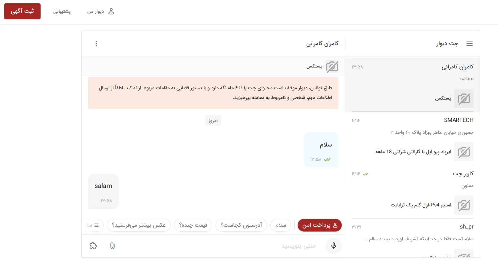
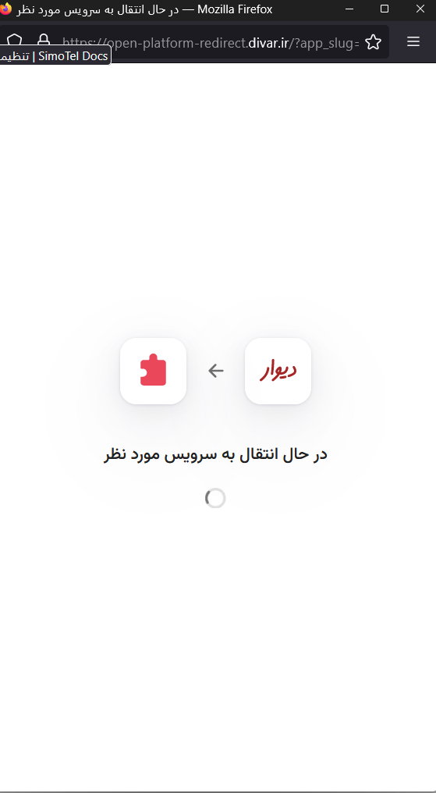
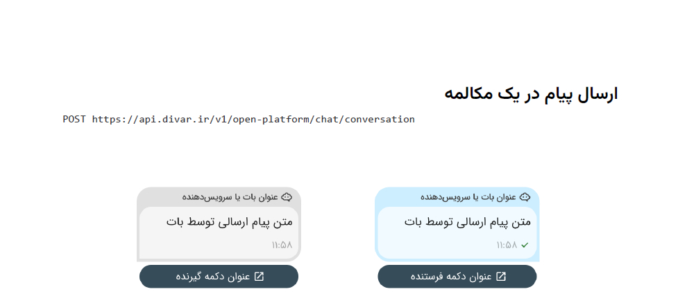

# تعریف سرویس  (امنیتو دیوار)  

---

## مقدمه

امنیتو یک شیوه پرداخت می باشد. در این سرویس ابتدا مشتری در جت باکس بر روی دکمه پرداخت امن کلیک میکند و بعد از اتصال به سایت پستکس از گیرنده خواسته می شود داخل چت باکس آدرس و مشخصات خود را وارد کند و پرداخت مبلغ فرایند آغاز می شود و برای فرستنده پیامی مبنی بر ثبت مرسوله ارسال می شود 

---

## Feature

### نیازمندی ها امنیتو

- فراخوانی سرویس نوتیفیکیشن
- فراخوانی سرویس یوزر منیجمند
- فرم غرامت و مفقودی
- رفع ایرادات حساب و شبا (اشتباه وارد شدن و یا یکسان نبودن مشخصات )
- فرایند نظر سنجی 
- فرایند عودت وجه 
- فرایند ثبت سفارش api

### قواعد کسب و کار برای امنیتو 

در تعریف امنیتو باید به نکاتی توجه کرد که مهم ترین های آن عبارت است از 

- فروشگاه و کاربر حتما ثبت نام کرده باشند 
- سیستم نوتیفیکیشن به درستی پیاده سازی شود که در هر مرحله پیامک برای ساید مورد نظر ارسال شود 
- در صورت عدم قبول سفارش فرم کنسلی سفارش ایجاد شود و اگر مرسوله دچار خسارت شده است فرم های مفقودی و و غرامت ایجاد شود
- در بازگشت وجه در صورت عدم قبول هزینه پستی کسر شود 
- عدم نمایش سرویس های پرداخت در محل و پس کرایه به مشتری 

 
---

## موجودیت ها

### فروشگاه 

- شماره موبایل
- شماره ملی یا شناسه ملی 
- شماره شبا(لیست)
- (کد پستی و لت و لانگ)لیست آدرس های منتخب 
- نام شرکت و یا فروشگاه
- نام و نام خانوادی مدیر و نماینده ها
-  تاریخچه نظرات مشتی و رنکینگ
-  SLA پاسخ و ارسال

### کاربر 

- شماره موبایل
- شماره کارت و شبا (لیست )
- نام و نام خانوادگی (لیست پزیرندگان)
- لیست آدرس های منتخب (کدپستی)
- وضعیت مشتری (ایرادات)
  
### واسط ها

- پست و پیک 
- بانک 
- پنل پیامکی 
- نقشه 
- پستکس نماینده ها

---

## Methods

متد دریافت چت 
{
Token: token,
ExtraData: chatData.ProviderData,
CallBackURL: callbackURL,
PostToken: chatData.PublicData.PostToken,
UserID: userID,
PeerID: chatData.PublicData.PeerId,
}

متد ارسال نوتیف 
{
"status": "string",
"message": "string",
"url": "string"
}

---

## فرایند ها

در این سرویس ابتده از چت دیدار شروع می شود و پس کلیک بر روی دکمه پرداخت امن به سامانه پستکس متصل می شود 

فرایند ارسال پیام در این سیستم به شکل زیر می باشد 

### Step 1

در مرحله اول برای هر دو فرد گیرنده  نوتیفی ارسال می شود این پیام شامل اطلاعاتی در مورد سابقه ارسال ها و نظرات در مورد فرستنده می باشد  و به طور کلی متن پیام به صورت زیر می باشد :
اطلاعات و امار ارسال کالا توسط فرستنده به گیرنده ارسال میشود که چه تعداد سفارش موفق و ناموفق داشته است و میزان رضایت نسجی از 5 چه میزان می باشد

### Step 2

در مرحله دوم نوتیفی برای گیرنده و فرستنده می رود که حاوی لینکی توضیحات در خصوص امنیتو می باشد 

"بدون خواندن قوانین و مقرارت لطفا از ثبت سفارش جدا خوداری فرمایید";//Redirec to divar info page

### Step 3 

در این مرحله ما اطلاعات فرستنده و گیرنده را دریافت میکنیم ، برای دریافت اطلاعات نوتیفی برای هر دو طرف ارسال می شود که اطلاعات را در جت باکس برای هم ارسال کنند این اطلاعات شامل نام و نام خانوادگی ، آدرس  میباشد
متن پیام برای گیرنده :
"لطفا اطلاعات خود را بعد از تکمیل اطلاعات توسط فرستنده در چت باکس وارد کنید";//No Action
متن پیام برای فرستنده :
"لطفا اطلاعات خود را در چت باکس وارد کنید";//No Action

### Step4

سفارش معلق: درصورتی که گیرنده تا درگاه رفت ولی پرداخت انجام نشد سفارش وارد وضعیت معلق در می آید 
متن پیام برای فرستنده : 
"سفارش تکمیل نشده در صورت نیاز از خریدار پیگیری کنید");//No Action
متن پیام برای گیرنده :
"سفارش شما تکمیل نشده است لطفا نسبت به تکمیل سفارش و پرداخت اقدام فرمایید");//No Action

نکته : لینکی که جهت تکمیل سفارش و پرداخت در صفحه چت ارسال می شود باید حاوی توکن باشد که مشخص شود سفارش از کجا آمده است و جهت تکمیل فرایند به مشکل برنخورد 

### Step 5 

سفارش تکمیل :
دراین وضعیت گیرنده هزینه سفارش به همراه هزینه ارسال را پرداخت کرده و پول نزد حساب ما به امانت می ماند تا روند ارسال تکمیل شود و سپس زینه آزاد شود 
در این مرحله مشتری می تواند انتخاب کند خدمات فنی و مهندسی خود را به این صورت که 

- اگر گزینه لیبل را تیک نزند و اعلام کند خودش به ک.ریر پسستی تحویل میدهد : باید قبل از تحویل سفارش یا پیرینت از فاکتور گرفته و روی بسته بچسباند و تحویل کوریر دهد یا با مراجعه به اداره پست از اون ها درخواست لیبل کند که هزینه جدا باید پرداخت کند و همچنین طبق قوانین پستی اگر بسته در بسته بندی استاندارد نباشد در صورت ایجاد مشکل برای بار مانند شکستگی شامل غرامت نمیشود 
- اگر تیک لیبل را بزند و اعلام کند جمع آوری با شرکت پستکس می باشد نماینده به محل اعزام و خودش لیبل و بسته بندی میکند و تحویل کوریر می دهد 
در این مرحله برای گیرنده و فرستنده نوتیف ارسال می شود

پیام فرستنده :سفارش خریدار پرداخت شد لطفا در اولین روزکاری کالا را ارسال بفرمایید;  //No Action
پیام گیرنده : "سفارش شما ثبت شد در اولین روزکاری توسط فرستنده ارسال خواهد شد"  ;//No Action

### Step 6

درخواست لغو سفارش قبل از ارسال کالا 
در صورتی که خریدار و یا گیرنده قبل از ارسال کالا از خرید منصرف شود باید با پشتیبانی تماس حاصل فرماید و اعلام کنسلی بار نماید و برای گیرنده و فرستنده نوتیف ارسال شود 
پیام برای فرستنده :
"خریدار از سفارش خود منصرف گردد لطفا کالا را ارسال نفرمایید");//send to support agent
متن پیام برای خریدار و گیرنده : درصورتی که فرستنده از ارسال کالا منصرف شود 
  "سفارش شما توسط فروشگاه لغو گردید و مبلغ طی 48 ساعت به حساب شما عودت داده می شد");//send to support agent

### Step 7 

یاداوری ارسال بسته 
دراین مرحله برای فرستنده پیام ارسال میشود جهت یاداوری برای ارسال بسته متن پیام به شرح زیر می باشد
 "لطفا سفارش را جهت ارسال به کویر آماده نمایید");//send to readyForSend info page

### Step 8

رهگیری بسته : بعد از ارسال بسته نوتیف برای گیرنده و فرستنده ارسال می شود که شامل شماره سفارش و کد رهگیری می باشد 

متن برای فرستنده :
"سفارش شما با شماره سفارش و کد رهگیری ارسال شده است");//send to tracking page and show auto
متن برای گیرنده :
"سفارش شما با شماره سفارش و کد رهگیری ارسال شده است");//send to tracking page and show auto

### Step 9 

در صورتی که مسوله ارسال ولی گیرنده در محل حضور نداشته باشد جهت تحول مرسوله به باجه معطله می رود و برای گیرنده نوتیف ارسال می شود 

متن پیام برای گیرنده : 
"مرسوله با شماره سفارش در باجه معطله می باشد  لطفا جهت تعیین و تکلیف سفارش به باجه معطله مراجعه نمایید");

### Step 10 

درصورتی که مرسوله تحویل گیرنده قرار گیرد و بسته قبول کند برای فرستنده نوتیف ارسال می شود

متن پیام فرستنده : 
"مرسوله با شماره سفارش توسط گیرنده تحویل گردد");
و طی دو روز کاری تسویه حساب انجام میگیرد 

### Step 11

در صورتی که خریدار از قبول مرسوله اعتنا کند مرسوله در روند برگشت قرار میگرد و برای فرستنده و گیرنده این مرحله نوتیف ارسال میشود 
متن پیام گیرنده : 
"کالا را پذیرش نگردید و مبلغ بعد از دو روز کاری با کسر مبلغ ارسال کالا به حساب شما عودت داده می شود");
متن پیام فرستنده : 
 "خریدار کالا را پذیرش نکرد و کالا عودت خواهد داده شد");// send to support agent

### Step 12

عودت وجه 
درصورتی که در مرحله عودت وجه و یا تسویه حساب اعلات وارد شده توسط گیرنده و فرستنده مانند شماره شبا و شماره کارت ایراداتی مانند اشتباه وارد شدن و یا یکی نبودن اطلاعات حساب با اطلاعات فرستنده و گیرنده برای هر یک از طرفین نوتیف ارسال می شود 

متن پیام فرستنده : "واریز وجه به علت ایرادات شماره شبا و یا شماره کارت انجام نگرفته است لطفا جهت رفع این موارد با پشتیبانی هماهنگ کنید");//Send to account info for edit
متن پیام گیرنده : "واریز وجه به علت ایرادات شماره شبا و یا شماره کارت انجام نگرفته است لطفا جهت رفع این موارد با پشتیبانی هماهنگ کنید");//Send to account info for edit

### Step 13

در صورت بروز هرگونه مشکل مانند مفقودی و آسیب دیدن کالا برای فرستنده و گیرنده نوتیف ارسال میشود و جهت پیگیری این امر باید با پشتیبانی تماس بگیرند 
متن پیام فرستنده :  "کالا شما دچار آسیب شده با پشتیبانی تماس حاصل فرمایید");//send to support agent
متن پیام گیرنده : 
 "کالا شما دچار آسیب شده با پشتیبانی تماس حاصل فرمایید");//send to support agent
 نکته : درصورتی که فرستنده خود بسته بندی را بر عهده بگیرد و از کارتن غیر استاندارد استفاده کند و مرسوله دچار آسیب شود شامل غرامت نخواهد شد

- فرایند غرامت و مفقودی
  در این فرایند اگر مرسوله به دست مشتری رسید و مشتری از قبول مرسوله به دلایل مانند خرابی و آسیب دیدن مرسوله اعتنا کرد و یا مرسوله گم و به دست مشتری نرسید ، فرم های مفقودی و غرامت ایجاد می شود که بعد از بررسی های لازم وجه عودت داده شود.
- فرایند بررسی شماره کارت ، شبا و اطلاعات حساب 
  در این فرایند بعد از اینکه مشتری در ابتدا سفارش اطلاعات بانکی و شخصی خود را وارد کرد بررسی انجام می شود و در صورت وجود مغایرت در اطلاعات پیامکی حاوی رفع نواقص و مغایرت ها برای کاربر ارسال می شود و تا مغایرت رفع نوشد فرایند ارسال انجام نمیگیرد و مراحل عودت وجه و پرداخت وجه هم باید با اطلاعات حساب یکسان باشد.
- فرایند نظر سنجی 
  بعد از ارسال مرسوله جهت کمک به بهبود فرایند امنیتو فرم نظرسنجی ارسال شود و اطلاعات وادر شده بررسی و در دستور کار رفع نواقص احتمالی این سوریس قرار گیرد.
- فرایند عودت وجه 
- فراید ثبت سفارش APi

---

## دیاگرام ها

[فرایند امنیتو ](amnito-flow divar.drawio)

