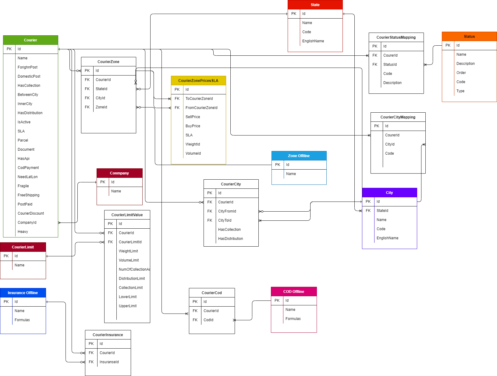

# تعریف سرویس ها (Product servise)  

- [تعریف سرویس ها (Product servise)](#تعریف-سرویس-ها-product-servise)
  - [مقدمه](#مقدمه)
  - [Feature](#feature)
    - [Getwaye Price](#getwaye-price)
    - [Add service provider](#add-service-provider)
    - [Bulk Service](#bulk-service)
    - [Price Service](#price-service)
    - [Tracking Service](#tracking-service)
    - [نیازمندی ها و قواعد کلی پروداکت سرویس](#نیازمندی-ها-و-قواعد-کلی-پروداکت-سرویس)
    - [قواعد کسب و کار برای مدیریت پروداکت](#قواعد-کسب-و-کار-برای-مدیریت-پروداکت)
  - [موجودیت ها](#موجودیت-ها)
    - [Courier](#courier)
  - [Methods](#methods)
  - [فرایند ها](#فرایند-ها)
    - [Add Service Provider](#add-service-provider-1)
    - [Pricing Service](#pricing-service)
  - [دیاگرام ها](#دیاگرام-ها)
    - [متد های , انتیتی های موجود در بخش تعریف سرویس ها](#متد-های--انتیتی-های-موجود-در-بخش-تعریف-سرویس-ها)

---

## مقدمه

وظیقه اصلی این سرویس تعریف کوریر های پستی مثل کالا رسان ، پست پیشتاز و ... همچنین اعمال محدودیت های هر سرویس را برعهده دارد.
این سرویس وظیفه ساخت , اتصال به سرویس های پستی خارجی را بر عهده دارد ، هر سرویسی که ثبت می شود به دو صورت می توان آن را پیاده سازی کرد یا به صورت آنلاین که از طریق ای پی آی پیاده سازی می شود یا به صورت آفلاین است. همچنین سرویسی مانند رهگیری در این بخش تعریف می شود که وظیفه ترکینگ و مپ کردن استاتوس ها را برعهده دارد.

---

## Feature

### Getwaye Price

- Define Product
- Define Product Attr
- Define Discont

### Add service provider

### Bulk Service

- Bulk Service

### Price Service

- ValidateInputbyContract
- Get Price
- Calc Price
- Log Price

### Tracking Service

- Bulk Tracking
- Single Tracking

### نیازمندی ها و قواعد کلی پروداکت سرویس 

- تعریف سرویس دهنده ها و لیست قیمت ها
- لیست قیمت ها
- تعریف شهر ها
- امکان تغریف تخفیف 
- دریافت کد رهگیری از هر سرویس به صورت مجزا 
- امکان ثبت سفارش از دو درگاه بانکی شامل بانک ملت و بانک سامان وجود داشته باشد

### قواعد کسب و کار برای مدیریت پروداکت

- هر سرویسی یک مدت زمان رسیدن دارد که باید پیاده سازی شود 
- پیاده ساری محدودیت های هر کوریر 
- محاسبه هزینه پستی بر اساس مبدا و مثپقصد و وزن و ابعاد مرسوله 
- اعمال تخیف کرویر ها بر روی هر سرویس 

---

## موجودیت ها

### Courier

- Internatioal Bluesky
- Internatioal PDE
- InternatioalPost
- Internatioal Chapar
- Domestic Post
- Domestic Persia
- Domestic Chapar
- Domestic kalaresan
- Domestic Tipax
- Domestic Mahex
- Domestic Yarbox
- Domestic Aramex
- Delivery Peykhub
- Delivery link
- Delivery Tarof
- Delivery Tinex
- Delivery Speed
- Connect to PishroPost
- SLA
- Api
- COD
- Courer Discount
- Courer Zone
- Courer Limit
- weight
- Volume
- Status

---

## Methods

[متد های موجود درسرویس](Diagrams/ServiceProvider.drawio)

- Authenticate(Username , password)
  احراز هویت
- RenewToken(Usename,password)
  دریافت توکن جدید
- GetPrice
  دریافت قیمت
- RegisterPrice
  ثبت مرسوله
- CancelParcel
   کنسل کردن مرسوله
- TrackParcel
  پیگیری مرسوله
- EditParcel
  ویرایش مرسوله

[متد های Service Provider](Diagrams/ProductServiceMethod.drawio)

- CeateProductionService:
  این متد به منظور ساخت سرویس ها مورد استفاده می گیرد . ورودی را از دیتابیس می گیرد و سرویس ها را ایجاد می کند
- EditProductService :
  متدی جهت ویرایش سرویس های عریف شده

[متد های بخش قیمت سرویس ها](Diagrams/PricingServiceMethod.drawio)

- GetEigibleService :
   دریافت لیست سرویس ها با توجه به ورودی های کاربر
- GetPriceFrom"ServiceName"
  استعلام قیمت سرویس دهنده های پستی  
- PriceManipulation
  این متد وظیفه اصلاح قیمت های خام که از سمت سرویس دهنده های پستی می شود را برعهده دارد و قیمت نهایی را به کاربر نشان می دهد

---

## فرایند ها

### Add Service Provider

 در تعریف سرویس دهنده ها باید به نکاتی توجه کرد که از مهمترین آن ها میتوان به ارسال داخلی یا خارجی کوریر ، بین شهری یا درون شهری بودن آن ، جمع  که آوری دارد یا خیر و... اشاره کرد که میتوانید لیست موارد قابل تعریف برای هر سرویس دهنده را در زیر مشاهده کنید 

- شرکت های کرویر پستی
  - محدویت داخلی یا خارجی (ForighnPost and DomesticPost Limit)
  - جمع آوری دارد (HasCollection)
  - بین شهری یا داخل شهری (InnerCity and BetweenCity)
  - توزیع دارد (HasDistribution)
  - فعال یا غیر فعال بودن (IsActive)
  - قیمت دهی (CourierZonePricesSLA)
    - تعریف زون (CourierZone)
    - اختصاص شهر یا استان به زون
    - تعریف قیمت براساس زون مبدا و مقصد و وزن و حجم
    - مدت زمان ارسال براساس زون مبدا و مقصد SLA تعریف(SLA)
  - نوع مرسوله ( داکیومنت و نان داکیومنت )
  - نوع بسته بندی (شکستنی و غیر  شکستنی)
  - ای پی آی دارد یا خیر (HasApi)
  - نوع پرداخت (cod,پس کرایه ,پیش کرایه) ()
  - COD دارد یا خیر (CodPayment)
  - مکان جغرافیایی (NeedLatLon)
  - رهگیری کوریر ها (CourierStatusMapping)
  - محدودبت کرویر ها (CourierLimit)
    - محدویت های وزنی (حداقل و حداکثر وزنی که ارسال میکنند) (WeightLimit)
    - محدودیت های ابعادی (VolumeLimit)
    - محدودیت تعداد جمع آوری و توزیع (NumOfCollectionAdnDistribution)
    - محدودیت در سیستم توزیع (DistributionLimit)
    - محدودیت در سیستم جمع آوری (CollectionLimit)
    - بیمه کوریر ها (حداکثر و حداقل) (LowerLimit and UpperLimit)
- توزیع پستکس (HasDistribution)
- جمع آوری پستکس (HasCollection)
- شهر فرستنده و گیرنده برای هر کوریر(CourierCity)

---
به عنوان مثال شرکت ملی پست محدودیت وزنی از 30 گرم تا 30 کیلو دارد و
 از لحاظ ابعاد حداکثر 1 متر
 از لحاظ نوع بسته بندی شکستنی ارسال نمیکنه
 سیستم جمع آوری دارد ولی برای سفارشات انبوه
 نوع مرسوله ارسالی در شرکت ملی پست هم به صورت داکیومنت است هم نان داکیومنت
 توزیع به همه شهر ها دارد
 مدت رمان ارسال هم از 3 تا 9 روز می باشد
نوع پرداخت پس کرایه ، پیش کرایه ، COD و پردخت رایگان  دارد
در مورد زون های خاص مثلا بنادر ارسال فقط اسناد دارد
در تعریف ویژگی های بالا دو قیمت وارد می کنیم یک هزینه خرید و دو قیمت پرداختی به نماینده ها

در نهایت خروجی  که ما از این سرویس دریافت می کنیم :
بیمه + خدمات cod + خدمات پستی

### Pricing Service

سیستم قیمت دهی سرویس ها که با استفاده از ارتباط با وندور ها و شرکت های پستی با استفاده از منطقه جغرافیایی و طول مسافت . همچنین وزن مرسوله قیمت با نمایش می دهد .

---

## دیاگرام ها

### متد های , انتیتی های موجود در بخش تعریف سرویس ها

[دیتابیس تعریف سرویس](Diagrams/Product.drawio)

