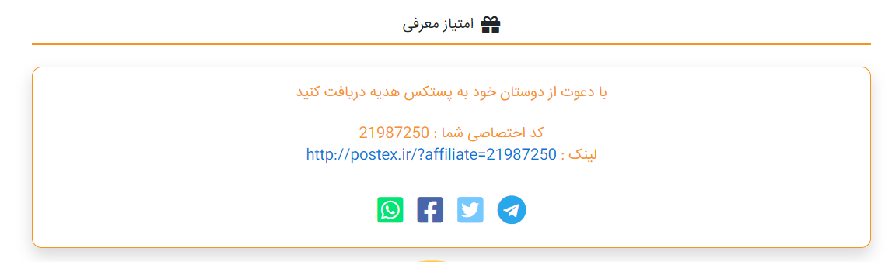

# Contract Service

- [Contract Service](#contract-service)
  - [مقدمه](#مقدمه)
    - [همکاران مرتبط با خدمات ارزش افزوده](#همکاران-مرتبط-با-خدمات-ارزش-افزوده)
  - [Feature](#feature)
    - [نیازمندی ها و قواعد کلی سرویس قرارداد](#نیازمندی-ها-و-قواعد-کلی-سرویس-قرارداد)
    - [قواعد کسب و کار برای مدیریت قراداد](#قواعد-کسب-و-کار-برای-مدیریت-قراداد)
  - [موجودیت ها سرویس قرارداد](#موجودیت-ها-سرویس-قرارداد)
    - [مدل های ورودی توابع](#مدل-های-ورودی-توابع)
  - [Method](#method)
    - [وزن حجمی](#وزن-حجمی)
    - [متد هاو دیتابیس بخش همکاری در فروش](#متد-هاو-دیتابیس-بخش-همکاری-در-فروش)
    - [متد ها و دیتابیس بخش تخفیفات](#متد-ها-و-دیتابیس-بخش-تخفیفات)
  - [فرایند](#فرایند)
    - [ثبت سفارش](#ثبت-سفارش)
    - [جمع آور](#جمع-آور)
    - [لفاف و بسته بندی](#لفاف-و-بسته-بندی)
    - [پرینت](#پرینت)
    - [انبار](#انبار)
    - [توزیع کننده](#توزیع-کننده)
    - [تخفیف ها](#تخفیف-ها)
    - [بازاریابی](#بازاریابی)
    - [لیزینگ](#لیزینگ)
    - [آواتار](#آواتار)
    - [پیامک](#پیامک)
    - [کارتون](#کارتون)
    - [کاغذ پرینت](#کاغذ-پرینت)
    - [لفاف](#لفاف)
    - [بیمه](#بیمه)
    - [خدمات پستی](#خدمات-پستی)
      - [فاکتور و رسید ارسال شده به مشتری](#فاکتور-و-رسید-ارسال-شده-به-مشتری)
  - [دیاگرام ها](#دیاگرام-ها)
    - [دیاگرام همکاری در فروش](#دیاگرام-همکاری-در-فروش)
    - [دیاگرام تخفیفات](#دیاگرام-تخفیفات)

---

## مقدمه

وظیقه ی این سرویس سفارشی کردن سفارشات است  و تعیین قراردادی است بین شرکت و مشتری برای خدماتی خاص همچنین این سرویس وظیفه تولید ، چک کردن انقضا و آپدیپ قرارداد را بر عهده دارد.

پنل قرارداد مشتریان شامل موجودیت های مختلفی می باشد و مشتریان با توجه به نوع قرارداد خود می توانند از مشتری عادی که صرفا می تواند ثبت سفارش کند شریک در قسمتی از درآمد شرکت تبدیل شوند
فرمول محاسبه هزینه ها به این صورت است که:

 هزینه نهایی = (هزینه پستی (9%+)- تخفیفات پستی )+خدمات ارزش افزوده(9%+)

هزینه پستی یا مستقیم از API تامین کننده دریافت میگردد یا از سرویس قیمت گذاری گیت وی

در فرمول بالا منظور از خدمات ارزش افزوده موجودیت های مختلف پنل قرارداد است که در زیر اشاره شده است
در هر یک از موارد زیر فرمول محاسبه و وابستگی های آیتم آمده است.
در تعریف قرارداد تاریخ شروع و پایان قرار داد را مشخص می کنیم 

### همکاران مرتبط با خدمات ارزش افزوده

- جمع آور
- ثبت کننده
- بسته بند
- لیبل و پرینت
- بازاریاب
- توزیع کننده

هر کدام از موارد ذکر شده یا بر اساس شهر فرستنده و گیرنده تعیین می شوند ویا به صورت اختصاصی در پنل قرارداد  همچنین بر اساس حجم  بسته و نماینده ای که داخل آن منتطقه وجود دارد یا خیر تعریف می شوند.
نکته : هر کدام از این موارد می تواند به یک یا چند نفر اعمال شود
نکته دوم : برخی از موارد فوق باید توسط ادمین (مالی و ...) تایید شود
نکته سوم : هر کدام از گزینه ها دو نوع هزینه تعریف می شود

- هزینه تمام شده برای مشتری
- هزینه برای پستکس

> قراردادی که برای افراد تعیین می کنیم باید امکان فعال و غیرفعال سازی موارد زیر را داشته باشد
> دسترسی به انواع ثبت سفارش
> امکان جمع آوری
> امکان توزیع
 آواتار (نشان تجاری )
 دسترسی به سرویس های پسکرایه سی او دی  

ما دارای دو توافق هستیم 
1- توافق با کویر ها :
که می شود درصدی که ما از آن ها سرویس را میگیریم 
2- توافق با مشتری ها 
از یک درصد تخفیف / یک پنجره برای وارد کردن مبلغ تخفیف که از اختلاف بین مقدار خرید و مقدار فروش به دست می آید 

---

## Feature

- Add Contract
- Edit Cotract
- Active Contract
- Disable Contract
- CustomerContract
- General Contract

### نیازمندی ها و قواعد کلی سرویس قرارداد

- امکان تعیرق قراداد مجزا بر قرار داد پیش فرض
- اعمال قرارداد بر روی ثبت سفارش و سایر موارد 
- امکان تعریف افراد در پنل قرارداد

### قواعد کسب و کار برای مدیریت قراداد

- امکان تعریف قرارداد پیش فرض برای همه مشتری ها
- امکان تغییر در پنل قرارداد یک مشتری 
- امکان فعال و غیر فعال کردن قرارداد مشتری

---

## موجودیت ها سرویس قرارداد

### مدل های ورودی توابع

- Contract 
  - Id
    شناسه قرارداد
  - CustomerId
    شناسه مشتری
  - ContractregistrantId
    ثبت نام کننده
  - StartDate
    تاریخ شروع قرارداد
  - EndDate
    تاریخ پایان قرارداد 
  - RegisterDate
    تاریخ ثبت نام 
  - IsActive
    فعال هست
 // - DeActive
    غیر فعال است

- ContractItem
  - Id
    شناسه
  - ContractId
    شناسه قرارداد
  - ContractItemTypeId
    ویژگی پنل قررداد
  - IsActive
    فعال بودن قرارداد
  - AddDate
   اضافه کردن تاریخ
  - DeActiveDate
   تاریخ غیرفعال شدن
  - DeActiveCustomer
   تاریخ غیر فعال مشتری
  - CorierId
    شناسه سرویس دهده
  - CityId
   شناسه شهر
  - InsuranceId
   شناسه بیمه
  - LeassingId
   شناسه لیزینگ
- ContractItemType
  - ContractItemTypeName
   نام مشخصات قرارداد
- ContractItemDetail
  - ContractItemPersent
    درصد قرارداد
  - PriningPaper
   هزینه های پرینت
  - ContractItemDetailesName
   نام جزئیات قرارداد
  - ContractCustumerId
   شناسه قرارداد مشتری
  - ContractItemDetailesSell
    قیمت خرید
  - ContractItemDetailesBuy
   قیمت خرید 
  - ContractItemId
   شناسه آیتم قرارداد
  - DeActiveDate
   تاریخ غیر فعال شدن
  - DeActiveCustomer
    مشتری غیر فعال
  - ContractItemNumber
    شماره آیتم قرارداد
  - Volume
   حجم
- Leassing
  - LeassingId
   شناسه لیزینگ
  - LeassingAmount
    نرخ تبدیل
  - ReturnRate
   نرخ بازگشت
  - WithDrawRate
    برخ برداشت
  - DailyWithDrawRate
  - سقف برداشت روزانه
  - Active
  فعال بودن
  - DailyDepositeRate
    نرخ واریز روزانه
  - DailyDepositRateCeiling
    سقف واریز روزانه
  - guarantee
   ضمانت
  - guarantee
  تاریخ ضمانت نامه
- Insurance
  - InsuranceId
   شناسه بیمه
  - Name
  نام
  - Formulas
  فرمول
- City
  - CityId
  شناسه شهر
  - Name
  نام
  - Area
  منطقه
- Address
  - CityId
  شناسه شهر
  - PostalCode
  کد پستی

---

## Method

[متد های پنل قرارداد](Diagrams/ContractServiceMethod.drawio)

- CreateEditContract
  ایجاد قرارداد جدید برای مشتری
- DeActiveCurrentContract
  غیرفعال سازی پنل قرارداد مشتری

  ### وزن حجمی

 فرمول وزن حجمی:

(طول *عرض* ارتفاع) / 5000

در قسمت هایی که حجم داریم از این فرمول استفاده می کنیم

### متد هاو دیتابیس بخش همکاری در فروش

[متدهای بخش همکاری در فروش](Diagrams/AffileatServiseMethod.drawio)

- CreatAffilate :
  ساخت لینک همکاری در فروش
- GetAffilateList
  نمایش لیست افیلیت ها
- EditAffilate
  ویرایش کد همکاری در فروش
- AssaignAffilateToCustomer
  اختصاص کد همکاری در فروش به کاربر
- GetAffilateById
  دریافت کد همکاری در فروش به وسیله شناسه
- GetAffilateByUserName
  دریافت کد همکاری در فروش
- DeleteAffilate
  حذف کد همکاری در فروش
- GetOrderUnderAffilate
  دریافت سفارش با کد همکاری در فروش  

### متد ها و دیتابیس بخش تخفیفات

[متدهای بخش تخفیفات](Diagrams/DiscountServiceMethod.drawio)

- CreateDiscount
  ساخت کد تخفیف
- CanApplyDiscountToOrder
  اضافه کردن کد تخفیف به سفارشات
- EditDiscount
  ویرایش کد تخفیف
- GetDiscountById
 دریافت کد با شناسه
- GetAllDiscounts
 نمایش تمامی کد های تخفیف
- UpdateDiscount
 بروزرسانی کد تخفیف
- GetDiscountUsageHistoryById
 نمایش تاریخچه تخفیفات با شناسه
- GetAllDiscountUsageHistory
 نمایش تاریخچه تخفیفات استفاده شده
- InsertDiscountUsageHistory
 قرار دادن تاریخچه نخفیفات برای کاربران
- DeleteDiscountUsageHistory
 حذف کد تخفیف
- SetdiscountLimitation
ایجاد محدودیت در تخفیفات

---

## فرایند

### ثبت سفارش
  
- افراد

فرمول ثبت سفارش :

هر سفارش نیازمند درصد
هزینه قابل پرداخت سرویس  پرینت به نماینده + یک عدد(سهم پستکس) =
مبلغ قابل فروش به مشتری

هزینه قابل پرداخت سرویس  پرینت به نماینده - ۹٪ (ارزش افزوده) =  
مبلغ قابل واریز به حساب نماینده بابت خدمت سرویس پرینت

---

### جمع آور
  
- افراد
- حجم
- شهر
- مبدا

فرمول جمع آوری :

   نرخ بسته براساس سایز آن = طول *عرض* ارتفاع

هزینه جمع آوری یک بسته = هزینه ثابت
هزینه جمع آوری بسته دوم اگر بسته یک سوم بسته اول سایز بسته دوم باشد هزینه هزینه بسته اول اعمال می شود
در غیر این صورت هزینه جمع آوری بسته دوم - هزینه جمع آوری بسته اول می شود و هزینه کلی سفارش برابر می شود با هزینه جمع آوری بسته اول + اختلاف هزینه بسته اول و دوم

فرمول دوم :
حجم + شهر + فرد جمع آور
در فرمول فول بر اساس شهر هزینه جمع آوری مغیر است و میتوان برای افراد مختلف هزینه های مختلف اعمال کرد

توزیع و جمع آوری دونه ای داشته باشیم و برای هر سایزی یه قیمت خرید و یه قیمت فروش و براساس آن قیمت نهایی نمایش داده شود
و یک رابطه یک به چند داشته باشد مثلا در شهری ما دو جمع اور با قیمت های یکی 100 و دیگری 500 داشته باشیم

در هر سیستمی ما یک قیمت خرید داریم و یک قیمت فروش،درصد هایی که ما قیمت خرید میگیریم و و درصد مشخص آن را به فروش می رسانیم.
به عنوان مثال جمع آوری در تهران مبلغ 30 هزار تومان به صورت پیشفرض تعیین شده ولی فردی خارج از تهران یک بسته ثبت می کند که هزینه جمع اوری آن می شود 50 هزار تومان ما این مبلغ را به صورت اختصاصی در سفارشات این فرد اعمال می کنیم.

---

### لفاف و بسته بندی

- افراد
- حجم
- شهر
- قیمت خرید

---

### پرینت
  
- افراد

---

### انبار
  
- لوکیشن و آدرس انبار ها

- افراد

---

### توزیع کننده
  
- شهر
- سایز
- افراد -> تعداد بسته در سبد سفارش آن روز
- تعداد
- مقصد

---

### تخفیف ها
  
- سرویس ها
- افراد - همکاری در فروش

   همکاری در فروش سیستمی است که به شما این اجازه را می دهد که بتوانید از ثبت سفارش دوستان و آشنایانتان درصدی دریافت کنید
   این سیستم به صورتی کار می کند که شما لینکی که در قسمت امتیاز همکاری وجود دارد را در اختیار سایر افزاد قرار دهید و درصدی را به عنوان معرفی این عزیزان به سیستم پستکس دریافت کنید
  
  

  درصد تخفیفات به دو صورت اعمال می شود
  1- تخفیفات نماینده ها

تخفبف نمایندگی فقط به نماینده ها اعطا می شود و می توانند موقع ثبت سفارش از آن استفاده کنند
افرادی که از تخفیف نمایندگی استفاده می کنند از بقیه تخفیف هانمیتوانند استفاده کنند

  سرویس پست پیشتاز 10 درصد

  سرویس ماهکس 15 درصد

  کالا رسان 20 درصد

  چاپار 10 درصد

  پیک هاب به صورت نرخ ثابت می باشد
  در سرویس های بالا نوع سفارش پس کرایه در سرویس ها پیشتاز و چاپار درصد زکر شده اعمال می شود
  2- مشتری
  تخفیف در مجموع سفارشات با استفاده از کد تخفیف
  همچنین برای مشتریان خاص مبلغ خاص بر روی مجموع سفارشات آن ها اعمال می شود

- کد تخفیف

   تخفیفات بخشی مهمی از سیستم پستکس هستند که شما با استفاده از آن می توانید به صوت تجمیعی و تکی برو روی سفارشات خود تخفیف در یافت کنید
   

---

### بازاریابی

---

### لیزینگ

COD

- موارد و اصطلاحاتی که در لیزینگ سر و کار داریم
    عدد لیزینگ : مبلغ توافق شده لیزینگ

    نرخ تبدیل : میزان قبول سفارشات ( در ابتدا به صورت دیفالت تعیین می شود سپس به صورت سیستمی تغییر می کند  مثال برای به دست آوردن این مبلغ از نرخ پایه 80 درصد استفاده می کنیم )

    نرخ برداشت : درصد مقدار برداشتی از سرمایه در گردش به سود شرکت

    نرخ واریز : مقداری که روزانه به حساب مشتری واریز می شود
    که محاسبه آن به این صورت است که نرخ برگشتی *عدد روزانه ارسال =x*80% = نرخ واریز

    سقف واریزی روزنه  : در نرخ واریز اگر مقدار عدد محصولات افزایش یافت باز همان مبلغ مشخص شده برایش وایز می شود و اگر ارسالی ها کمتر مقدار مشخص شده بود نسبت به همان نرخ واریزی کاهش پیدا می کند

    ضمانت نامه : برای جلوگیری از هر گونه سواستفاده از سیستم لیزینگ باید ضمانت نامه بانکی داده شود

  نکته : اگر سفارشات از حد تعیین شده دو برابر شود و یا بیشتر مبلغ لیزینگ افزایش پیدا نمی کند چون قرارداد بر طبق مبلغ قبلی بوده است و در صورتی که نیاز به افزایش مبلغ لیزینگ باشد باید قرارداد جدید تنظیم شود
  تمامی مراحل لیزینگ باید دارای ناتفیکیشن باشند به این صورت که اگر الگو ارسال عوض شود باید آلارم ارسال شود و یا اینکه هر کدام از موارد مانند نرخ بارگشت ،نرخ واریز روزانه ، نرخ تعداد سفارشات روزانه ، تاریخ سر رسید ضمانت نامه  نیاز به ارسال ناتفیکیشن می باشد.
  تمامی موارد بالا به واسطه کیف پول اجرا می شود در ابتدا کیف پول منفی می شود (طبق قانون سایت کیف پول منفی امکان ثبت سفارش ندارد ولی اگر قرارداد لیزینگ داشته باشد از این قانون مستثنا می باشد)
  در صورتی که کیف پول مثبت شود می تواند درخواست کش اوت و تسویه حساب دهد تا برایش واریز شود
  
---

### آواتار

---

### پیامک

---

### کارتون

حجم  
افراد

---

### کاغذ پرینت

نوع کاغذ
افراد

---

### لفاف

---

### بیمه

- به ارزش کالا
   فرمول محاسبه بیمه به صورت زیر می باشد:

   روش اول :

   بیمه = a% *ارزش کالا

  به عوان مثال
  800.000 * 0.1% = 800

روش دوم: رده ارزشی

0 تا 100 هزارتومان 0.3%

100 تا 300 هزار تومان 0.2%

---

هر کدام موارد بالا رابطه یک به چند دارند :
  به عنوان مثال یک محصول یا سفارش ممکن است چند جمع آور داشته باشد مانند سیستم کالارسان

در صورتی که برای مشتری قرارداد خاص منعقد نگردد، قرارداد عمومی برای او استفاده می شود.

- پیشفرض
   یک قرارداد عمومی برای تمامی مواردی که در محاسبه قیمت و .... تاثیر گذار هستند
- اختصاصی
   برای فردی و مشتری خاصی در سیستم تعریف می شود به عنوان مثال جمع آوری در شهری که چند جمع آور داریم مثل تهران ، سفارشی که ثبت میشود به کدام یک اختصاص یابد.

### خدمات پستی

خدمات پستی شامل قیمت دریافت شده از  API + درصد افزایش موجود در سرویس محصول
مثال:

پست: قیمت اعلامی از API(8000) + درصد افزایش (20%) = 9600

#### فاکتور و رسید ارسال شده به مشتری

رسید خرید

فاکتور رسمی :
مبالغ فاکتور رسمی به صورت دو میلیونی می باشد و اگر مبلغ کمتر این مقدار باشد جمع سفارشات اعمال می شود و در فاکتور اعمال می شود

---

---

## دیاگرام ها

[پنل قرارداد](Diagrams/BC1-CustumerPlan.drawio)

[ContractService Database](Diagrams/ContractServiceDatabase.drawio)

### دیاگرام همکاری در فروش

[پنل همکاری در فروش](Diagrams/Affiliatelink.drawio)

### دیاگرام تخفیفات

[تخفیفات](Diagrams/Discount.drawio)

