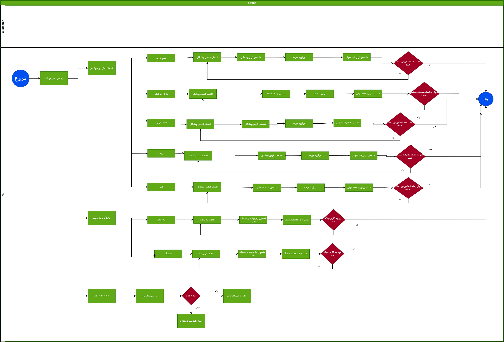
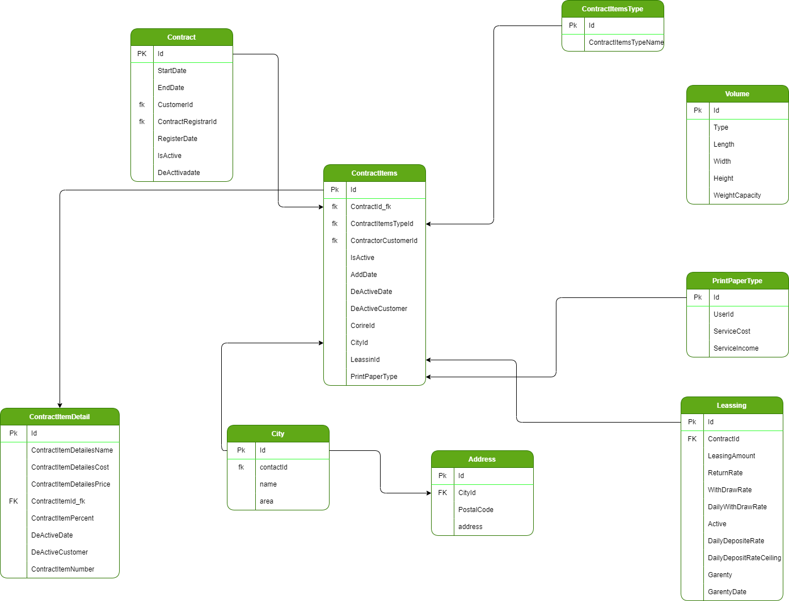

# Contract Service

---
پنل قرارداد مشتریان شامل سطوح مختلفی می باشد و مشتریان با توجه به نوع قرارداد خود می توانند از مشتری عادی که صرفا می تواند ثبت سفارش کند شریک در قسمتی از درآمد شرکت تبدیل شوند 
فورمول محاسبه هزینه ها به این صورت است که:
هزینه نهایی = هزینه پستی (9%+)+هزینه خدمات پستی(9%+) - تخفیفات
در فورمول بالا منظور از خدمات پستی سطوح پنل قرارداد است که در زیر اشاره شده است

- جمع آور
- توزیع کننده
- لفاف بندی
- پرینت
- ثبت سفارش
- انبار
- تخفیف ها
- بازاریابی
- لیزینگ

## افراد دخیل در ثبت سفارش

- جمع آور
- ثبت کننده
- بسته بند
- لیبل و پیرینت
- بازاریاب
- توزیع کنند
هر کدام از موارد ذکر شده یا بر اساس شهر فرستنده و گیرنده تعیین می شوند ویا به صورت اختصاصی در پنل قرارداد تعریف می شوند
نکته : هر کدام از این موارد می تواند به یک یا چند نفر اعمال شود
نکته دوم : برخی از موارد فوق باید توسط ادمین (مالی و ...) تایید شود
نکته سوم : هر کدام از گزینه ها دو نوع هزینه تعریف می شود 
  - هزینه تمام شده برای مشتری
  - هزینه برای پستکس

### دسترسی افراد تعریف شده در پنل قرارداد

- دسترسی به انواع ثبت سفارش
- امکان جمع آوری
- امکان توزیع
- آواتار (نشان تجاری )
- دسترسی به سرویس های پسکرایه سی او دی  
- امکان جمع آوری

## فاکتور خدمات پستی

- خدمات پایه پستی
- پیمه و غرامت اجباری
- خدمات فنی و مهندسی (مابه التفاوت قیمت پایه پستی تا مبلغ که مشتری برای خرید سرویس می بیند  )

### فاکتور خدمات ارزش افزوده

- جمع آوری
  - هزینه خرید سرویس
  - هزینه فروش
- بسته بندی
  - خرید
  - فروش
- ثبت سفارش
  - خرید
  - فروش
- لیبل و پرینت
  - خرید
  - فروش
- آواتار
  - فروش
- رهگیری پیامک
  - خرید
  - فروش
- نماینده یا بازاریاب
  - از خدمات فنی و مهندسی به احدی از بازاریابان می رشد
- خدمات ارزش افزوده نمایندگی(مبلغی بین صفر تا صد هزار تومان برای سفارش داخلی و مبلغ صفر تا دویست هزار تومان برای سفارش خارجی)
  - خرید
  - فروش(خرید-9%)

## دیاگرام مربوط به پنل قرارداد

[پنل قرارداد](Diagrams/BC1-CustumerPlan.drawio)

## دیتابیس سرویس قرارداد

[ContractService Database](Diagrams/ContractServiceDatabase.drawio)

## Method

[متد های پنل قرارداد](Diagrams/ContractServiceMethod.drawio)

- CreateEditContract
  ایجاد قرارداد جدید برای مشتری
- DeActiveCurrentContract
  غیرفعال سازی پنل قرارداد مشتری

### مدل های ورودی توابع

- Contract Items Model
  - ContractId
    شناسه قرارداد
  - CustomerId
    شناسه مشتری
  - RegistereContrctor
    ثبت نام
  - RegistereContrctorCost
    درصد ثبتنام کننده
  - PriningContrctorPrice
   هزینه های پرینت
  - AffiliateContrctor
   پنل همکاری در فروش
  - MarketingCommissionValue
   درصد بازاریابی
  - MarketingCommissionLeasing
   درصد بازاریابی لیزینگ
  - PackingContractor
    قرارداد بسته بندی
  - List<PackingItemForContractModel> PackingContractorItems
    موارد موجود در قرارداد بسته بندی
  - LeasingPercent
    درصد لیزینگ
  - ReturnRoofValue
    حداکثر مقدار برگشتی
  - DailyCrediteRoofValue
   سقف اعتبار روزانه
  - ShippingAcceptancePercentageValue
   درصد قبول مرسوله
  - CODPercent
    درصد پرداخت در محل

- Packing Item For Contract Model
  - CartoonItemsName
    نام ایتم بسته بندی
  - CartoonItemsCost
   هزینه بسته بندی
  - CartoonItemsPrice
   قیمت بسته بندی
