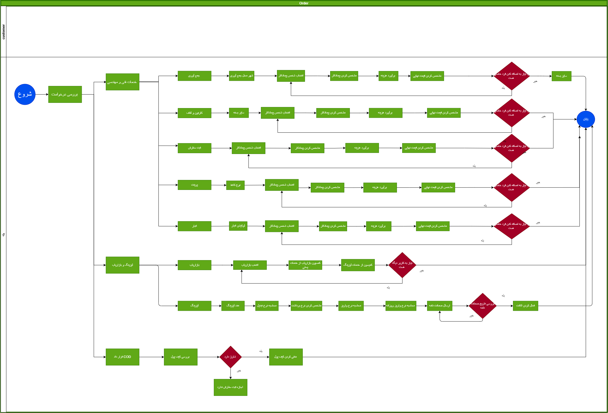
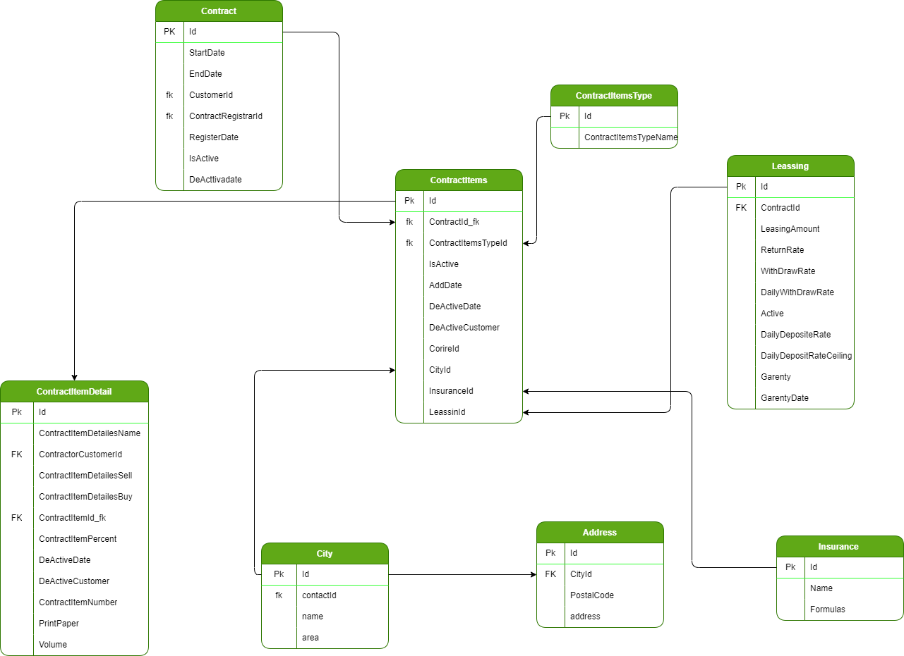

# Contract Service

پنل قرارداد مشتریان شامل موجودیت های مختلفی می باشد و مشتریان با توجه به نوع قرارداد خود می توانند از مشتری عادی که صرفا می تواند ثبت سفارش کند شریک در قسمتی از درآمد شرکت تبدیل شوند 
فرمول محاسبه هزینه ها به این صورت است که:

 هزینه نهایی = (هزینه پستی (9%+)- تخفیفات پستی )+خدمات ارزش افزوده(9%+)   

هزینه پستی یا مستقیم از API تامین کننده دریافت میگردد یا از سرویس قیمت گذاری گیت وی

در فرمول بالا منظور از خدمات ارزش افزوده موجودیت های مختلف پنل قرارداد است که در زیر اشاره شده است

## ثبت سفارش
  
  وابستگی های این آیتم 

افراد
## جمع آور
  
  وابستگی های این آیتم 

  شهر
 
  سایز

افراد -> تعداد بسته در سبد سفارش آن روز

## لفاف و بسته بندی
  
  وابستگی های این آیتم 

افراد

سایز

## پرینت
  
  وابستگی های این آیتم 

افراد
## انبار
  
  وابستگی های این آیتم 

لوکیشن و آدرس انبار ها

افراد
## توزیع کننده
  
  وابستگی های این آیتم 

  شهر
 
  سایز

افراد -> تعداد بسته در سبد سفارش آن روز

تعداد

---

## تخفیف ها
  
  وابستگی ها این آیتم
  سرویس ها 
  افراد - همکاری در فروش
## بازاریابی
    وابستگی ها این آیتم

  افراد - همکاری در فروش

## لیزینگ
  وابستگی ها این آیتم

COD

هر کدام موارد بالا رابطه یک به چند دارند :
  به عنوان مثال یک محصول یا سفارش ممکن است چند جمع آور داشته باشد مانند سیستم کالارسان

  - تخفیفات 
  درصد تخفیفات به دو صورت اعمال می شود 
  1- تخفیفات نماینده ها 

تخفبف نمایندندگی فقط به نماینده ها اعطا می شود و می توانند موقع ثبت سفارش از آن استفاده کنند 
افرادی که از تخفیف نمایندگی استفاده می کنند از بقیه تخفیف هانمیتوانند استفاده کنند

  سرویس پست پیشتاز 10 درصد 

  سرویس ماهکس 15 درصد 

  کالا رسان 20 درصد 

  چاپار 10 درصد 

  پیک هاب به صورت نرخ ثابت می باشد 
  در سرویس های بالا نوع سفارش پس کرایه در سرویس ها پیشتاز و چاپار درصد زکر شده اعمال می شود 
  2- مشتری 
  تخفیف در مجموع سفارشات با استفاده از کد تخفیف 
  همچنین برای مشتریان خاص مبلغ خاص بر روی مجموع سفارشات آن ها اعمال می شود
  

---

- آواتار
- پیامک

    وابستگی ها این آیتم

مبلغ خرید
- کارتون

  وابستگی ها این آیتم

سایز  
افراد 
- کاغذ پرینت
  
    وابستگی ها این آیتم

نوع کاغذ
افراد

- لفاف

  وابستگی ها این آیتم

قیمت خرید 
افراد

در صورتی که برای مشتری قرارداد خاص منعقد نگردد، قرارداد عمومی برای او استفاده می شود.
  - پیشفرض
   یک قرارداد عمومی برای تمامی مواردی که در محاسبه قیمت و .... تاثیر گذار هستند
  - اختصاصی
   برای فردی و مشتری خاصی در سیستم تعریف می شود به عنوان مثال جمع آوری در شهری که چند جمع آور داریم مثل تهران ، سفارشی که ثبت میشود به کدام یک اختصاص یابد.

## همکاران مرتبط با خدمات ارزش افزوده

- جمع آور
- ثبت کننده
- بسته بند
- لیبل و پرینت
- بازاریاب
- توزیع کننده

هر کدام از موارد ذکر شده یا بر اساس شهر فرستنده و گیرنده تعیین می شوند ویا به صورت اختصاصی در پنل قرارداد  همچنین بر اساس حجم  بسته و نماینده ای که داخل آن منتطقه وجود دارد یا خیر تعریف می شوند.
نکته : هر کدام از این موارد می تواند به یک یا چند نفر اعمال شود
نکته دوم : برخی از موارد فوق باید توسط ادمین (مالی و ...) تایید شود
نکته سوم : هر کدام از گزینه ها دو نوع هزینه تعریف می شود 
  - هزینه تمام شده برای مشتری
  - هزینه برای پستکس

> قراردادی که برای افراد تعیین می کنیم باید امکان فعال و غیرفعال سازی موارد زیر را داشته باشد
>   دسترسی به انواع ثبت سفارش 
> امکان جمع آوری
> امکان توزیع
 آواتار (نشان تجاری )
 دسترسی به سرویس های پسکرایه سی او دی  
 

## خدمات پستی

خدمات پستی شامل قیمت دریافت شده از  API + درصد افزایش موجود در سرویس محصول
مثال: 

پست: قیمت اعلامی از API(8000) + درصد افزایش (20%) = 9600

### فاکتور و رسید ارسال شده به مشتری
رسید خرید

فاکتور رسمی :
مبالغ فاکتور رسمی به صورت دو میلیونی می باشد و اگر مبلغ کمتر این مقدار باشد جمع سفارشات اعمال می شود و در فاکتور اعمال می شود 

###  خدمات ارزش افزوده
- بیمه و غرامت اجباری
  + به ارزش کالا
   فرمول محاسبه بیمه به صورت زیر می باشد:

   روش اول :

   بیمه = a% *ارزش کالا
   
  به عوان مثال
  800.000 * 0.1% = 800

روش دوم: رده ارزشی

0 تا 100 هزارتومان 0.3%

100 تا 300 هزار تومان 0.2%

- جمع آوری
  + افراد
  + حجم
  + شهر
   فرمول جمع آوری : 

   نرخ بسته براساس سایز آن = طول * عرض * ارتفاع

هزینه جمع آوری یک بسته = هزینه ثابت
هزینه جمع آوری بسته دوم اگر بسته یک سوم بسته اول سایز بسته دوم باشد هزینه هزینه بسته اول اعمال می شود
در غیر این صورت هزینه جمع آوری بسته دوم - هزینه جمع آوری بسته اول می شود و هزینه کلی سفارش برابر می شود با هزینه جمع آوری بسته اول + اختلاف هزینه بسته اول و دوم

فرمول دوم : 
حجم + شهر + فرد جمع آور 
در فرمول فول بر اساس شهر هزینه جمع آوری مغیر است و میتوان برای افراد مختلف هزینه های مختلف اعمال کرد 

توزیع و جمع آوری دونه ای داشته باشیم و برای هر سایزی یه قیمت خرید و یه قیمت فروش و براساس آن قیمت نهایی نمایش داده شود 
و یک رابطه یک به چند داشته باشد مثلا در شهری ما دو جمع اور با قیمت های یکی 100 و دیگری 500 داشته باشیم 

- بسته بندی
  + افراد
  + حجم
  + شهر
- ثبت سفارش
  + فرد
- لیبل و پرینت
  + افراد
- آواتار
- رهگیری پیامک
- نماینده یا بازاریاب
  - از خدمات فنی و مهندسی به احدی از بازاریابان می رشد
- خدمات ارزش افزوده نمایندگی(مبلغی بین صفر تا صد هزار تومان برای سفارش داخلی و مبلغ صفر تا دویست هزار تومان برای سفارش خارجی)
  - خرید
  - فروش(خرید-9%)

در هر سیستمی ما یک قیمت خرید داریم و یک قیمت فروش،درصد هایی که ما قیمت خرید میگیریم و و درصد مشخص آن را به فروش می رسانیم.
به عنوان مثال جمع آوری در تهران مبلغ 30 هزار تومان به صورت پیشفرض تعیین شده ولی فردی خارج از تهران یک بسته ثبت می کند که هزینه جمع اوری آن می شود 50 هزار تومان ما این مبلغ را به صورت اختصاصی در سفارشات این فرد اعمال می کنیم.

## دیاگرام مربوط به پنل قرارداد

[پنل قرارداد](Diagrams/BC1-CustumerPlan.drawio)

## دیتابیس سرویس قرارداد

[ContractService Database](Diagrams/ContractServiceDatabase.drawio)

## Method

[متد های پنل قرارداد](Diagrams/ContractServiceMethod.drawio)

- CreateEditContract
  ایجاد قرارداد جدید برای مشتری
- DeActiveCurrentContract
  غیرفعال سازی پنل قرارداد مشتری

### مدل های ورودی توابع

- Contract Items Model
  - ContractId
    شناسه قرارداد
  - CustomerId
    شناسه مشتری
  - RegistereContrctor
    ثبت نام
  - RegistereContrctorCost
    درصد ثبتنام کننده
  - PriningContrctorPrice
   هزینه های پرینت
  - AffiliateContrctor
   پنل همکاری در فروش
  - MarketingCommissionValue
   درصد بازاریابی
  - MarketingCommissionLeasing
   درصد بازاریابی لیزینگ
  - PackingContractor
    قرارداد بسته بندی
  - List<PackingItemForContractModel> PackingContractorItems
    موارد موجود در قرارداد بسته بندی
  - LeasingPercent
    درصد لیزینگ
  - ReturnRoofValue
    حداکثر مقدار برگشتی
  - DailyCrediteRoofValue
   سقف اعتبار روزانه
  - ShippingAcceptancePercentageValue
   درصد قبول مرسوله
  - CODPercent
    درصد پرداخت در محل

- Packing Item For Contract Model
  - CartoonItemsName
    نام ایتم بسته بندی
  - CartoonItemsCost
   هزینه بسته بندی
  - CartoonItemsPrice
   قیمت بسته بندی
