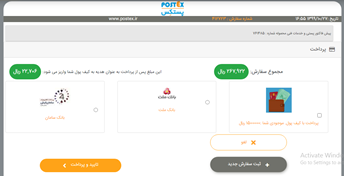

# Parcel Order Service

تمامی امور مربوط به مرسولات شامل ثبت مرسوله، تغییر وضعیت آن دریافت کد مرسوله دریافت بارکد پستی بر مبنای سرویس ارسال و دریافت محاسبه قیمتی مرسوله و... در این سرویس انجام خواهد شد
در این سرویس مشتریی که وارد سایت شده و اقدام به ثبت نام کرده می تواند ثبت سفارش (داخلی ، خارجی ، پرداخت در محل ،انبوه و سازمانی ) را انجام دهد همچنین دراین سرویس بعد از ثبت سفارش اقدام به تولید بارکد می شود و همچنین فعالیت بر روی سفارش مانند کنسل شده سفارش بر عهده این سرویس می باشد 
در سرویس پارسل ما امکاناتی داریم از قیبل ساخت پارسل که میتواند شامل یک سفارش یا مجموع سفارشات باشد 
تغییر استاتوس یا وضعیت سفارشات که شامل معلق ،درحال پردازش تکمیل شده و منصرف که هر کدام از این حالات وضعیت حال حاظر سفارش را توضیح می دهند مثلا وضعیتی که در حال پردازش است یه این معنیست که سفارش پرداخت شده ولی تایید نشده و با تایید آن می شود سفارش را به حالت تمکیل در آورد
از جمله دیگر امکانت می توان به پارسل ستینگ که تنظیمات کلی یک پارسل و تنظیمات را مشخص می کند و با محاسبه هزینه پارسل پرداختی های آن را مشخص می کنید

---

## Feature - امکانات

- Creat Parcel
- Parcel change status
- parcel seting
- Calculate Parsel Prise
- Get Postal barcode
- ExcelService
- Shipment Bundeling
- Set parcel number

### نیازمندی ها و قواعد کلی سرویس پارسل

- امکان ثبت سفارش
- امکان اصلاح سفارش
- محاسیه هزینه سفارش
- امکان تجمیع سفارشات
- امکان تولید شماره سفارش
- دریافت کد رهگیری
- امکان تعریف سفارشات به صورت پسکرایه و امن و پرداخت رایگان
- امکان تولید فاکتور بعد از پرداخت
- امکان انتخاب آدرس از میان آدرس های قبلی 

### قواعد کسب و کار برای مدیریت پارسل

- امکان بازبینی در ثبت سفارش
- ثبت سفارش یه صورت تکی و انبوه 
- تولید بارکد در صورتی که بارکد از سمت سرویس دهنده تولید نشده باشد 
- امکان کنسل کردن و عودت وجه 
- وارد کردن مواردی مانند ادرس گیرنده و فرستنده ، ابعاد مرسوله و ارزش ریالی کالا اجباری باشد 

---

## موجودیت ها

- Order
  - id
  - CustomerId
  شناسه مشتری 
  - OrderStatusId
  شناسه وضعیت سفارش
  - PaymentStatusId
  شناسه وضعیت پرداخت
  - PaymentMethodId
  شناسه روش پرداخت
  - AuthorizationTransActionId
  شناسه مجوز معامله
  - OrderTotal
  مجموع سفارشات
  - OrderTax
  مالیات سفارش
  - OrderDiscount
  تخفیف سفارش
  - PaidDate
  تاریخ پرداخت
  - CustomOrderNumber
  شماره سفارش
  - AffiiateId
  شناسه همکاری در فروش
  - RefundedAmount
  مبلغ بازپرداخت شده 
  - CustomerIp
  آی پی مشتری
  - OrderDate
  تاریخ سفارش
  - RelatedOrderId
- Parcel
  - Id
  شناسه
  - OrderId
  شناسه سفارش
  - TrackingNumber
  کد رهگیری
  - SenderAddressId
  آدرس فرستنده
  - ReceiverAddressId
  آدرس گیرنده
  - Description
  توضیحات سفارش
  - DeliveryStatus
  وضعیت ارسال
  - FinancialItemId
  شناسه آیتم های مالی
  - RelatedParcelId
  
- ParcelMileInfo
  - Id
  شناسه
  - ParcelId
  شناسه پارسل
  - MileInfoId
  شناسه اطلاعات
  - Priority
  اولویت ها

- MileInfo
  - Id
  - ServiceId
  - RelatedAgentId
  - RelatedbaykerId
  - AsignDate
  - ForceDoDate
  - MileType
  - AddressId
- ParcelDitails
  - Id
  - ContractCustumerId
  - ContractItemId
  - ContractItemDitaisName
  - ContractItemDitaisSell
  - ContractItemDitaisBuy
  - ContractItemPercent
  - DeActiveDate
  - DeactiveCustumer
  - ContractItemNumber
  - PrintPaper
  - Volume
  - InsuranceId
  - LeassingId
  
---

## متدها

- CreateOrder(OrderModel);
  متد ساخت سفارش
- CreateParcel(ParcellModel);
  ساخت پارسل
- PayOrder(Order);
  هزینه سفارش
- RefundOrder(Order);
 
- ChangeOrderStatus(OrderStatus);
  تغییر وضعیت سفارش
- CancelOrder(order);
  کنسل کردن سفارش
- CanelParcel();
  کنسل کردن پارسل
- CalcOrderPrice();
  محاسبه هزینه سفارش
- CalcParcelPrice();
  محاسبه هزینه پارسل
- CreateFinancialItem();
ساخت آیتم های مالی سفارش
- CreateMileInfo();
  
- BuildMileInfo();
  
- proccesmileInf();
  پردازش
- BeginAffterOrder();
  مراحل بعد از ثبت سفارش

---

## فرایند ها

### فرایند ثبت سفارش

در این مرحله کاربر بعد از ثبت نام در سایت می تواند با وارد کردن نوع ارسال و وارد کردن آدرس فرستنده ، مشخصات مرسوله و آدرس گیرنده اقدام به ثبت سفارش کنند.

#### ثبت سفارش داخلی - پیش کرایه و پس کرایه

سفارشات پیش کرایه سفارشاتی هستند که بایستی قبل از ارسال فرستنده یا ثبت کننده سفارش هزینه ارسال را پرداخت نماید و در صورت عدم پرداخت، برای سفارش کد رهگیری صادر نشده و سفارش جمع آوری و ارسال نخواهد شد. کد رهگیری این سفارشات و برای سرویس های واحد  تجارت الکترونیک 20رقمی می باشد
سفارش داخلی و ارسال مرسولات به صورت پیش کرایه یا پس کرایه و COD باید از گزینه   استفاده کرد. با کلیک روی گزینه "پست داخلی" صفحه ای نمایش داده می شود باید نوع سرویس را از این صفحه انتخاب کرد

در مرحله اول ثبت سفارش باید آدرس فرستنده را وارد کرد. برای ورود اطلاعات فرستنده دو گزینه وجود دارد. گزینه "انتخاب آدرس قبلی" برای مواردی است که آدرس مدنظر قبلا توسط آن مشتری و آن اکانت در سایت وارد شده باشد و با انتخاب این گزینه باکسی برای سرچ کردن آدرس قبلی وارد شده باز خواهد شد و همچنین آدرس جدید برای مواردی که قبلا انتخاب نشده باشند مطابق با شکل زیر ثبت میکنیم

بعد از پر کردن اطلاعات فرستنده و زدن دکمه "ثبت اطلاعات مرسوله و گیرنده" وارد مرحله بعدی که ثبت اطلاعات مرسوله می باشد وارد می شویم

برای ثبت سفارش مرسوله بایستی محتویات بسته ارسالی را در باکس "محتویات مرسوله" مانند نمونه ای که در خود باکس وجود دارد، وارد کرد. وزن مرسوله را همراه با بسته بندی انجام شده برای آن به گرم در باکس "وزن مرسوله (گرم)"، و ارزش ریالی مرسوله را در باکس "ارزش ریالی محتویات مرسوله" وارد می کنیم. وارد کردن ارزش ریالی مرسوله برای استفاده از بحث بیمه در صورت مفقود شدن یا آسیب به مرسوله ضروری است. باکس مربوط به "تعداد بسته پستی" نیز برای مواردی است که فرستنده قصد ارسال بیش از 1 مرسوله با مشخصات یکسان (محتویات، وزن، ارزش ریالی، ابعاد، فرستنده و گیرنده) را دارد. در این صورت باید عدد موجود در این باکس را به تعداد مرسولات موجود تغییر داد سپس در مرحله پرداخت به همان تعداد مرسوله هزینه پرداخت کرده و در نهایت به همان تعداد هم کدرهگیری صادر خواهد شد، که عدد پیش فرض موجود در این باکس 1 می باشد چنانچه تعداد مرسولات در این بخش تغییر داده شد، وزن و ارزش ریالی و سایر موارد مرسولات نباید به صورت تجمیعی وارد شود. در زمان ثبت یک سفارش علاوه بر وارد کردن وزن دقیق مرسوله، بایستی ابعاد آن را نیز از لیست ابعاد موجود در قسمت "حدود اندازه مرسوله (طول*عرض*ارتفاع)" انتخاب کرد.
بعد از وارد کردن سایز کارتون نوبت به وارد کردن بیمه مرسوله می باشد و در انتها باید ید آدرس گیرنده را وارد کنیم 

 بعد از وارد کردن آدرس گیرنده با تایید کردن قوانین پستکس وارد مرحله بعد یعنی انتخاب نوع سرویس پستی می شویم
 
 در صورتی که از پس کاریه استفاده می کنیم لیست سرویس ها به صورت زیر می باشند 
  

 با انتخاب سرویس مورد نظر و ورود به مرحله بعدی ثبت سفارش، صفحه زیر نمایش داده خواهد شد:
  
  چنانچه تعداد مرسولات شما بیش از 1 مرسوله باشد می توانید در این قسمت از ثبت سفارش با استفاده از دکمه   مجددا وارد صفحه ورود اطلاعات مرسوله جدید و گیرنده خواهید شد.
  مرحله بعدی مربوط به پرینت فاکتور سفارش است.در این قسمت مشتری می تواند انتخاب کند به چاپ فاکتور نیاز دارد یا خیر 
  
   در مرحله آخر با زدن دکمه ثبت سفارش وارد مرحله پرداخت هزینه می شود که مشتری قادر است سفارش خود را از طریق کیف پول و یا درگاه پرداخت انجام دهد 

#### ثبت سفارش انبوه و سازمانی

 گزینه "سفارش سازمانی" نیز به مشتری امکان ثبت سفارش به تعداد زیاد با استفاده از فایل اکسل را می دهد. این نوع ثبت سفارش مبلغ21800ریال حق ثبت روی هر سفارش اعمال میشود. بایستی با توجه به پیش کرایه یا پس کرایه بودن سفارش، فایل اکسل مورد نظر را دانلود و پر و در نهایت در سایت آپلود کرد.  در وارد کردن اطلاعات فایل اکسل باید به یک نکته دقت کرد که برخی سلول های این فایل دارای مقادیر از قبل تعریف شده و لیست هستند که مقادیر این سلول ها باید از داخل کشویی و لیست موجود انتخاب شود و برخی سلول های دیگر این فایل اکسل، دارای مقادیر قبلی نبوده و اطلاعات آنها باید به صورت دستی پر شود. ستون آخر فایل اکسل "ارزش افزوده" نام دارد. این ستون در واقع همان باکس "مبلغ خدمات نمایندگی" مربوط به نماینده هاست که باید جمع هزینه جمع آوری، بسته بندی و پرینت فاکتور در این قسمت به ریال وارد شود.

بعد از پر کردن فایل اکسل انبوه و قبل از آپلود در سایت باید "نوع مرسوله" را مشخص نمود. این فیلد دارای 3 مقدار "پست داخلی"، "پست داخلی-پرداخت توسط گیرنده"، و "پست بین المللی"  "سرویس خصوصی ماهکس" "پس کرایه ماهکس" "یارباکس" " چاپار" "حمل اوبار "می باشد چنانچه فایل اکسل سفارشات پیش کرایه توسط مشتری پر شد باید "پست داخلی"، فایل اکسل پس کرایه یا COD پر شد گزینه "پست داخلی-پرداخت توسط گیرنده" و چنانچه قصد ارسال به خارج از کشور را داشت باید فایل اکسل سفارشات پیش کرایه را پر کرده و  گزینه "پست بین المللی" را انتخاب نماید.

در ثبت سفارش انبوه  داخل سایت و بدون حق اشتراک سالیانه می باشد. با کلیک روی "سفارش انبوه" صفحه زیر را مشاهده خواهید کرد.

در بخش اول، بخش "اطلاعات سفارش" باید آدرس فرستنده و سایر موارد را وارد کرد. در بخش "اطلاعات مرسوله" مانند فایل اکسل به تعداد مرسولات بایستی سطر ایجاد شده و اطلاعات مرسولات در سطرها صورت کامل  وارد شود. برای ایجاد سطر می توان با وارد کردن تعداد سطر مورد نیاز  از دکمه    یا علامت "+" پایین جدول استفاده کرد.
در نهایت که به محض زدن دکمه "ثبت سفارش انبوه"، برای پرداخت هزینه سفارش وارد درگاه بانکی خواهید شد.

#### ثبت سفارش خارجی 

تمامی روند ثبت سفارش و ورود اطلاعات جهت سفارش بین المللی مانند ثبت سفارش های داخلی است ما این تفاوت که در آدرس گیرنده باید کشور گیرنده را سرچ و انتخاب کرد و اطلاعات گیرنده را حتی الامکان باید به صورت لاتین وارد نمود. در مرحله انتخاب نوع سرویس هم شرکت های خصوصی که ارسال به سایر کشورها را انجام می دهند
همانند ثبت سفارش داخلی ابتدا آدرس فرستنده را وارد می کنیم سپس وارد قسمت اطلاعات مرسوله می شویم

در این مرحله توجه داشته باشید بار گزاری تصاویر مرسولات الزامی می باشد
 در مرحله بعد باید انتخاب آدرس گیرنده را تکمیل کنید
 
 و بعد از آن نوبت یه انتخاب سرویس دهده پستی می رسد

 
بعد از انتخاب سرویس دهنده و ثبت سفارش تیم پشتیبانی با شرکت ارسال کننده تماس میگیرد و جزئیات سفارش را بیان می کند و شرکت در صورت قیمت نهایی را اعمال میکند که این قیمت به صورت پیامک به مشتری ارسال می شود و با پرداخت مبلغ  سفارش ثبت و وضعیت آن تکمیل می شود

#### کنسلی سفارش

فرایند کنسل کردن کردن سفارش به چند صورت انجام می شود
1- سفارشاتی که هزینه آن ها پرداخت نشده و وضعیت آن ها معلق است 
2-  سفارشاتی که هزینه های آن ها پرداخت شده  ولی جمع آوری انجام نشده است
3- سفارشاتی که هزینه ی آن ها پرداخت شده و  جمع آوری انجام شده است 
در مورد اول کنسلی انجام می شود و هزینه پرداخت نشده که برگردد 

در مورد دوم هزینه بارکد در صورتی که صادر شده باشد کسر می شود و مابقی بازگردانده می شود
در مورد سوم هزینه بارکد و هزینه جمع آوری کسر می شود و ما بقی عودت داده میشود
در حالتی که مرسوله تحوویل کوریر پستی ذلذه شذه باشد امکان کنسلی سفارش وجود ندارد

---

## دیاگرام ها

[دیاگرام تولید بارکد](Diagrams/Barcode-reproduction.drawio)

[دیاگرام ثبت سفارش داخلی](Diagrams/inner-order.drawio)

[دیاگرام ثبت سفارش داخلی پسکرایه](Diagrams/innerCod-order.drawio)

[دیاگرام ثبت سفارش داخلی پسکرایه](Diagrams/cod-order.drawio)

[دیاگرام ثبت سفارش سازمانی](Diagrams/sazmani-order.drawio)

[دیاگرام ثبت سفارش انبوه](Diagrams/anboh-order.drawio)

[دیاگرام ثبت سفارش خارجی](Diagrams/Foreign-order.drawio)

[دیاگرام کنسلی](Diagrams/cancel%20order.drawio)

[دیاگرام کنسلی پس کرایه](Diagrams/cancel%20cod%20order.drawio)
