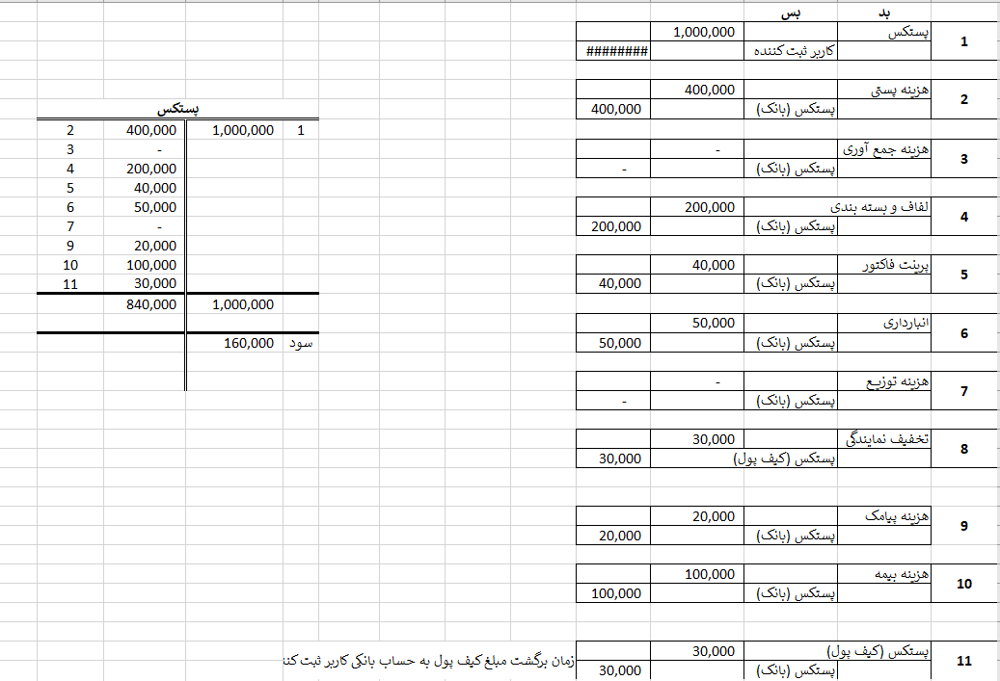
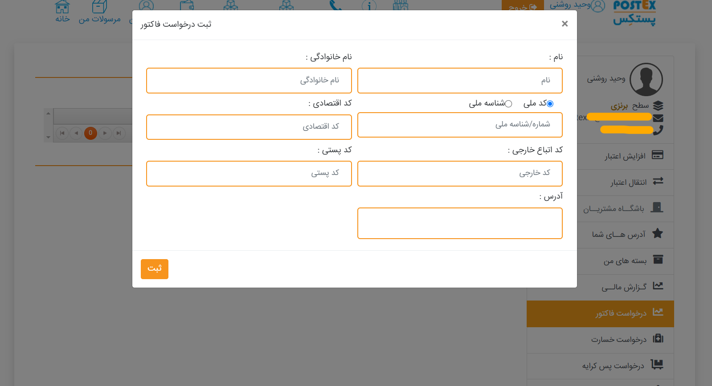
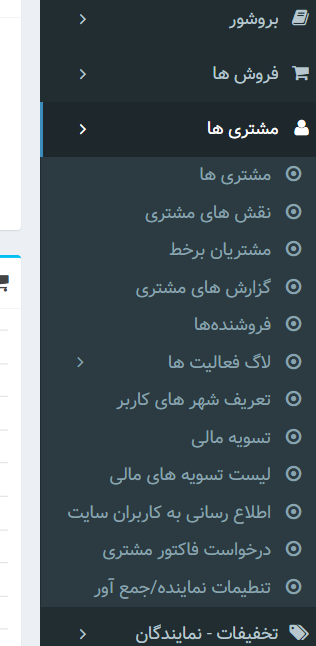
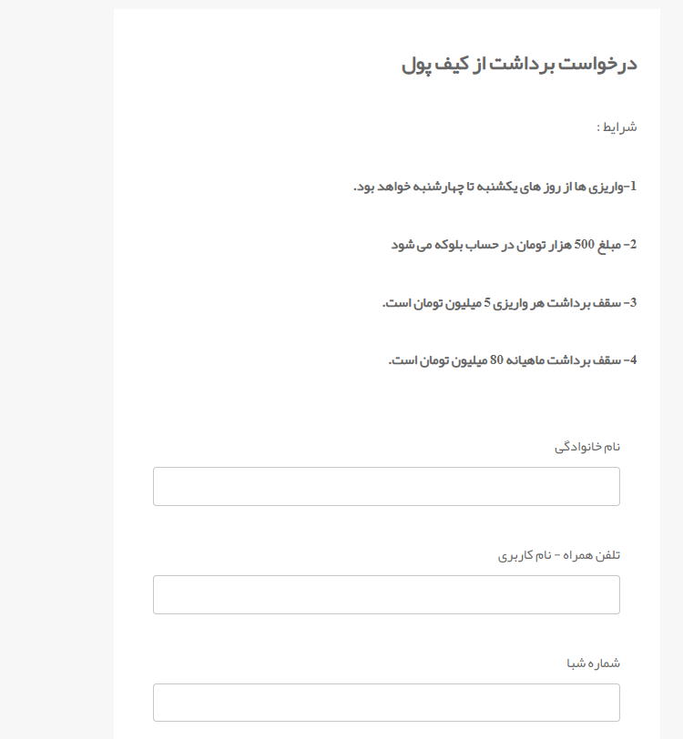
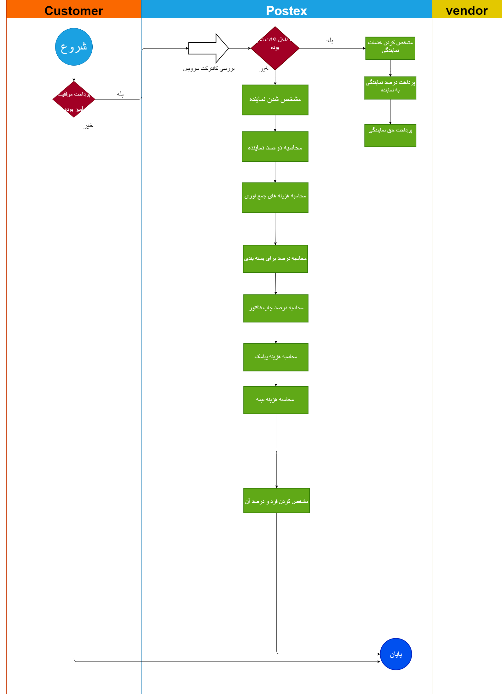
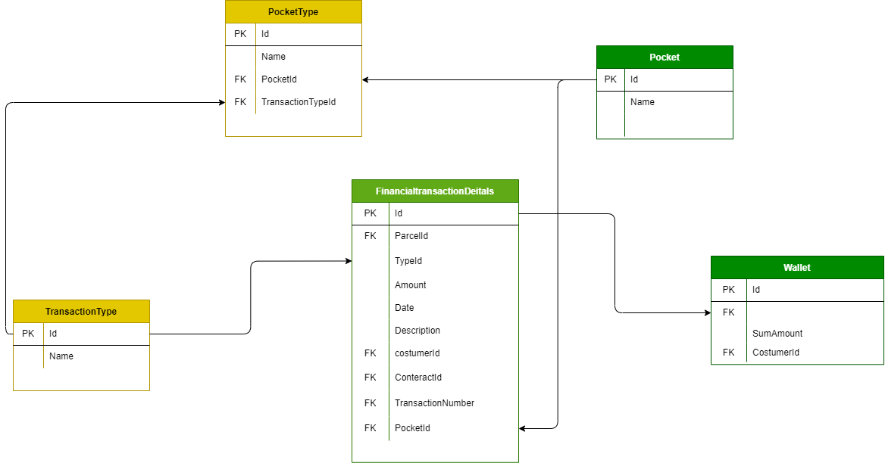
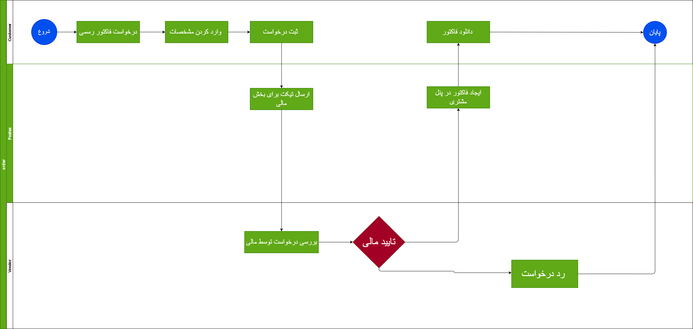
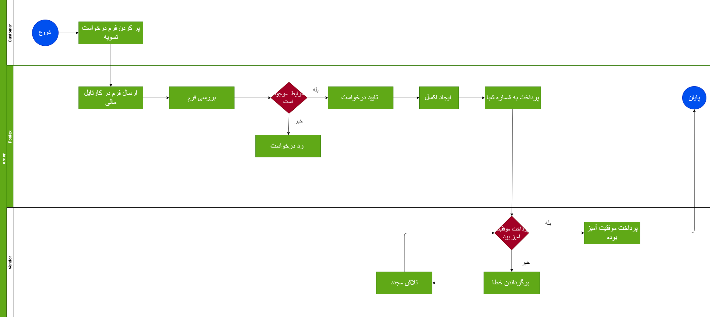
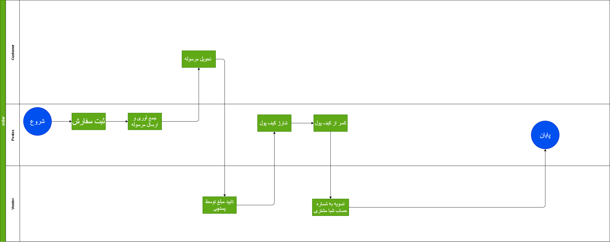

# Accounting service

## مقدمه

تمامی اتفاقات مالی شامل تعریف قراردادهای مختلف مبتنی بر آنچه اکنون کار می شود، پرداختی های آنلاین و غیر آنلاین، تسهیم وجود در کیف پول، گیفت کارتها، پروموشن های تشویقی، تخفیفات در این سرویس انجام خواهد شد. لیزینگ نیز در این بخش تعریف خواهد شد
در فرایند اکانتینگ بعد از ثبت سفارش در ابتدا بخش مربوط به کانترکت بررسی می شود و با توجه به قرارداد افرادی زی نفع ثبت سفارش درصد های خود را دریافت خواهند کرد به عنوان مثال بعد از ثبت سفارش  نماینده و جمع آور سفارش مشخص می شود و اگر سفارش شامل بسته بندی بود درصد آن مشخص شده و سهم شرکت هم مشخص می شود

---

## Feature

- Cashout
- Wallet
- Refound
- Financial promotion
- Gifts

### نیازمندی ها سرویس مالی

- تعریف کیف پول 
- امکنا برداشت و واریز به کیف پول 
- گزارش گیری از کیف پول 
- امکان محاسبه هزینه ها بعد از ثبت سفارش
- امکان پرداخت موارد قرارداد به صورت دستی یا اتوماتیک 
- امکان دریافت گزارش مالی 
- امکان دریافت گزارشات مربوط به ثبت سفارشات

### قواعد کسب و کار برای سرویس مالی

- امکان ثبت سفارش با کیف پول
- افزایش اعتبار کیف پول
- امکان منفی کردن کیف پول برای لیزینگ و برگشتی پسکرایه و جریمه وجود داشته باشد
  
---

## موجودیت ها

### FinancilaTransactionDeitals

- Id
  شناسه
- parcelId
  شناسه سفارش
- TypeId
  شناسه نوع درخواست
- Amount
  مبلغ پرداختی
- Date
  تاریخ ثبت
- Description
  توضیحات
- CustomerId
  شناسه مشتری
- ContractId
  شناسه قرارداد
- PocketId
  شناسه جیب
- TransactionNumber
  شماره تراکنش

### PocketType

- Id
  شناسه
- Name
  نام
- PocketId
  شناسه جیب
- TransactionTypeId
  شناسه نوع پرداخت

### TransactionType

- Id
  شناسه
- Name
  نام

### Pocket

- Id
  شناسه
- Name
  نام

### Wallet

- Id
  شناسه
- FinancialtransactionDeitalsId
  شناسه جزئیات پرداخت
- SumAmount
  جمع پرداخت
- CustomerId
  شناسه مشتری

---

## متدها

- RegisterTranscation(ParcelId?,PocketTypeId,Amount,Date,Description,costumerId,ConteractId?,TransactionNumber?)
 ثبت یک تراکنش توسط سرویس های دیگه میتواند فراخوانی شود
- UpdateWalletAmount(CustomerId,Amount)
  بروزرسانی کیف پول برای کاهش و افزایش مقدار کیف پول 
- GetTransactionList(CustomerId,StartDate,EndDate)
  برای ویو است لیستی ار تراکنش هارا نمایش می دهد

---

## فرایند ها

### after Order

بحث پنل قرارداد را میتوان جز از بحث مالی در نظر بگیریم
در این فرایند بعد از ثبت سفارش در ابتدا به بررسی کانترکت می پردازیم و به این موضوع می پردازیم که مشتری دارای قرارداد هست یا خیر اگر هست قرارداد اعمال می شود و در غیر این صورت قرارداد پیشفرض اجرا می شود.

در زمانی نماینده خود ثبت سفارش انجام دهد دو مبلغ دریافت می کند که یک حق نمایندگی و دو خدمات نمایندگی است برای محاسبه خدمات نمایندگی با توجه به مبلغی که خود نماینده موقع ثبت سفارش وارد میکند محاسبه می شود و این مبلغ اگر کمتر از 5 هزار تومان باشد مبلغ 500 تومان و اگر مبلغ بالای 5 هزار تومان باشد ده درصد آن  به عنوان سهم پستکس از  ارزش افزوده نمایندگی کسر می شود 
هزینه های ما شامل یک قیمت خرید و یک قیمت فروش می باشد و از اختلاف این دو عدد سود شرکت را به دست می آوریم
بعصی از این آیتم ها در پرداخت آن ها تاخیر و تقدم دارند و وابسته به استاتوس های آن ها می باشند و فرایند پرداخت به شخص مورد نظر تا فعالیت انجام نگیرد اتفاق نمی افتد ، مانند توزیع تا فرایند توزیع انجام نگیرد هزینه ای پرداخت نمی شود
در اکانتینگ ما نیاز به ثبت ریز تراکنش ها داریم که در جدول زیر به بررسی آن ها پرداخته ایم
|Accounting Item     | Descreption|
|:-------- | :------:|
|type      | Wallet charging ،Order |
|Date      | Order registration date |
|Transaction number      | Transaction number  |
|Customer      |Agent , Customer |
|Parcel      | parcel type  |
|contract      | contract type (default or custom) |
|port      | Which bank |

#### روند اصلی بعد از ثبت سفارش

زمانی که ثبت سفارش انجام می گیرد مبلغ وارد درگاه می شود این مبلغ به عنوان درآمد شناسایی می شود 
هر ماه هزینه پیامک برای یک ماه ثبت می شود که این مبلغ به عنوان هزینه مشخص می شود 
ماهانه هزینه ی توزیع و جمع آوری نماینده و لیبل و کارتون و بسته بندی مشخص و به نماینده و افراد ذی نفع پرداخت می شود که این هزینه را به عنوان هزینه شناسایی می شود.
هر ماه بابت جمع هزینه های پستی یک سند ثبت می شود که پرداختی به شرکت های مرسوله (پست ، چاپار ، ماهکس ) که هزینه ها پستی لحاظ می شود 
در برگشتی کیف پول از درآمد کم می کنیم و به حساب شخص اول ارسال می شود 

### فرایند در خواست فاکتور رسمی 

برای درخواست فاکتور رسمی مشتری ابتدا باید وارد حساب کاربری خود شود و از قسمت درخواست فاکتور رسمی اقدام به ثبت درخواست کند 
برای این عمر ابتدا باید مطابق تصویر زیر مشخصات خود را تکمیل کند 

سپس برای مالی یک تیکت ارسال می شود و بعد از تایید قسمت مالی فاکتور برای دانلود ایجاد می شود.

مشتری می تواند از قسمت فاکتور رسمی اقدام به دانلود کند 
همچنین اگر نیاز به فاکتور فیزیکی داشته باشد می تواند با تیکت به قسمت مالی درخواست خود را ثبت کند.

### فرایند درخواست برداشت از کیف پول

برای برداشت از کیف پول ابتدا مشتری باید فرم درخواست برداشت از کیف پول را پر کند بعد از آن درخواست در کارتابل مالی قرار میگیرد و مسئول مربوطه بعد از تایید درخواست مبلغ را شماره شبا مشتری واریز می کند 

---

## دیاگرام ها

[بعد از ثبت سفارش](Diagrams/AfterOrderAccounting.drawio)

[موجودیت ها](Diagrams/AccountingERD.drawio)

[درخواست فاکتور رسمی](Diagrams/Factor-rasmi.drawio)

[درخواست برداشت از کیف پول](Diagrams/Liquidation-wallet.drawio)

[تسویه پسکرایه](Diagrams/CODPlan.drawio)

