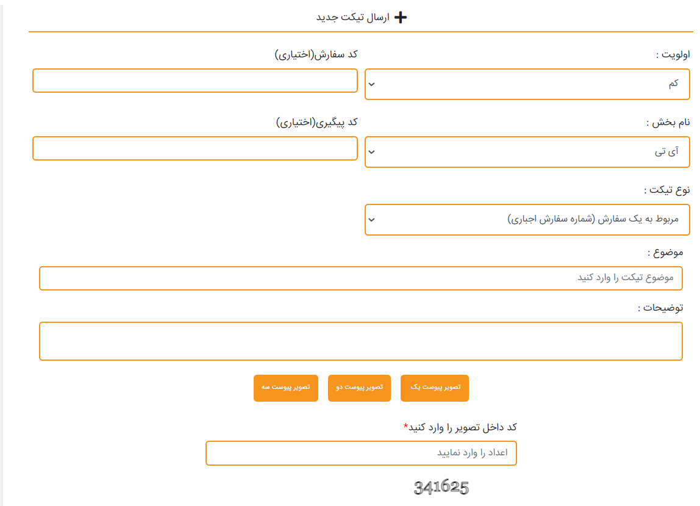
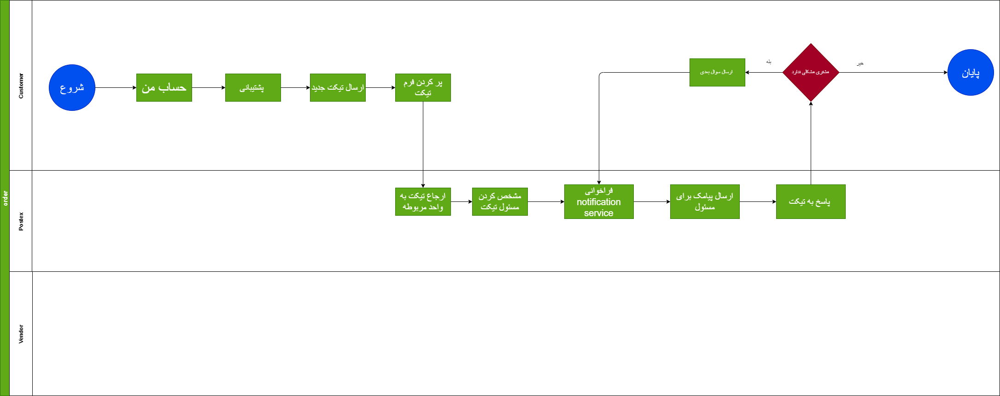

# Agent Service

## مقدمه

این سرویس راه ارتباطی مشتری و همکاران در سیستم است و با انتخاب این سرویس مشتری می تواند با بخش های مانند مالی ، پشتیبانی ، امور نمایندگی و آی تی ارتباط برقرار کند همچنین در این سرویس امکان آپلود فایل نیز وجود دارد

---

## Feature

- Ticket CRUD
- Ticket Follow up

---

## موجودیت ها

### TicketingDetails

- id
  شناسه
- TicketingOwnerId
  شناسه ایجاد کننده تیکت
- TicketingDepartmentId
  شناسه دپارتمان مربوطه برای ارجاع تیکت
- assigniId
  شناسه شخص مورد نظر جهت ارجاع تیکت
- CloserById
  شناسه فرد خاتمه دهنده تیکت
- LastAnswer
  اخرین فرد بازدیدکننده
- TicketingStatus
  وضعیت تیکت (بسته یا باز)
- Subject
  موضوع تیکت
- DeadLine
  طول عمر تیکت
- Date
  تاریخ ایجاد تیکت

### TicketingDepartment

- Id
  شناسه 
- Name
  نام دپارتمان
- CustomerId
  افردا موجود در دپارتمان 

### assigni

- Id
  شناسه
- Name
  نام فرد
- TicketingDepartmentId
  شناسه دپارتمان ارجاع داده شده
- CustomerId
  شناسه کارمند ارجاع خورده

### CloserBy

- Id
  شناسه
- Name
  نام فردی که تیکت را می بندد
- TicketingDepartmentId
  شناسه دپارتمان فرد خاتمه دهنده
- CustomerId
  شناسه کارمند خاتمه دهنده به تیکت
  
### TicketingOwner

- Id
  شناسه
- Name
  نام مشتری ایجاد کننده تیکت
- ParcelId
  شناسه سفارش ثبت شده که میتواند به صورت خالی یا همراه با شماره سفارش باشه
- CustomerId
  شناسه مشتری ایجاد کننده تیکت
- TrackingNumber
  کد رهگیری مرسوله

---

## متدها

---

## فرایند ها

مشتری می تواند وارد حساب کاربری خود شود و با انتخاب پشتیبانی تیکت خود را ثبت کنند

---

## دیاگرام ها

[دیاگرام بخش تیکت](Diagram/Diagram-Ticket.drawio)

