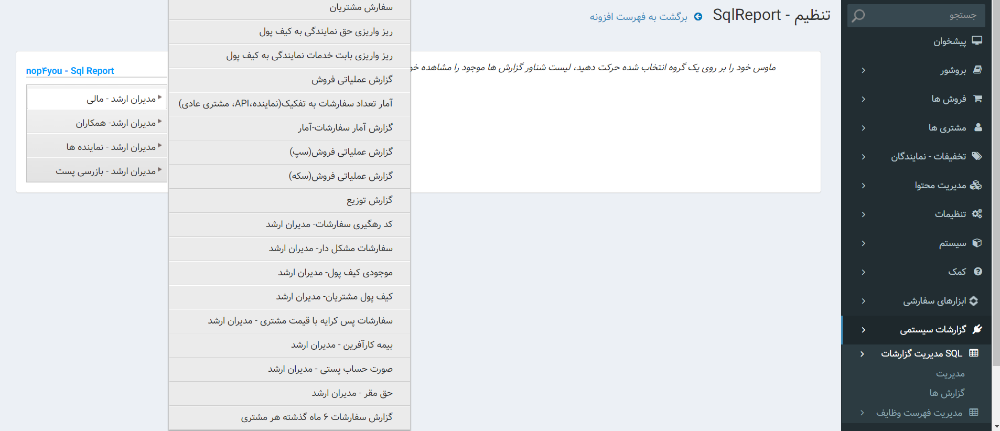
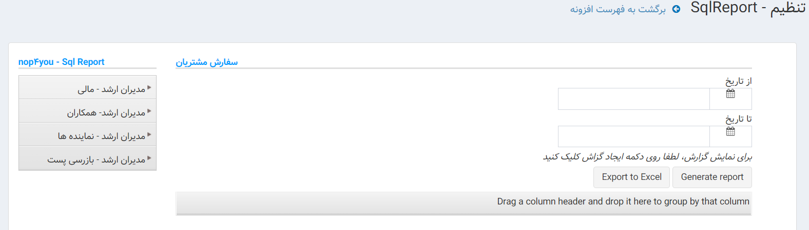
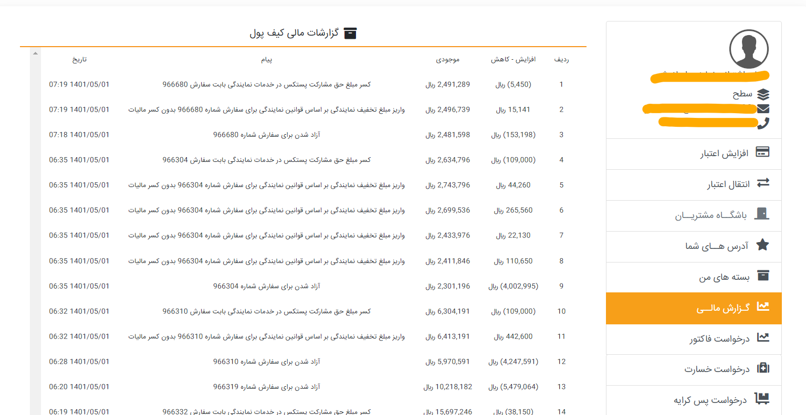
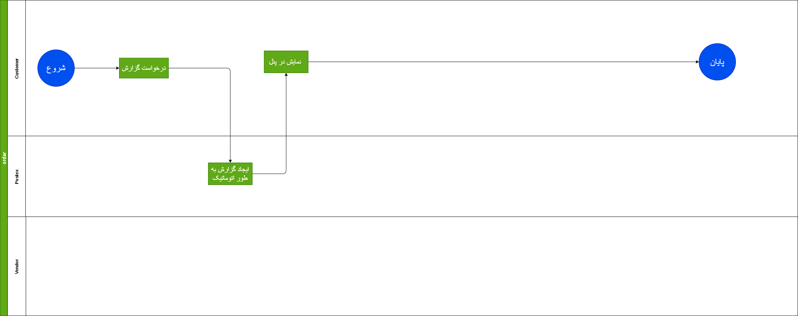

## مقدمه

در سیستم ما گزارشات مختلفی داریم که هر کدام از آن ها از قسمت های مختلفی گزارش تهیه می کند و به صورت اکسل می توان از آن خروجی گرفت 
افراد با رول های مختلفی دسترسی به این گزاراشات دارند و همه افراد دسترسی به همه گزارشات ندارند

---

## Feature

- Show Reports
- Customize Reports
- Print Reports
- Make Queue
- Create Invoice
- Create Offline Reports
- Merg Reports

### نیازمندی ها و قواعد کلی سرویس گزارشات

- امکان ساخت گزارش 
- امکان ایجاد فیلتر های مختلف بر روی گزارشات 
- دانلود اکسل گزارشات 
- امکان یکسان کردن چند گزارش
- خروجی مناسب برای هر گزارش
- نمایش گزارشات

### قواعد کسب و کار برای مدیریت گزارشات

- محدود کردن گزارشات بر اساس سطح دسترسی کاربران 
- امکان گزارش گیری از مرسولات ثبت شده 
- اعمال محدودیت زمانی و تعداد رکورد های گزارش به عنوان مثال گزارشات به صورت 20000 رکورد و یا اعمال محدودیت 30 روزه بر روی گزارشات که بعد از زمان فوق پاک شود به طور خودکار 

---

## موجودیت ها

---

## متدها

---

## فرایند ها

در سیستم لیست گزارشاتی که نیاز داریم  از جمله این گزارشات می توان به

### گزارشات مشتری ، نماینده

- گرازش سفارشات ثبت شده با جزئیات 
  - کد رهگیری
  - شماره سفارش
  - نوع سفارش
  - روش پرداخت 
  - تاریخ ثبت 
  - استان مبدا
  - شهر مبدا
  - شهر مقصد 
  - تخفیف نماینده
  - خدمات نمایندگی 
  - بیمه
  - پیامک 
  - حق ثبت
  - جمع آوری 
  - کارتون و لفاف بندی
  - لیبل و فاکتور 
  - مبلغ فاکتور مرسوله
  - مبلغ هزینه پستی مرسوله
  - مبلغ کل سفارش
  - مبلغ کل سفارش رده وزنی
- گزارش کیف پول
  - مانده کیف پول
  - کسر/اضافه
  - شرح
  - تاریخ
- بارکد میله ای
  - کد رهگیری 
  - بارکد میله ای
- گزارش توزیع - نماینده
  - شماره سفارش
  - کد رهگیری
  - تاریخ ثبت 
  - وزن تراوزنی
  - ابعاد
  - حق السهم کارتن و بسته
  - حق السهم چاپ فاکتور
  - حق السهم جمع آوری
  - حق السهم جمع آوری محموله
  - تاریخ ارجاع
  - تاریخ جمع آوری 
  - فرستنده
  - استان 
  - شهر 
  - آدرس
- گزارش  جمع آوری-نماینده
  - تاربخ انتصاب
  - ابعاد
  - شناسه سفارش
  - کد رهگیری
  - استان مقصد
  - شهر مقصد
  - مبلغ پرداختی
  - تاریخ سفارش
  
### گزارشات پشتیبانی

- گزارش بارکد های کنسلی
  - نام کاربری
  - کد رهگیری
  - شماره سفارش
  - نوع سفارش
  - روش پرداخت 
  - تاریخ ثبت 
  - تخفیف نماینده
  - خدمات نماینده
  - بیمه
  - پیامک
  - حق ثبت
  - جمع آوری
  - کارتون و لفاف بندی
  - مبلغ فاکتور مرسوله
  - مبلغ هزینه پستی مرسوله
  - مبلغ کل سفارش
  - علت کنسلی
- گزارش بارکد های تولید شده
  - مبلغ سفارشات 
  - ارزش کالای سفارش
  - تعداد 
  - تاریخ ثبت
- سفارشات معلق
  - نام کاربری
  - کد رهگیری
  - شماره سفارش
  - تاریخ ثبت
  - وضعیت
- مشتریان بار اولی
  - نام کاربری
  - کد رهگیری
  - شماره سفارش
  - نوع سفارش
  - تاریخ ثبت 
  - وضعیت

### گزارشات امور نمایندگی

- گزارش عملکرد روزانه نمایندگان
  - نام کاربری
  - نام نماینده
  - تعداد سفارشات ثبت شده 
  - تعداد سفارشات جمع آوری شده 
  - تعداد سفارشات کنسل شده
  - جمع هزینه پستی
  - جمع کل سفارشات
- نمایندگان فعال
  
  
### گزارشات مالی 

- گزارش رهگیری
  - شماره کاربری
  - کد رهگیری
  - شماره سفارش
  - نوع سفارش
  - روش پرداخت
  - تاریخ ثبت
  - استان مبدا
  - شهر مبدا
  - شهر مقصد
  - تخفیف نمایندگی
  - خدمات نمایندگی
  - بیمه
  - پیامک
  - حق ثبت
  - جمع آوری
  - کارتون و لفاف بندی
  - لیبل و فاکتور
  - مبلغ فاکتور
  - مبلغ هزینه پستی
  - مبلغ کل سفارش
  - رده وزنی
- گزارش  تعداد سفارشات به تفکیک(نماینده،API، مشتری عادی)
  - تعداد سفارشات نمایندگان
  - تعداد سفارشات مشتریان
  - تعداد سفارشات API
- صورت حساب تامین کنندگان خدمات - مدیران ارشد
  - نام طرف حساب
  - نوع حساب
  - کد رهگیری
  - شماره سفارش
  - تاریخ
  - مبلغ هزینه پستی
- گزارش ریز سفارشات
  - شماره کاربری 
  - کد رهگیری
  - شماره سفارش
  - نوع سفارش
  - روش پرداخت 
  - تاریخ ثبت
  - استان مبدا
  - شهر مبدا
  - شهر مقصد
  - تخفیف نماینده
  - خدمات نمایندگی
  - سود بیمه
  - سود پیامک
  - سود حق ثبت
  - سود جمع اوری
  - سود کارتون و بسته 
  - سود لیبل و فاکتور
  - سود مرسوله
  - رده وزنی
  - محتوا سفارش
- گزارش COD
  - شماره کاربری 
  - کد رهگیری
  - شماره سفارش
  - نوع سفارش
  - روش پرداخت 
  - تاریخ ثبت
  - استان مبدا
  - شهر مبدا
  - شهر مقصد
  - تخفیف نماینده
  - خدمات نمایندگی
  - سود بیمه
  - سود پیامک
  - سود حق ثبت
  - سود جمع اوری
  - سود کارتون و بسته 
  - سود لیبل و فاکتور
  - سود مرسوله
  - ارزش کالای دریافتی از مشتری
  - رده وزنی
  - محتوا سفارش
  - وضعیت مرسوله
- گزارش جمع آوری 
  - جمع آور
  - شماره سفارش
  - کد رهگیری
  - تاریخ ثبت
  - وزن تراوزنی
  - ابعاد
  - حق السهم کارتن و یسته
  - حق السهم چاپ فاکتور
  - حق السهم جمع آوری
  - حق السهم جمع آوری محموله
  - تاریخ ارجاع به جمع آوری 
  - تاریخ جمع آوری
  - فرسنتنده
  - استان 
  - شهر 
  - آدرس
- گزارش توزیع 
  - نام کاربری
  - توزیع کننده
  - تاریخ انتصاب
  - ابعاد
  - شناسه سفارش
  - استان مقصد 
  - شهر مقصد
  - مبلغ پرداختی
  - تاریخ سفارش
- گزارش کیف پول 
  - نام کاربری
  - نام مشتری/ نماینده
  - مانده کیف پول
  - کسر/ اضافه
  - شرح
  - تاریخ
- ریز تسویه حساب پس کرایه ها
  - نام کاربری
  - نام مشتری 
  - شماره سفارش
  - کد رهگیری
  - تاریخ واریز مبلغ COD
  - مبلغ COD
  - تاریخ تسویه
- تعداد سفارشات هر مشتری
  - نام کاربری
  - تعداد سفارشات
- لاگ فعالیت همکاران
  - کاربر همکار
  - تاریخ و ساعت ورود
  - تاربخ و ساعت خروج
- گزاراش لیزینگ

### پیشخوان سایت 

- گزارش تعداد سفارشات 
- گزارش تعداد مشتریان جدید ثبت نام شده 
- گزارش نوع سرویس سفارشات 
- تعداد و مبلغ سفارشات معلق و تکمیل و کنسل شده 

همر یک گزارشات بالا توسط اپراتور سیستم قابل استخراج است و افرادی که رول مدیران ارشد دارند می توانند گزارشات را تهیه کنند 
افرادی که رول مشتری و یا مدیران میانی دارند مقط قادر هستند گزارشات 3000 سفارش آخر خود و گزارشات توزیع و جمع آوری را می توانند بگیرند 

مواردی که در تولید گزارشات مهم است این است که حتما گزارشات دارای کپچا باشد همچنبن محدودیت هایی برای جلوگیری از خطرات احتمالی اعمال شود مانند محدودیت در تعداد ریکورد ها حداکثر 20000 است . همچنین محدودیت در تعداد روز نگه داری گزارش در سیستم و همچنین محدودیت در تعداد درخواست گزارش در روز 

---

## دیاگرام ها

[دیاگرام گزارشات](Diagrams/Reporting.drawio)

[دیاگرام گزارشات اتوماتیک](Diagrams/ReportingDiagram.drawio)

