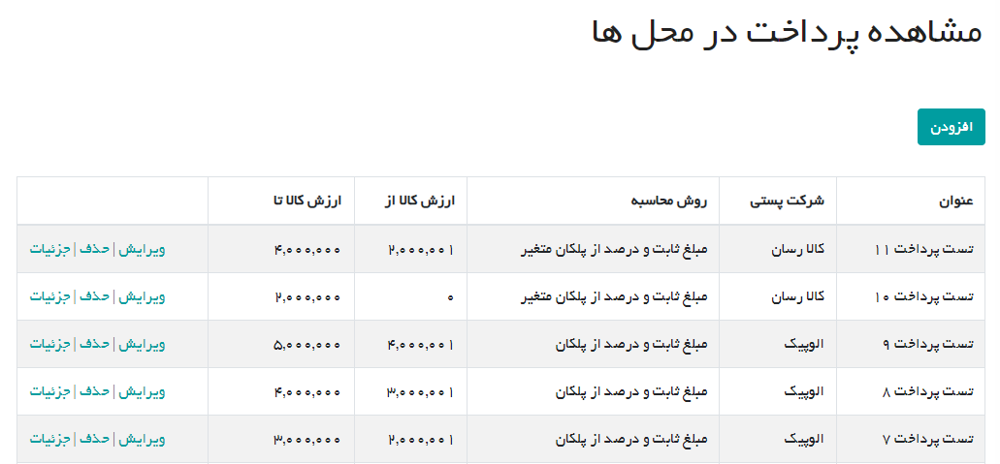
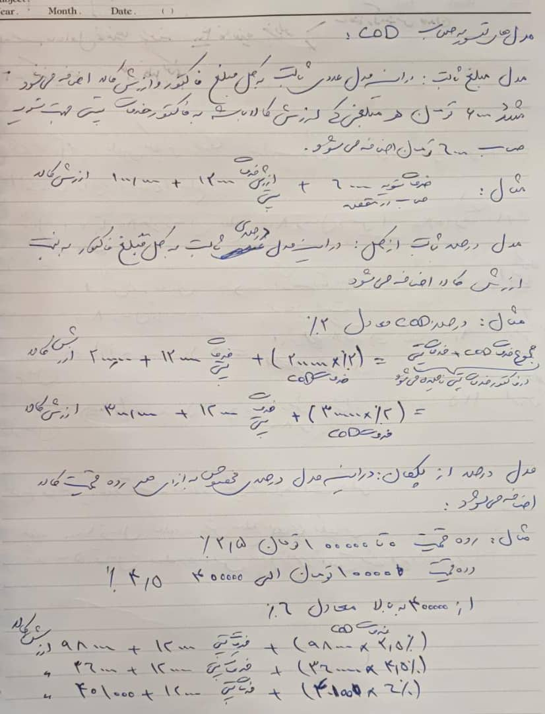
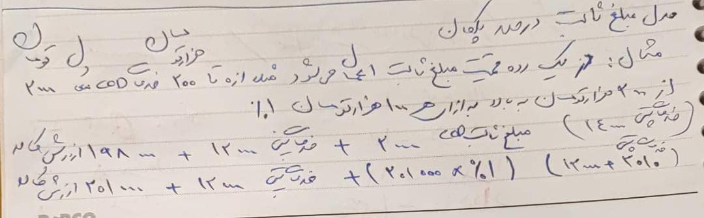
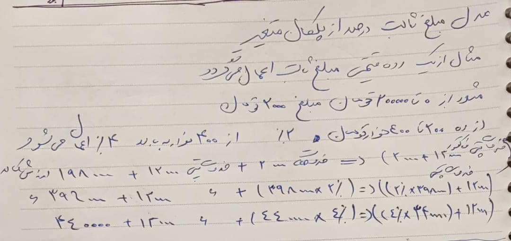

# تعریف پرداخت در محل ها (Cod)

## پرداخت در محل جدید

در این بخش کاربران ادمین می توانند برای هر شرکت پستی یک روش پرداخت در محل تعیین کرده و بازه رقمی آن را تعیین کنند

روش های محاسبه تسویه حساب(پرداخت در محل) شامل موارد زیر است:

1- مبلغ ثابت
2- درصد ثابت از کل
3- درصد از پلکان
4- مبلغ ثابت و درصد از پلکان
5- مبلغ ثابت و درصد از پلکان متغیر

## ERD دیتابیس

[ERD Database](Diagrams/CodDatabase.drawio)

## مستندات روش های محاسبه

