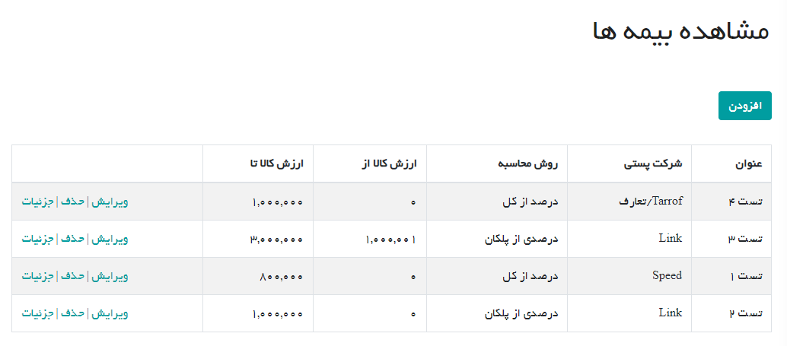
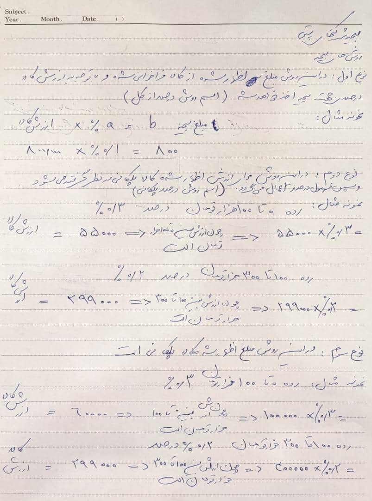
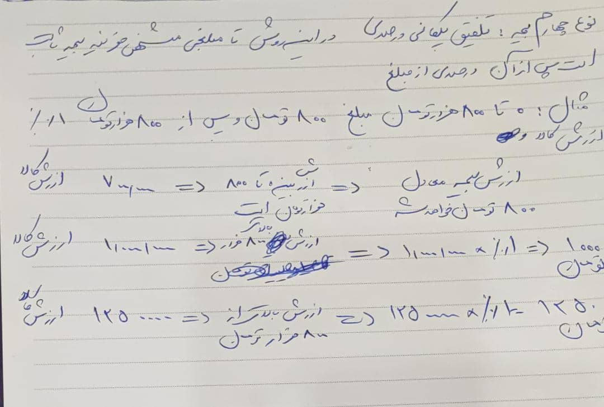

# تعریف بیمه شرکت های پستی (Insurance)

## بیمه جدید

در این بخش کاربران ادمین می توانند برای هر شرکت پستی یک روش محاسبه بیمه تعیین کرده و بازه رقمی آن را تعیین کنند

روش های محاسبه بیمه شامل موارد زیر است:

1- درصد از کل
2- درصدی از پلکان
3- پلکانی
4- درصدی پلکانی
5- ثابت و پلکانی

## ERD دیتابیس

[ERD Database](Diagrams/InsuranceDatabase.drawio)

## مستندات روش های محاسبه

