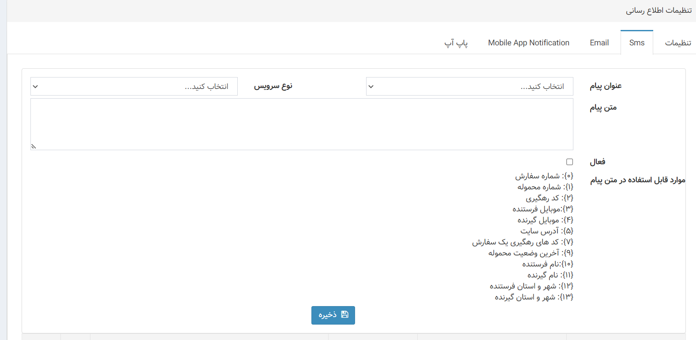
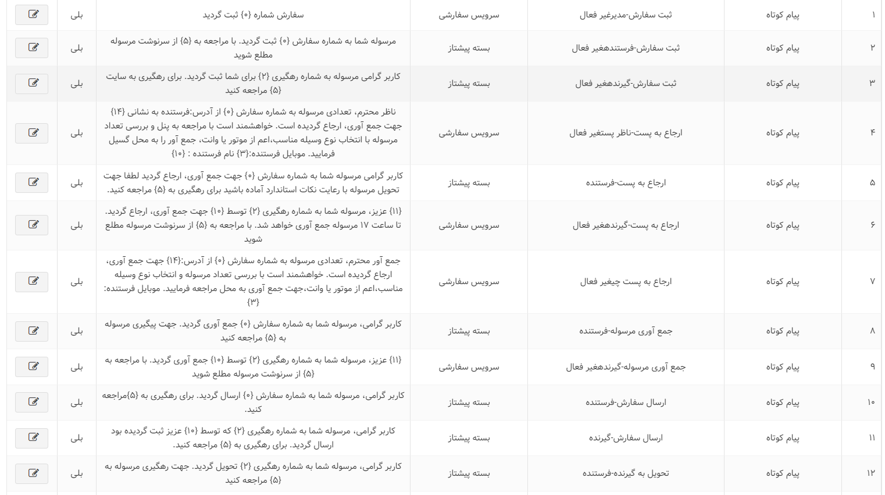
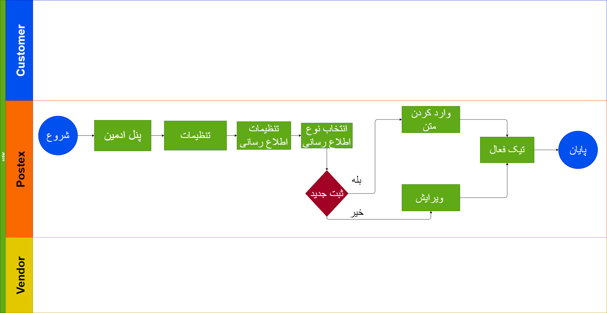

# Notification Service

## مقدمه

در این سرویس شروط تعریف می شود مانند اینکه پیامک برای کی و چه زمانی تعریف شود.

---

## Feature

- Connect to SMS Services
- Connect To Email Services
- Application Push Notification
- social media web services
در بخش ناتفیکیشن ها قابلیت ارسال پیامک ، ایمیل ، و پوش نوتیفیکیشن وجود دارد
برای پیاده سازی پیامک از سرویس کاوه نگار استفاده می کنیم و با استفاده از تنظیمات به طور خودکار بعد از فرایند هایی مانند ثبت نام (جهت احراز هویت) ، بعد از ثبت مرسوله همگام دریافت کد رهگیری برای نماینده ها همگام ارجاع بار و... پیامک ارسال می شود
همچنین در تنظیمات می توانیم ایمیل ثبت کنیم که اطلاع رسانی از طریق آن انجام  داده شود
در مورد پوش نوتیف که از طریق اپلیکیشن انجام میگیرد مشتری با نصب اپ می تواند نوتیف هایی جهت اطلاع رسانی دریافت کند 
همچنین با وب سرویس هایی که از طریق شبکه های اجتماعی در اختیار داریم و پیاده سازی می کنیم مشتری می تواند انتخاب کند که مثلا بعد از ثبت سفارش از طریق واتس آپ اطلاع رسانی شود و اخبار و سایر اطلاعات را در شبکه ی اجتماعی خود داشته باشد

---

## موجودیت ها

### NotificationPatern

- Id
  شناسه
- Patern
  الگوی پیام
- ProductId
  این جول با توجه به سرویس محصولات به جدول پروداکت متصل می شود و شناسه سرویس انتخابی را بر میگرداند
- NotificationTypeId
  شناسه نوع پیام
- IsActive
  فعال بودن
- NotificationStatusTypeId
  شناسه نوع استاتوس ها

### NotificationType

- Id
  شناسه
- Name
  نام
  ما سه نوع نوتیف دارید پیامک ، ایمیل ، پوش نوتیف و شبکه های اجتماعی
  که مشتری می تواند خود انتخاب کند که چه نوع اطلاع رسانی برای او انجام گیرد.

### NotificationStatudType

- Id
  شناسه
- Name
  نام استاتوس
  در این قسمت وضعیت ها را بررسی می کنم و هر وضعیت را به عنوان یک رکورد ثبت می کنیم

### NotificationLog

- Id
 شناسه
- Sender
  ارسال کننده
- NotificationText
  متن پیام
- NotificationPaternId
  شناسه الگوی پیام 
- Mobile
  موبایل گیرنده
- Email
  ایمیل گیرنده
- NotificationRoleTypeMappingId
  شناسه نوع دسترسی ها
- NotificationUserMappingId
  شناسه نوع مشتری

### NotificationRoleTypeMapping

- Id
  شناسه
- Name
  نام
- CanSendNotification
  میتواند نوتیف ارسال کند

### NotifactionUserMapping

- Id
  شناسه
- CustomerId
  شناسه مشتری
- CanSendNotifation
  میتواند نوتیف ارسال کند

---

## متدها

---

## فرایند ها

ارسال پیام از طریق های مختلف جهت اطلاع رسانی به مشتری ها

---

## دیاگرام ها

[دیاگرام بخش ناتفیکیشن](Diagram/Diagram-popup.drawio)

