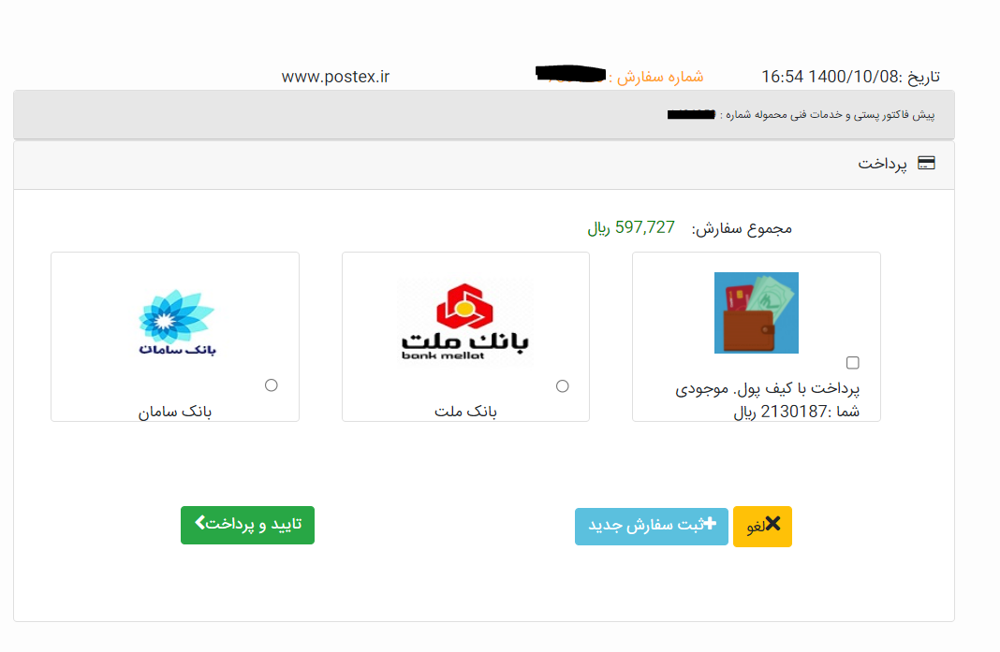

# Payment Service

## مقدمه

این سرویس وظیفه پرداخت و اتصال به درگاه  های مختلف را برعهده دارد  

---

## Feature

- PayForOrder
- refund

### نیازمندی ها سرویس پرداخت

- امکان مشاهده انواع روش پرداخت (درگاه پرداخت و کیف پول )

- امکان مشاده موجودی کیف پول
- امکان برگشت به سایت بعد از پرداخت از طریق درگاه بانکی
- امکان ثبت سفارش از دو درگاه بانکی شامل بانک ملت و بانک سامان وجود داشته باشد

### قواعد کسب و کار برای سرویس پرداخت

درصورت پرداخت از طریق کیف پول و چه درگاه پرداخت بانکی بعد از عملیات پیامک برای فرد از طریق سرویس نوتیفیکیشن ارسال شود
درصورتی که موجودی کمتر حد سفارش است از طریق اکانتینگ سرویس امکان شارژ کیف پول وجود داشته باشد
امکان ثبت سفارش درصورتی که کیف پول منفی بود وجود نداشته باشد مگر برای افرادی که قرارداد لیزینگ داشته باشند و میزان اعتبار و سقف منفی شدن مشخص شده باشد

### refund

برای این سرویس ما از سرویس شرکت جیبیت استفاده میکنیم 
درخواست ها را ثبت میکنیم و در انتها پرداخت خودکار انجام می شود 

---

---

## موجودیت

- refund
  - userId
  - amuont
  - shabaNumber
  - transfersMode روش پرداخت
  -  GUID   شماره تراکنش
  -  CorrelationID شناسه درخواست بین سرویس های سیستم 
  -  MobileNo شماره موبایل
  -  PayerId 
  -  OrderNumber شماره سفارش 
  -  SentOrderNumber 
  -  PaymentRequestState
  -  FailReason دلیل انجام نشدن درخواست
  -  Description 
  -  PaymentMethod
  -  PaymentToken 
  -  ReturnUrl
  -  CancelUrl کنسلی درخواست 
  -  AppName  درخواست دهنده
  -  Remark  سایر توضیحات

- pay
  -  usreId
  -  amuont
  -  GUID   شماره تراکنش
  -  CorrelationID شناسه درخواست بین سرویس های سیستم 
  -  MobileNo شماره موبایل
  -  PayerId 
  -  OrderNumber شماره سفارش 
  -  SentOrderNumber 
  -  PaymentRequestState
  -  FailReason دلیل انجام نشدن درخواست
  -  Description 
  -  PaymentMethod
  -  PaymentToken 
  -  ReturnUrl
  -  CardNumber شماره کارت 
  -  CancelUrl کنسلی درخواست 
  -  AppName  درخواست دهنده
  -  Remark  سایر توضیحات

---

## متدها

- PaymentRequest()
- PaymentRequestRefund()
- PaymentWebhookResult ()
  این یک متد فرعی می باشد برای نوشتن نتایج روی دیتابیس 

---

## فرایند ها

---

## دیاگرام ها
