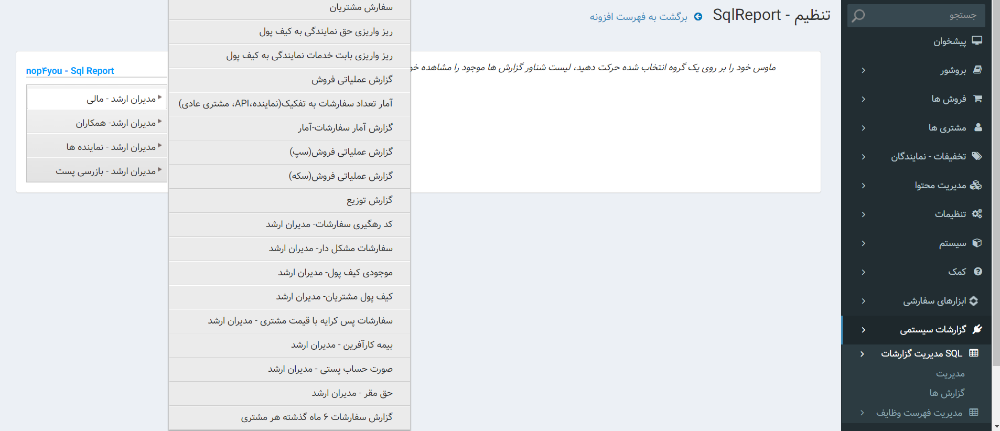
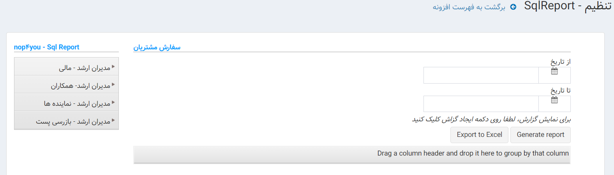
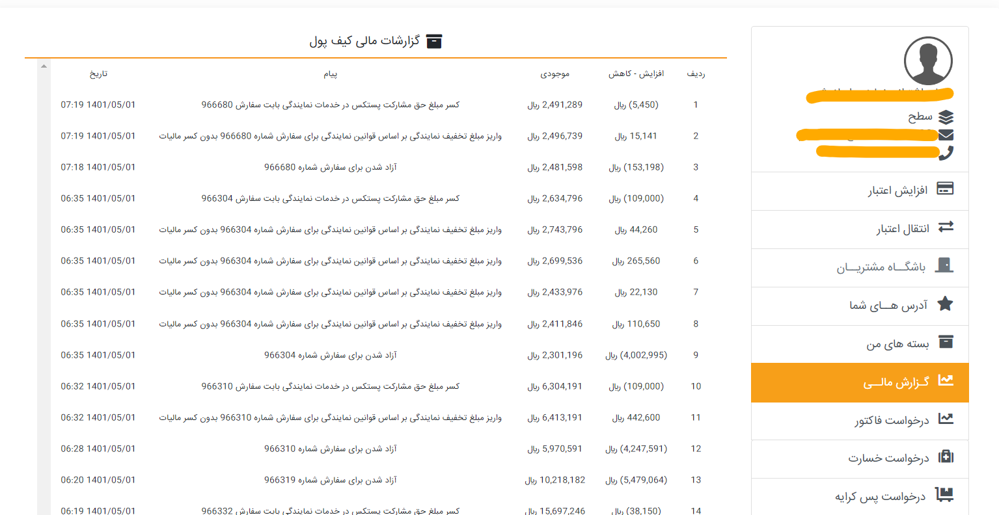

## مقدمه

در سیستم ما گزارشات مختلفی داریم که هر کدام از آن ها از قسمت های مختلفی گزارش تهیه می کند و به صورت اکسل می توان از آن خروجی گرفت 
افراد با رول های مختلفی دسترسی به این گزاراشات دارند و همه افراد دسترسی به همه گزارشات ندارند 

---

## Feature

- Show Reports
- Customize Reports
- Print Reports
- Make Queue
- Create Invoice
- Create Offline Reports
- Merg Reports

---

## موجودیت ها

---

## متدها

---

## فرایند ها

در گزارشات سیستم م لیست گزارشاتی که نیاز داریم 
از جمله این گزارشات می توان به

- لاگ فعالیت همکاران- مدیران ارشد
- ریز واریزی بابت خدمات نمایندگی به کیف پول
- ریز واریزی حق نمایندگی به کیف پول
- گزارش توزیع - نماینده
- گزارش  جمع آوری-نماینده
- فروش - مدیران ارشد
- گزارش همکاران فروش
- مانده کیف پول مشتریان به تفکیک - مدیران ارشد
- کد رهگیری سفارشات- مدیران ارشد
- وضعیت نوع- مدیران ارشد
- سفارشات نوع- مدیران ارشد
- سفارشات نوع- مدیران ارشد
- گزارش  تعداد سفارشات به تفکیک(نماینده،API، مشتری عادی)
- صورت حساب تامین کنندگان خدمات - مدیران ارشد
- آیتم های سفارش به تفکیک- مدیران ارشد
- گزارش سفارشات 6 ماه گذشته هر مشتری
- گزارش عملیاتی سود ناخالص
- گزاراش لیزینگ

همر یک گزارشات بالا توسط اپراتور سیستم قابل استخراج است و افرادی که رول مدیران ارشد دارند می توانند گزارشات را تهیه کنند 
افرادی که رول مشتری و یا مدیران میانی دارند مقط قادر هستند گزارشات 3000 سفارش آخر خود و گزارشات توزیع و جمع آوری را می توانند بگیرند 

---

## دیاگرام ها

[دیاگرام گزارشات](Diagrams/Reporting.drawio)

