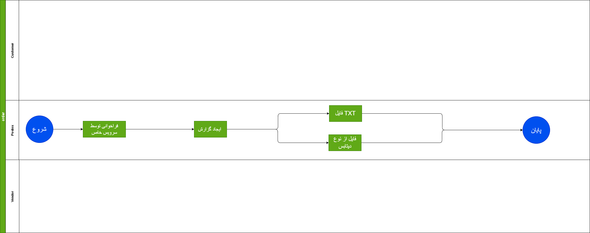
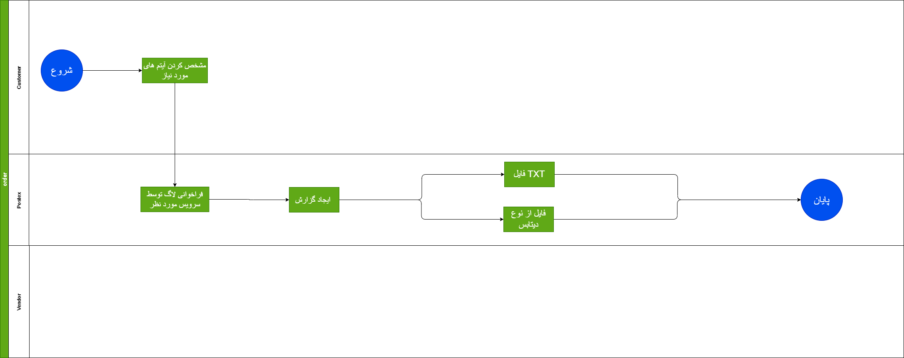

# Log Service

## مقدمه

لاگ های یک سیستم یکی از مهم ترین قسمت های سیستم می باشد و با برای جلوگیری از خطرات احتمالی  به ما کمک می کند

---

## Feature

- ThirdPartyLoging Servic
- always
- percase
- Environment

### نیازمندی هاسرویس لاگ

- امکان دریافت لاگ در همه سرویس ها
- دسترسی به لاگ ها بر اساس سطح دسترسی

### قواعد کسب و کار برای سرویس لاگ

در سه زمان ما نیاز به لاگ داریم :

- همیشگی
مواردی هستند که نیاز دارند به صورت دائم لاگ شوند مانند درخواست ما به شرکت پست 
- بر اساس درخواست 
  یک سری موارد نیاز به لاگ دائمی ندارند و بر اساس درخواست ما از آن ها لاگ گرفته می شود مانند سوپر اپ ها که مثلا ورودی آن ها چک می شود

- بر اساس محیط 
 در محیط توسعه هستش یا محیط اجرا 

---

## موجودیت ها

- Id
  شناسه 
- LogLevel
  سطح لاگ مشخص شده
- Message
  پیام
- MessageTemplate
  نمونه پیام
- TimeStamp
  زمان
- Exception
  مربوط به ارر خاصی
- Properties
  تنظیمات

---

## متدها

---

## فرایند ها 

سمت ادمین اگر فعال شود باید یک فایل سمت پستکس ایجاد می شود 

---

## دیاگرام ها

[دیاگرام لاگ ها](Diagrams/Log.drawio)

[دیاگرام لاگ سمت مشتری](Diagrams/LogDiagram.drawio)

