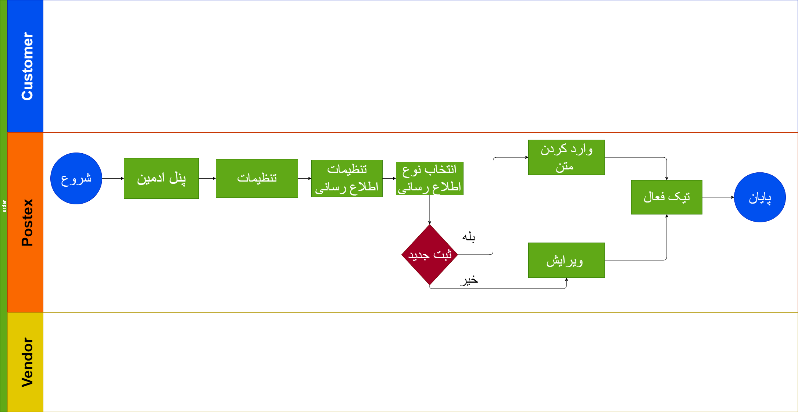

## MessageService(sms)

## مقدمه

در این سرویس شروط تعریف می شود مانند اینکه پیامک برای کی و چه زمانی تعریف شود.

---

## Feature

- Connect to SMS Services
- Connect To Email Services
- Application Push Notification

---

## موجودیت ها

---

## متدها

---

## فرایند ها

در بخش ناتفیکیشن ها قابلیت ارسال پیامک ، ایمیل ، و پاپ آپ وجود دارد 
برای پیاده سازی پیامک از سرویس کاوه نگار استفاده می کنیم و با استفاده از تنظیمات به طور خودکار بعد از فرایند هایی مانند ثبت نام (جهت احراز هویت) ، بعد از ثبت مرسوله همگام دریافت کد رهگیری برای نماینده ها همگام ارجاع بار و... پیامک ارسال می شود
همچنین در تنظیمات می توانیم پاپ آپ ثبت کنیم که در هنگام ورود به سایت نمایش داده شود

---

## دیاگرام ها

[دیاگرام بخش ناتفیکیشن](Diagram/Diagram-popup.drawio)

