# UI

## تکنولوژی 

React Native تکنولوژی مورد استفاده در این پروژه می باشد 
آیتم ها به صورت کامپوننت در سیستم تعریف می شوند

## Desktop Mode

### صفحه خانه

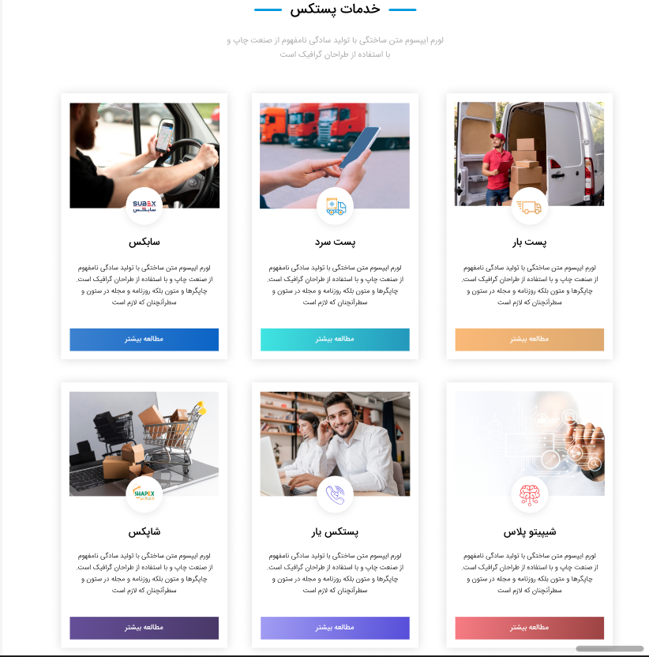

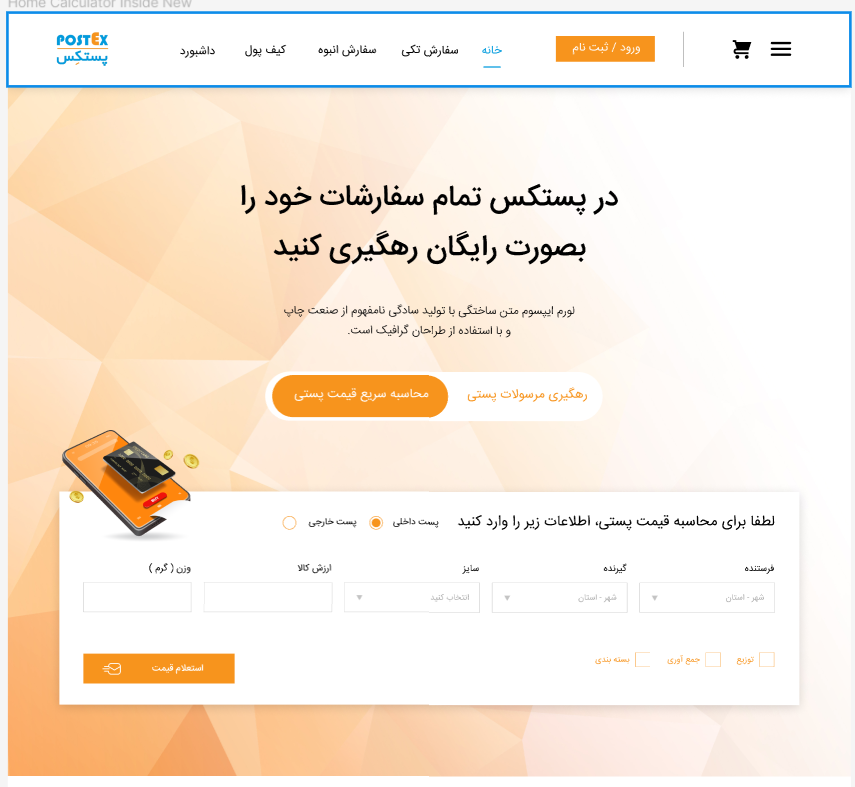

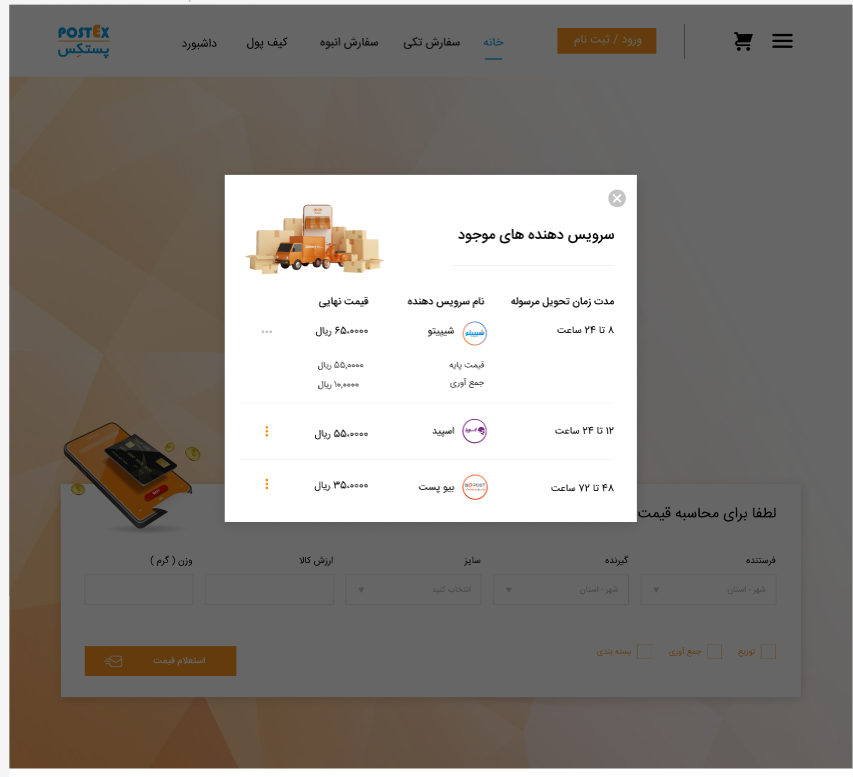

در پیاده سازی این قیمت از پروداکت سرویس استفاده میکنیم

برای پیاده سازی قیمت رهگیری مرسولات هم از پروداکت سرویس استفاده می کنیم

---

### صفحه ورود و ثبت نام

 برای پیاده سازی قسمت ورود و ثبت نام از سرویس AuthenticationAndRole استفاده می کنیم

---

### حساب کاربری

برای طراحی این قسمت از سرویس آدرس باید استفاده کرد

در این قسمت هم با استفاده از نوتفیکیشن سرویس پیام ها را ارسال می کنیم 

امتیاز معرفی را باید با استفاده از سرویس کانترکت پیاده سازی شود

پیاده سازی کیف پول از اکانتینگ سرویس استفاده می کند
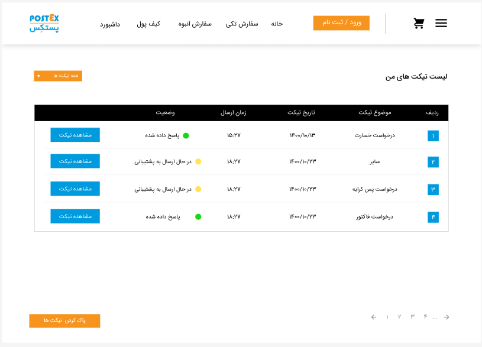
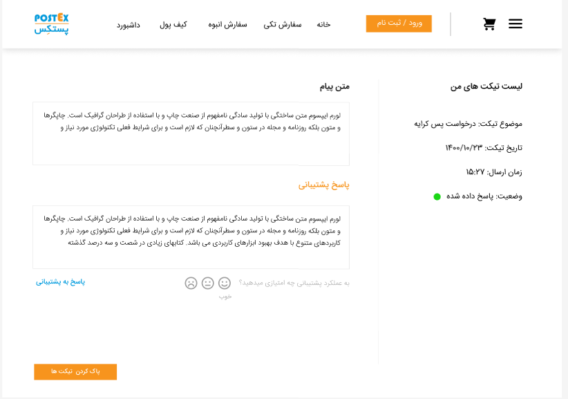

سرویس مورد نیاز تیکت سرویس است
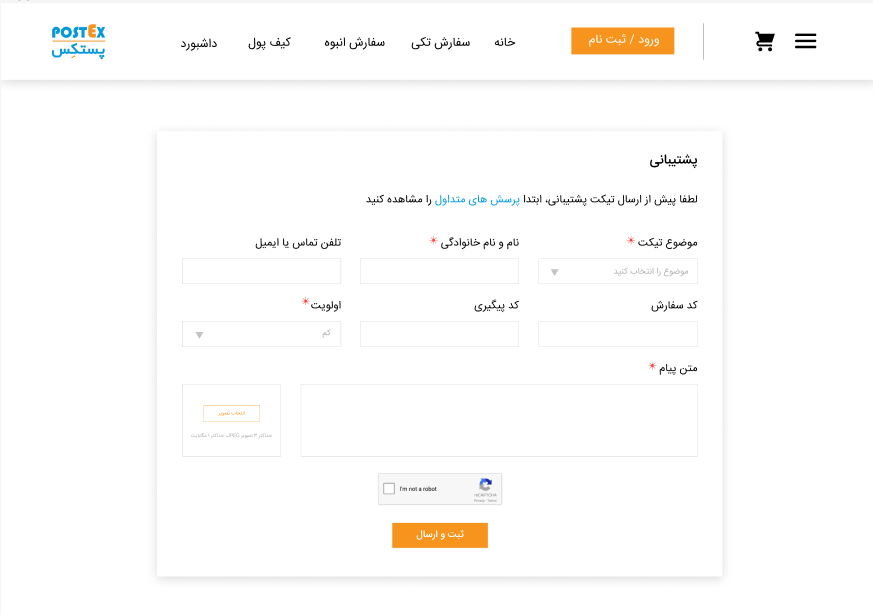
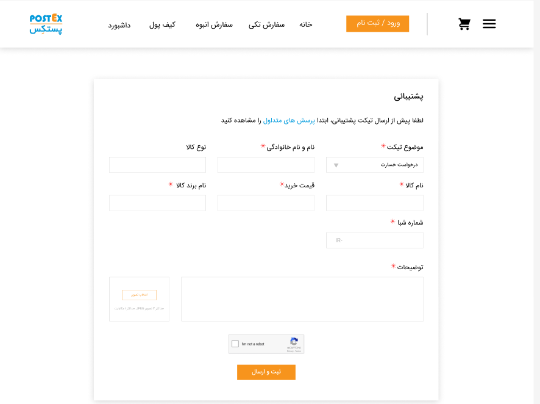

 لیست سفارشات

---

### ثبت سفارش

- ثبت سفارش تکی

 
- ثبت سفارش انبوه
  
  
  
  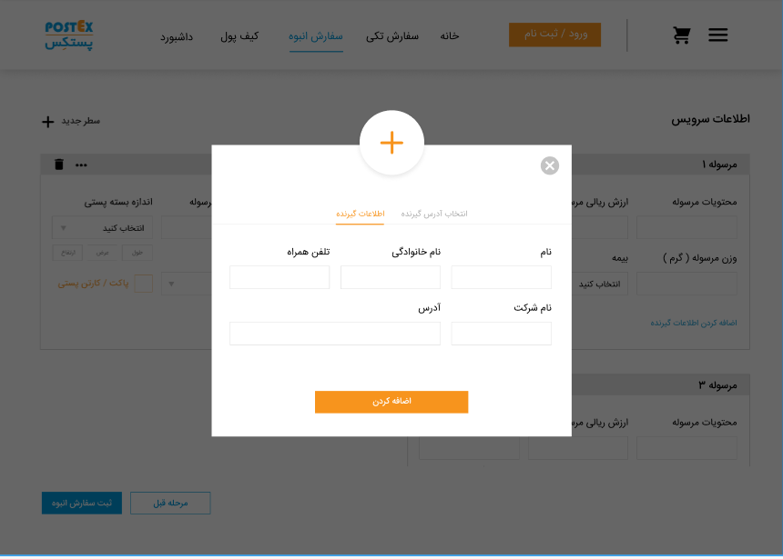
  

- خرید کارتن
    

در پیاده سازی سرویس ثبت سفارش از پارسل سروس استفاده می کنیم

---

## Mobile Mode

### صفحه خانه

در پیاده سازی این قیمت از پروداکت سرویس استفاده میکنیم

برای پیاده سازی قیمت رهگیری مرسولات هم از پروداکت سرویس استفاده می کنیم

---

### صفحه ورود و ثبت نام

 برای پیاده سازی قسمت ورود و ثبت نام از سرویس AuthenticationAndRole استفاده می کنیم

---

### حساب کاربری

در این قسمت هم با استفاده از نوتفیکیشن سرویس پیام ها را ارسال می کنیم 

امتیاز معرفی را باید با استفاده از سرویس کانترکت پیاده سازی شود

برای طراحی این قسمت از سرویس آدرس باید استفاده کرد

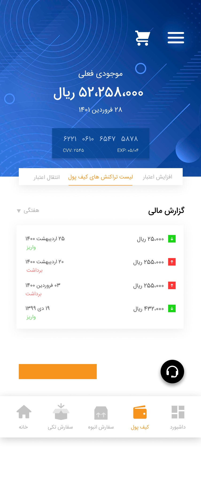

پیاده سازی کیف پول از اکانتینگ سرویس استفاده می کند

سرویس مورد نیاز تیکت سرویس است

 لیست سفارشات

---

### ثبت سفارش

- ثبت سفارش تکی

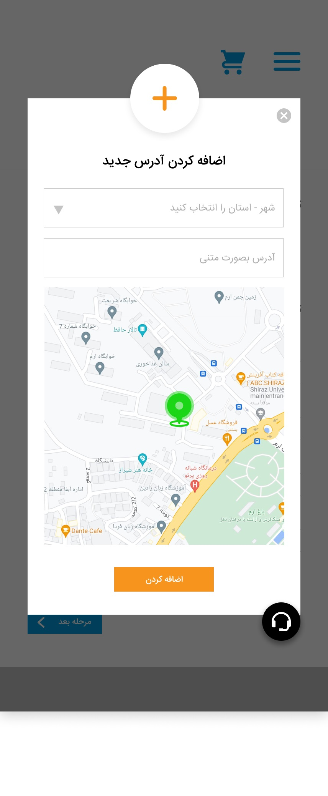

- ثبت سفارش انبوه
  
  
  
  
  
  
  
  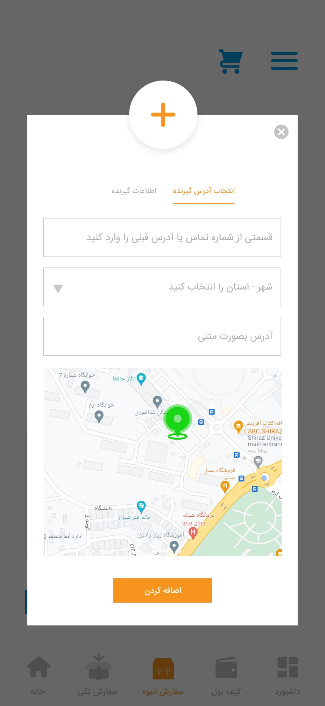
  
  
- خرید کارتن
   

در پیاده سازی سرویس ثبت سفارش از پارسل سروس استفاده می کنیم
