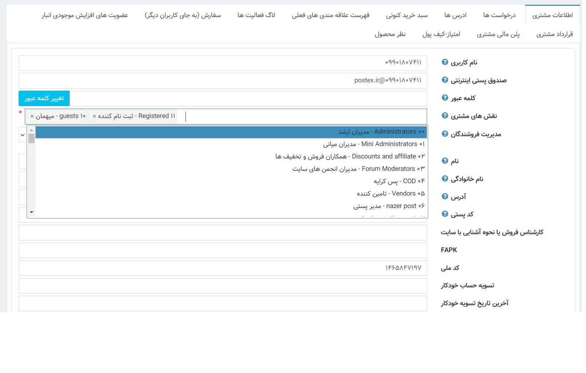
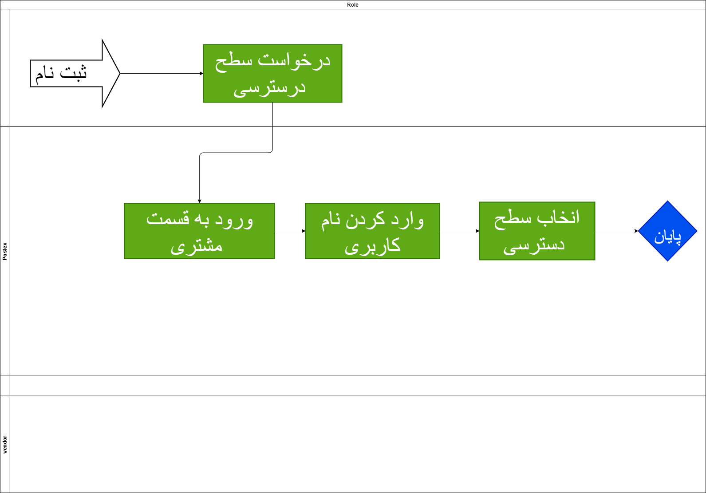
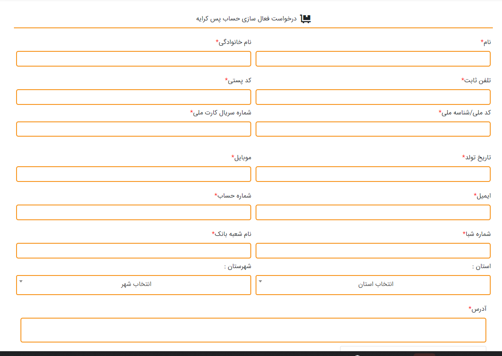
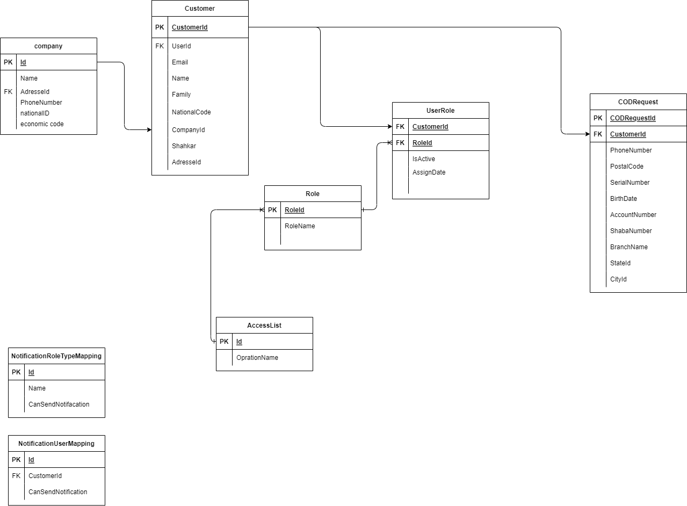
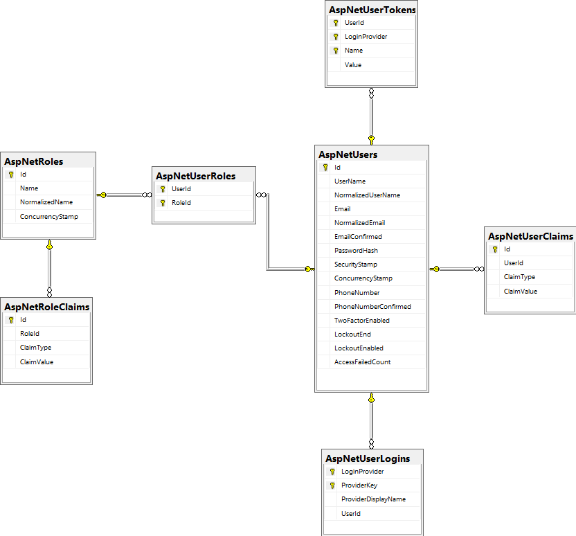

# Profile Manager

## مقدمه

این سرویس وظیفه اختصاص دادان سطح دسترسی عملیاتی دارد و  سایر درخواست های کاربر را بررسی میکند

 ---

## Feature

- Group
  دسته بندی ها 
- Role
در این قسمت شما سطح دسترسی و نقش هر کاربر را تایین می کنید که به کدوم قسمت ها دسترسی داشته باشد یا خیر با این عمل شما می توانید مشتری ها را در سطح های مختلف طبقه بندی کنید

- Permissions
  
### نیازمندی ها سرویس Authentication And Role

- امکان اختصاص سطح دسترسی خاص برای یک کاربر
- امکان اختصاص چند سطح دسترسی به کاربران
- درخواست پسکرایه کاربران به طور اتوماتیک در گیت وی ثبت شود

### قواعد کسب و کار برای سرویس کاربران

- بررسی شود در صورت دادن سطح دسترسی خاص به کاربر فقط به آن سطح دسترسی داشته باشد
- این امکان وجود داشته باشد که کاربر در یک مورد محدود یا ممجوز بگیرد به عنوان مثال یک کاربر فقط توانایی  ثبت سفارش را نداشته باشد
- تازمانی که کاربری درخواست پس کرایه را پر نکرده است توانایی ثبت سفارش پسکرایه را نداشته باشد

---

## موجودیت ها

### Customer

- CustomerId
- National Code
- Mobile
- Name
- Email
- Address
- CompanyId
- COD(Bool)
- Shahkar
  تاییده سامان شاهکار

### Company

- CompanyId
- Name
- Adress
- PhoneNumber
- nationalCode
- EconomicCode

### CODRequest

- CustomerId
- PhoneNumber
- PostalCode
- NationalCode
- SerialNumber
- BirthDate
- AccountNumber
- ShabaNumber
- BranchName
- StateId
- CityId

---

## Methods

[Method](Diagrams/AuthenticationAndRoleMethod.drawio)

- AssignRole
  اختصاص سطح دسترسی خاص به کاربر
- IsInRole
  کاربرانی که از یک سطح دسترسی استفاده می کنند
- RegisterExtraUserData
  اضافه اطلاعات بیشتر برای کاربر  
- AssignContract
  تعریف قرارداد برای کاربر
- AssignAccessRole
  اختصاص سطح دسترسی
- DefineRole
  تعریف سطح دسترسی
  
---

## فرایند

### دسترسی 

در این قسمت به کاربران دسترسی خاصی داده میشود که این دسترسی ها به صورت عمومی می باشد

همانطور که در عکس مشخص سطح دسترسی مختلفی وجود دارد که 
- Administrator مدیران ارشد 
  سطح دسترسی فول دارند
- mini administrator مدیران میانی
  سطح دسترسی مخصوص نماینده ها
و به همین ترتیب سطوح مختلف دسترسی تعریف می شود

 
---

## دیاگرام ها

### دیاگرام بخش ثبت نام و ورود

 دیاگرام سطح دسترسی
  [دیاگرام سطح دسترسی](Diagrams/Diagram-CustumerRole.drawio)
  
دیاگرام سطح دسترسی
  [دیاگرام درخواست پس کرایه](Diagrams/BCP1-CODPlan.drawio)
  

[ERD Database](Diagrams/ProfileManager.drawio)

## ERD Microsoft Identity

