# BackOfice

## مقدمه

بک آفیس یا داشبرد ادمین یک پنل مدیریتی می باشد که در آن با مشخص کردن نقش هر کاربر وظیفه مدیریت یک قسمت را او میدهیم 
از جمله بخش هایی که در آن وجود دارد :
- لیست سفارشات 
- انجام عملیات بر روی سفارشات 
- تیکت ها 
- مدیریت مشتریان 
- گزارشات 
- ...
می باشد 

---

### نیازمندی ها بک آفیس

- امکان ویرایش یک سفارش(تغییر وضعیت ،کنسلی و ...)
- امکان پاسخ دهی به تیکت ها
- امکان تعریف بخش ها و دپارتمان های مختلف
- امکان تعریف مشتریان 
- امکان تعریف و مدیریت نمایندگان 
- امکان گزارش گیری از قسمت های مختلف 
- امکان تعریف و مدیریت کاربران ادمین 
- امکان تعریف قرارداد ها 
- امکان پاسخدهی به درخواست ها 
  

### قواعد کسب و کار برای سرویس تیکت

- ایجاد نقش های مختلف بر اساس سطح دسترسی کاربران 
- ایجاد صف برای تیکت ها جهت مدیریت کارمندان وجود داشته باشد
- ایجاد دپارتمان های مختلف برای افراد سازمان 
- دریافت لیست سفاراشات از وب سرویس مربوطه و ایجاد قابلیت ویرایش و کنسل کردن برای هر سفارش فراهم باشد 
- امکان ارجاع یک مرسوله به نماینده خاص وجود داشته باشد 
- امکان تعریف مناطق جمع آوری از روی نقشه برای هر نماینده فراهم باشد 
- امکان مدیریت سفارشات مفقودی و برگشتی وجود داشته باشد 
- امکان گزارش گیری بر اساس فیلتر های مختلف در سفارشات و بخش های مختلف فراهم شده باشد

---

## موجودیت ها

- مرسولات مفقودی: ثبت گزارش مفقود شدن مرسولات توسط کاربر دیجی کالا و پیگیری توسط تیم پشتیبانی
- ثبت سفارش انبوه
- مشکوک به مفقودی: مرسولاتی که ۲۴ الی ۷۲ ساعت از آخرین تغییر وضعیتشان می گذرد
- سفارشات پستکس: سفارشات سیستم لگسی در پنل
- مرسولات بازگشتی
- تیکت
- درخواست های کنسلی سفارش
- درخواست های برداشت از کیف پول
- نماینده و فروشگاه
- محدوده فعالیت نماینده یا فروشگاه
- نقشه شرکت های کوریر(پستی)
- سفارشات در جریان(انبارداری دراپ شیپینگ)
- گزارشات سیستمی
- دسترسی کاربران به یک یا چند استان خاص
- دسترسی کاربران به یک یا چند مشتری خاص
- دسترسی کاربران به یک یا چند واحد سازمانی خاص
- اسلایدر
- اطلاعیه
- درخواست های استخدام
- سطح دسترسی های خود سیستم
  
---

## فرایند ها

پنل مدیریتی شامل قسمت های مختلفی میباشد که در این بخش به بررسی هر کادام از آن ها می پردازیم.

### داشبرد

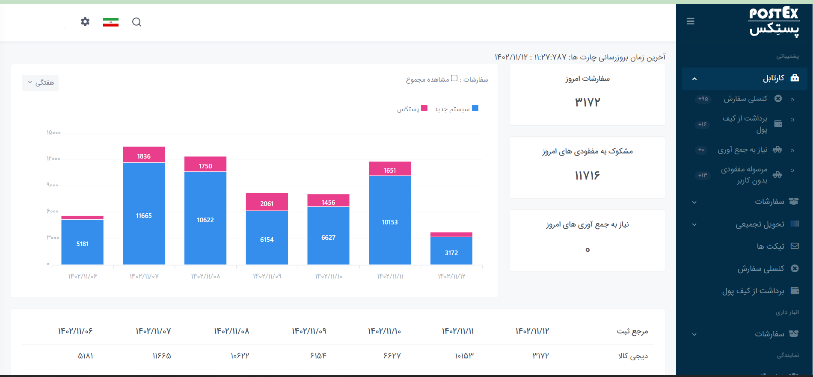

 در این بخش شما می توانید یک گزارش لحظه ای از لیست سفاراشت مشاهده فرمایید 

### کارتابل

در این قسمت بخش هایی مانند 
- کنسلی سفارش 
  در این قسمت بخش های پر کاربرد مورد استفاده قرار گرفته اند شما میتوانید لیست مرسولات کنسلی را مشاهده فرمایید و عملیات مناسب بر روی آنها اعمال کنید 

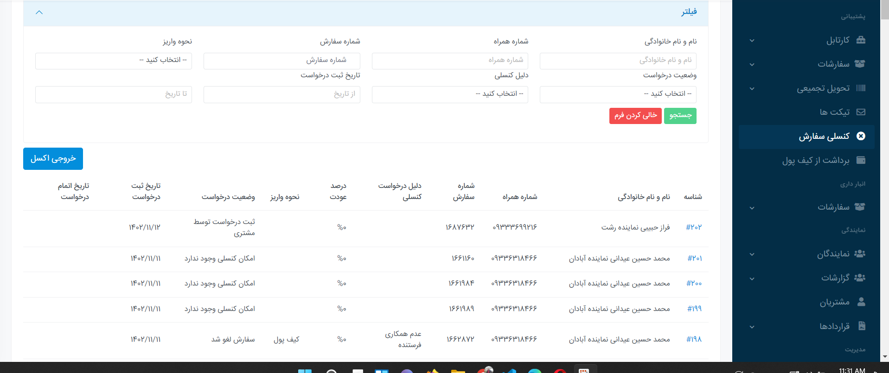

- برداشت از کیف پول 
  درخواست های برداشت از کیف پول را از این قسمت می توانید مشاهده و رسیدهپگی کنید 
  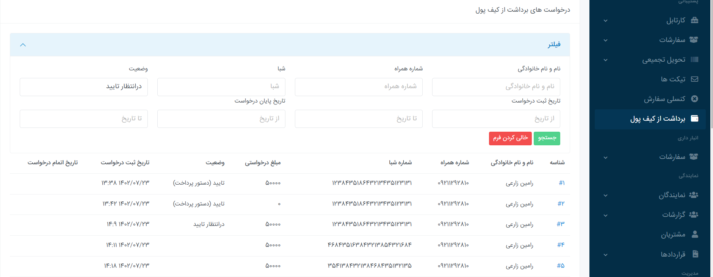

- نیاز به جمع آوری
  لیست سفارشات نیاز به جمع آوری را از این قسمت میتوانید مشاهده و ومیرایش کنید 
  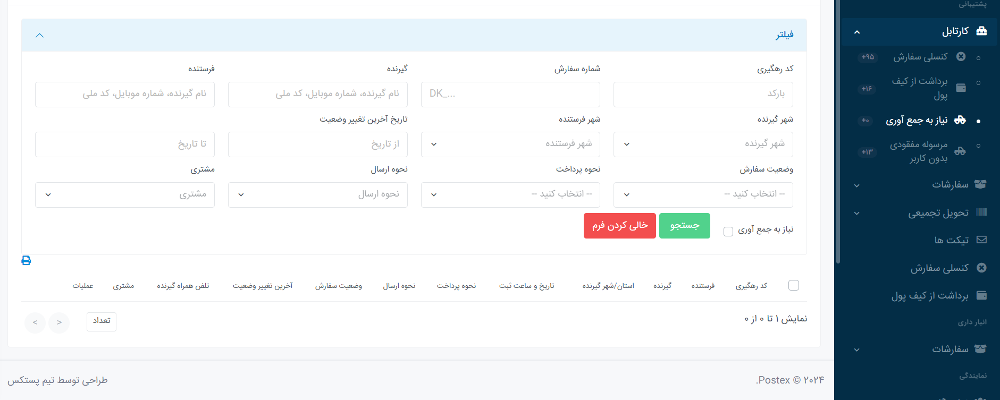

- مرسولات مفقودی
  در نهایت لیست سفاراشات مفقودی که نیاز به پیگیری از سمت پشتیبانی دارند را می توانید مشاهده و مدیریت کند 
  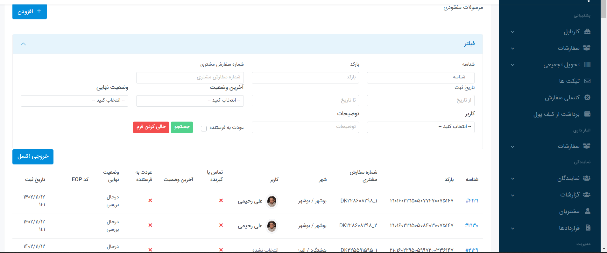

### سفارشات

در بخش سفارشات شما لیست سشفارشات را دارید ک دارای وضعیت های مختلف برای مدیریت سفاراشات هستن 

- لیست سفارشات 
 تمامی سفارشات ثبت شده در این قسمت مشخص هستن
 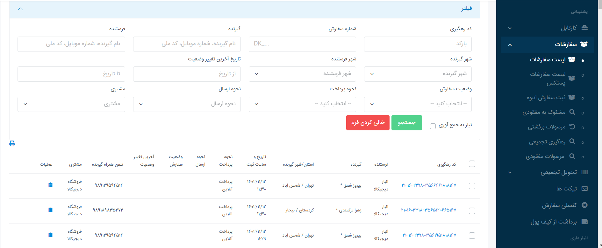

- ثبت سفارش انبوه
  همچنین ادمین می تواند سفارش انبوه ثبت کند با استفاده از اکسل 
  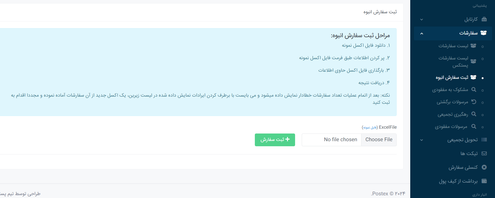
- مشکوک به مفقودی 
  برخی سفارشات هستن که در دسته مفقودی قرار ندارند ولی چند روزی هست که وضعیت آن ها آپدیت نشده. در این لیست لیستی از این مرسولات قابل مشاهده هستن که پشتیبان می تواند آن ها را بررسی کند و در صورت وجود مشکل آن ها را بررسی و گزارش کنند
  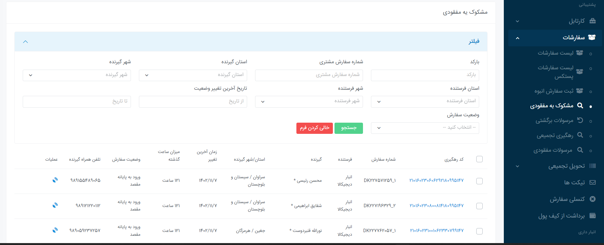

- مرسولات برگشتی
  در بخش برگشتی لیست مرسولات برگشتی را مشاهده می کنید 
  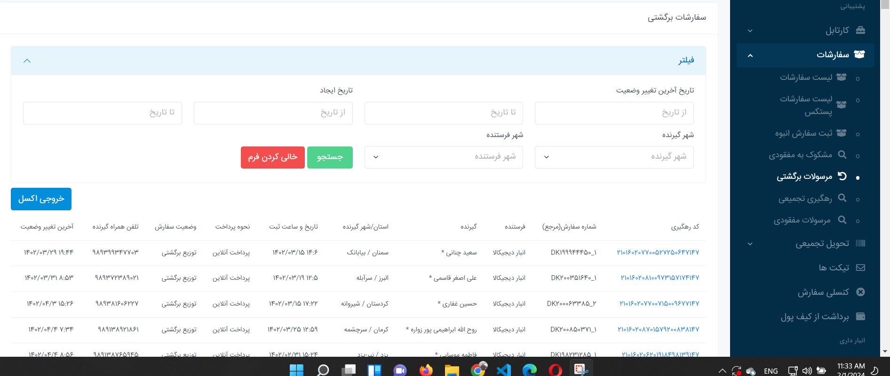
- رهگیری تجمیعی 
  در این قسمت میتوانید رهگیری و وضعیت مرسولات را ه صورت تجمیعی و با استفاده از اکسل دریافت کنید 
  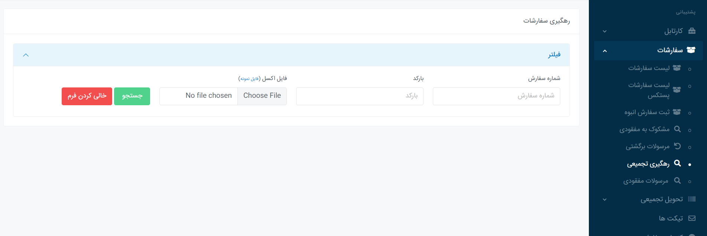
- مرسولات مفقودی
  این بخش هم مفقودی را لیست می کند
  

### تیکت ها

در این قسمت لیست تیکت ها قابل مشاهده هست و پشیبان میتواند تیکت را پاسخ دهد و همچنین آن هارا ارجاع بدهد 
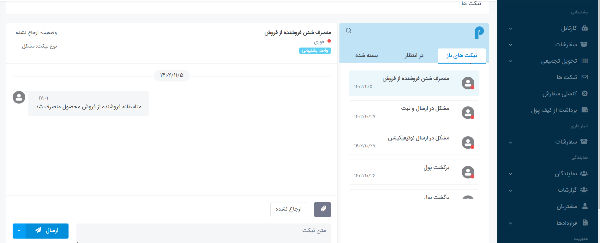

### نمایندگی 

بخش نمایندگی تمامی فعالیت ها برای یک نماینده را بررسی میکند 

- لیست نمایندگی 
  در این قسمت لیست نمایندگان فعال و تمامی افرادی که درخواست نمایندگی داده اند قابل مشاهده هستش 
  همچنین میشود بر روی افراد عملیات خاصی انجام داد مانند رد درخواست ، فعال یا غیر فعال کردن افراد 
  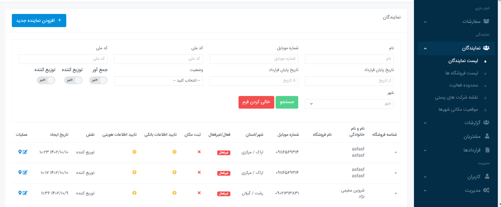
- لیست فروشگاه ها 
  علاوه بر نمایندگان لیست فروشگاه ها هم میشود مدیریت کرد 
  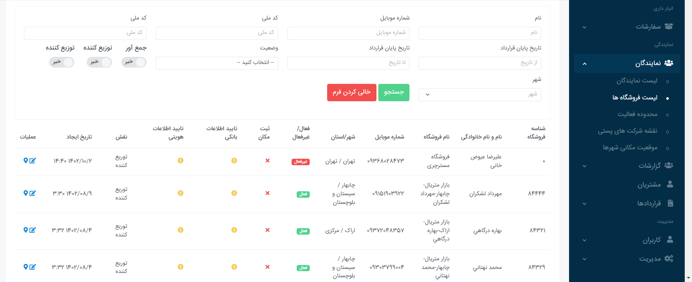

- محدوده فعالیت 
  در این قسمت می توانید محدوده فعالیت نماینده ها را مشخص کرد که در ارجاع جمع آوری مورد استفاده قرار گیرد 
  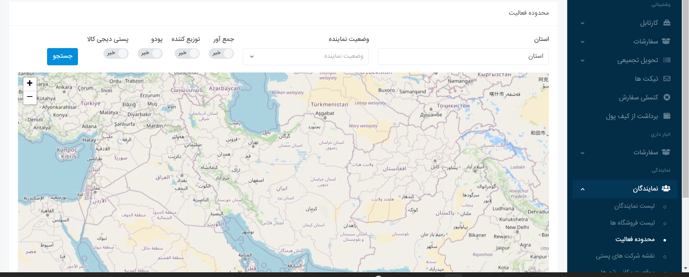
- نقشه شرکت های پستی 
  در این قسمت آدرس دفاتر پستی قابل مشاهده است که میتوانید آن ها را ویرایش و اضافه کنید 
  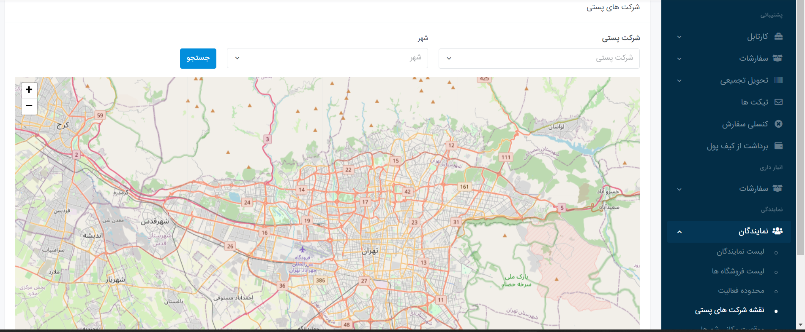

- موقعیت مکانی شهر ها 

### گزارشات

لیست گزارشات مورد استفاده در سیستم را در این قسمت می توانید ببینید در این بخش گزارشاتی از جمله 

- گزارش تخفیفات نمایندگان
- غرامت 
- خدمات ارزش افزوده 
- کمیسون پستکس
- عملکرد رده وزنی 
- گزاراشت سفارشات استان ها 
- گزارش مقایسه عملکرد 

وجود دارد که شما می توانید ان ها را با جزئیات و یا بدون جزئیات مشاهده و دانلود فرمایید 

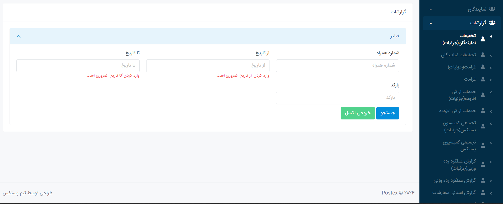

### مشتریان 

لیست مشتریان شرکت در این قسمت هستش    که به دو دسته نمایندگان و مشتریان عادی تقسیم می شوند

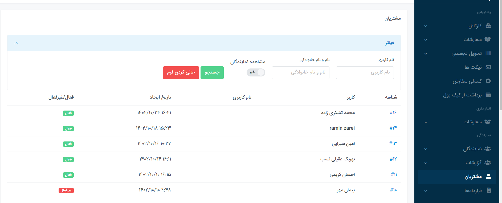

### قرارداد ها

در اینبخش قرارداد های پستکس با افراد قابل مشاهده و تنظیم می باشد این قرارداد ها شامل قرارداد لیزینگ و سایر قراداد ها می باشد 

### کاربران 

بخش کاربران تعیین کننده افرادی هستش که میتوانند از قیمت ادمین استفاده کنند در این بخش شما کاربران  ، نقش ها ، دپارتمان ها را مشخص میکنید 
همچین در این بخش می توانید یک کاربر را برای مدیریت یک مشتری ، نماینده و یا فروشگاه تعیین کنید همچنین این می توانید نسبت به شهر فعالیت نماینده ها و فروشگاه ها نیز کاربر اضافه کنیم که مدیریت مناطق بهتر و راحت تر شود 

- تعریف کاربران
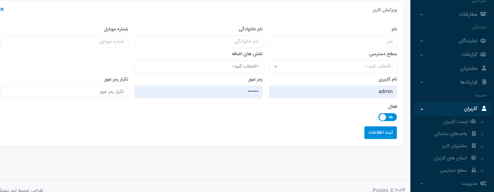

- واحد های سازمانی
  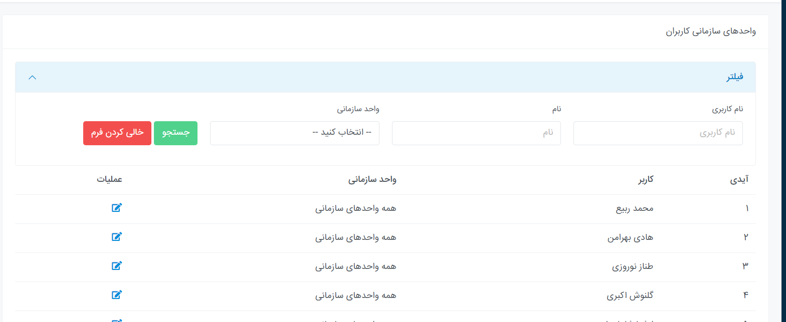
- سطح دسترسی 
  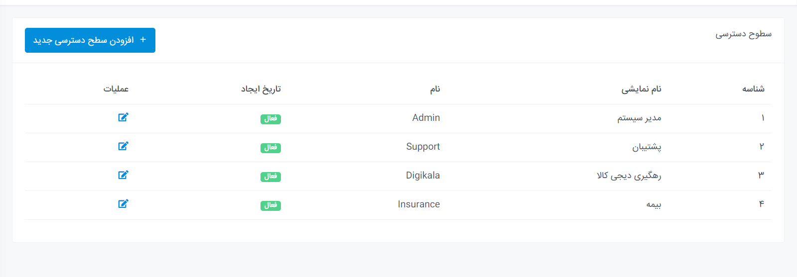

---

## دیاگرام ها

[دیاگرام بخش تیکت](Diagram/Diagram-Ticket.drawio)

