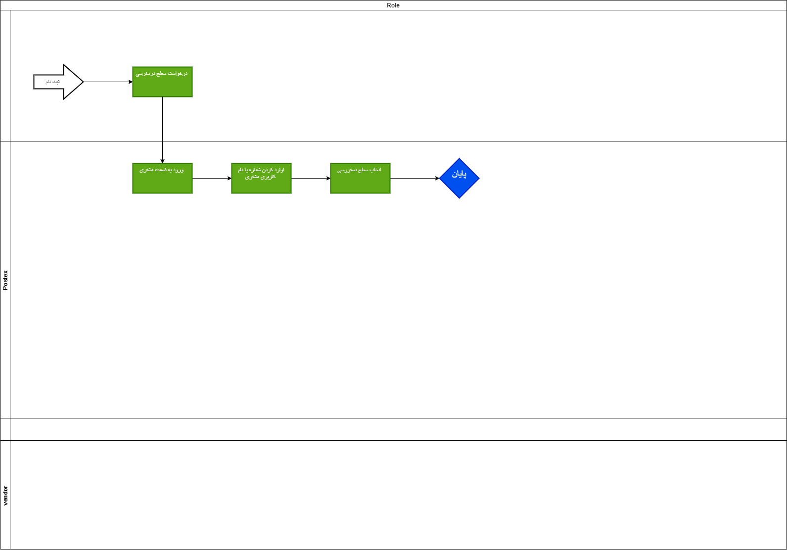
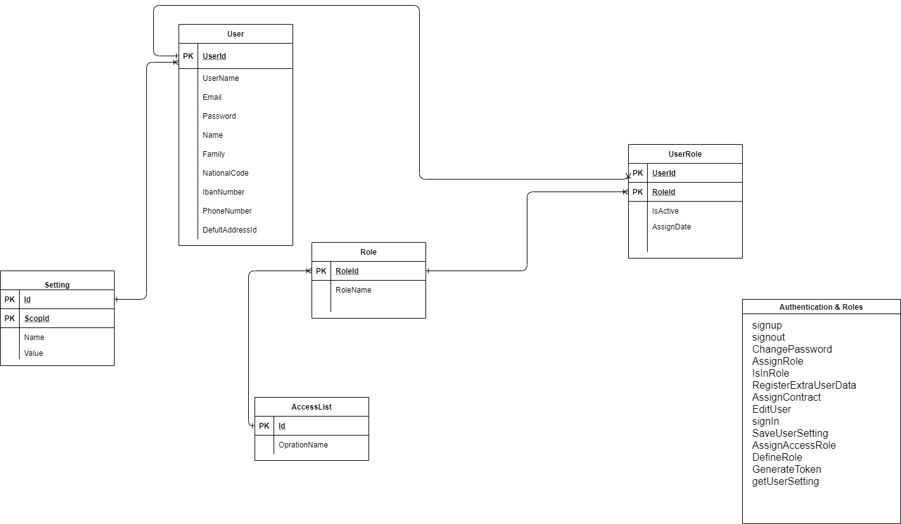
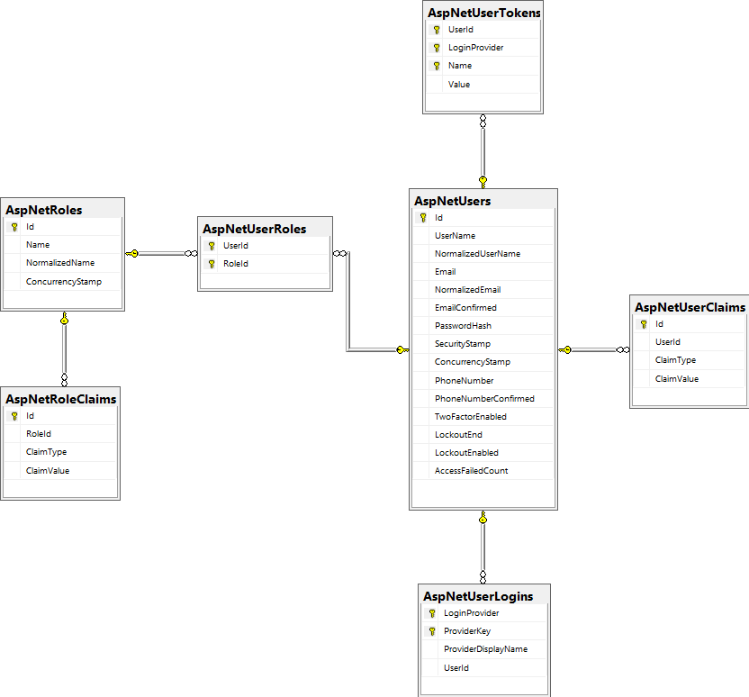
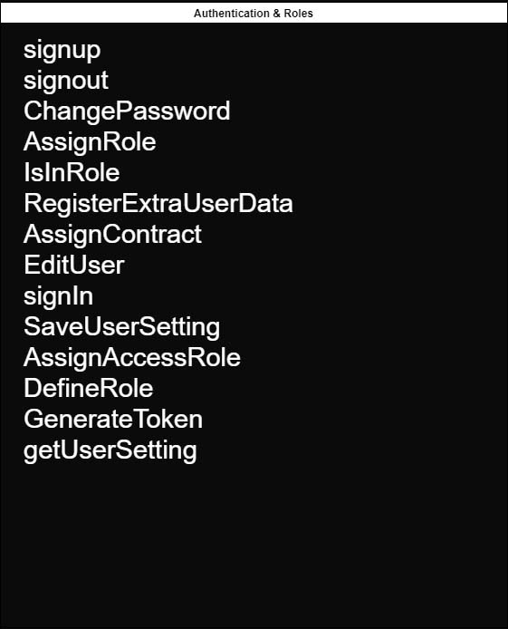

# Authentication And Role

## ثبت نام

 در وحله اول برای استفاده از امکانات سیستم شما باید ثبت نام انجام دهید شما بعد از ثبت نام به عنوان کاربر عادی وارد سیستم می شوید و در ادامه میتوانید با استفاده از رول های خاص سطح دسترسی خود را افزایش دهید.
 برای ثبت نام شما نیاز به وارد کردن اطلاعات زیر هستین

 1. کد ملی (درصورتی که چز دسته اتباع می باشین باید کد اتباع و یا شماره پاسپورت خود را وارد کنید  )
 2. شماره موبایل
 3. رمز عبور دلخواه
  
  &#x202b;بعد از وارد کردن این موارد نیاز به تایید قوانین دارید
  
  در ادامه ثبت نام کد ارسالی به تلفن همراه شما را باید وارد کنید 

  دیاگرام بخش ثبت نام
  &#x202b;[دیاگرام ثبت نام](BL1-Login.drawio)
 
---

## ورود

برای ورود به حساب کاربری از  شماره همراه و رمز تعیین شده در ثبت نام استفاده میکنیم و وارد پنل کاربری می شویم

  دیاگرام ورود
  [دیاگرام ورود](BL1-Login.drawio)
  

## سطح دسترسی

در این قسمت شما سطح دسترسی و نقش هر کاربر را تایین می کنید که به کدوم قسمت ها دسترسی داشته باشد یا خیر با این عمل شما می توانید مشتری ها را در سطح های مختلف طبقه بندی کنید 

  دیاگرام سطح دسترسی
  [دیاگرام سطح دسترسی](BR-CustumerRole.drawio)
  

## ERD دیتابیس

[ERD Database](Authentication.drawio)

## ERD Microsoft Identity

## Methods

[Method](AuthenticationAndRoleMethod.drawio)

