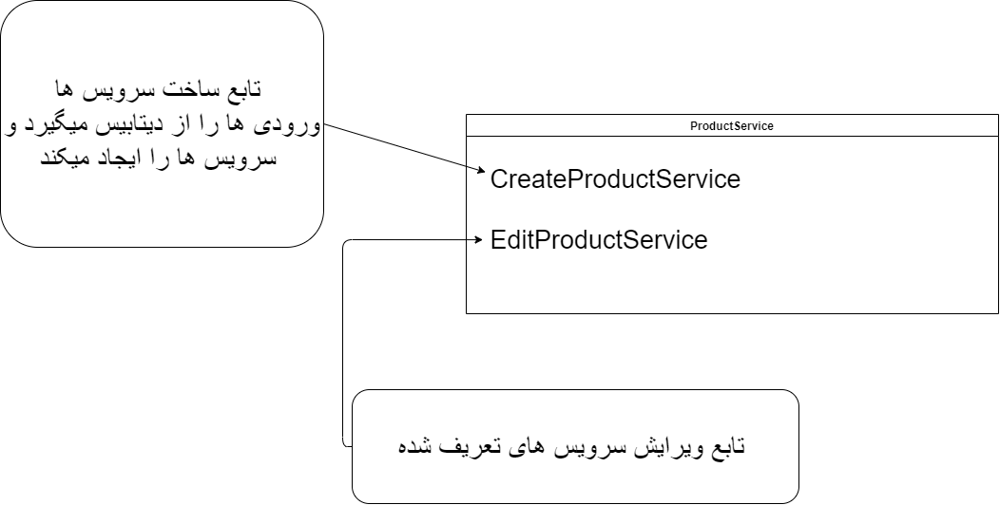
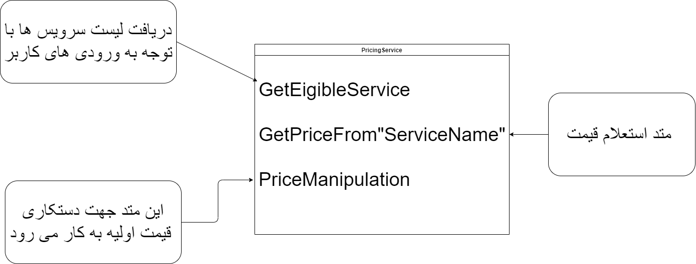
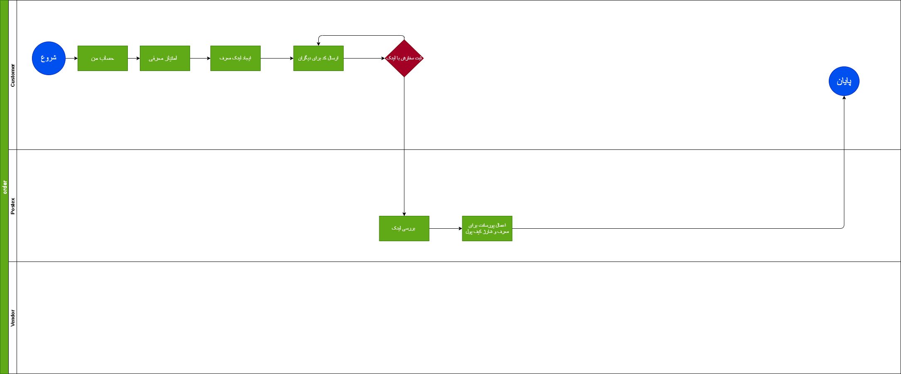
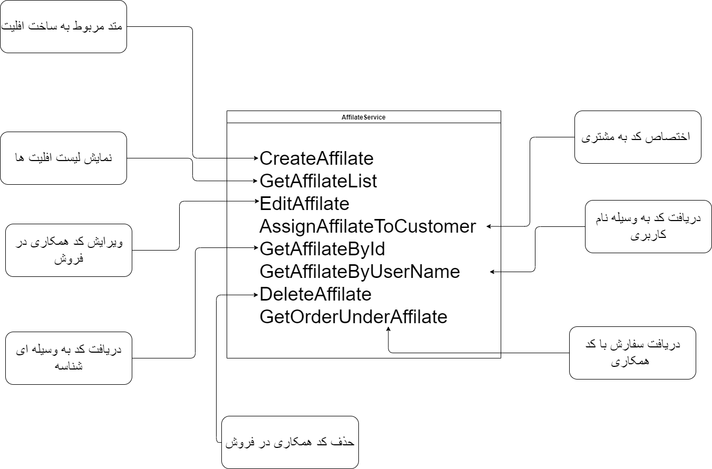
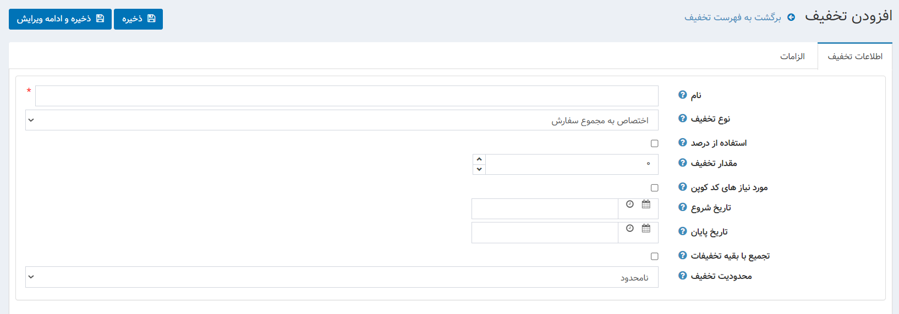
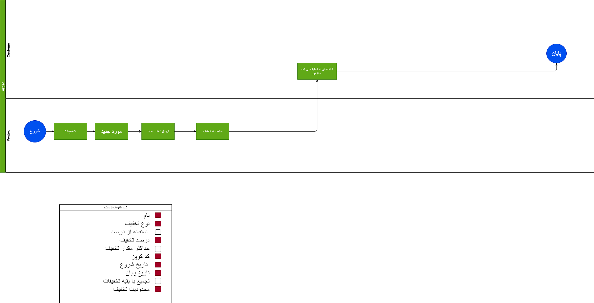
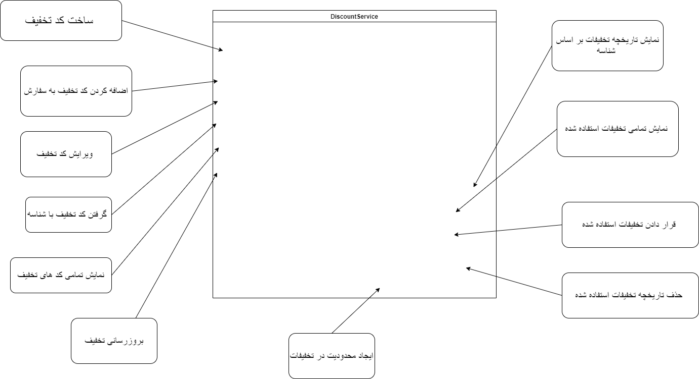

## تعریف سرویس ها (Product servise)  
- ProductService
- PricingService
- AffiliateService
- DiscountService

- --

1. Product Service:
 
 این سرویس وظیفه ساخت سرویس های پستی را بر عهده دارد ، هر سرویسی که ثبت می شود یک سری آیتم می توان برای سرویس مورد نظر انتخاب کرد که این آیتم ها به شرح زیر می باشند 

- شرکت ملی پست هست یا سرویس خصوصی
- درون شهری فعالیت می کند یا برون شهری
- پست خارجی انجام می دهد یا خیر
- هزینه جمع آوری دارد 
- هزینه توزیع دارد 
- فعال یا غیر فعال بودن 
- پست پیشتاز هست یا نه 
- ای پی آی دارد یا خیر

###متد های , انتیتی های موجود در بخش تعریف سرویس ها
[متد های قابل تعریف](ProductServiceMethod.drawio)

[دیتابیس تعریف سرویس](ProductServiceDatabase.drawio)

2. Pricing Service:
سیستم قیمت دهی سرویس ها که با استفاده از ارتباط با وندور ها و شرکت های پستی با استفاده از منطقه جغرافیایی و طول مسافت . همچنین وزن مرسوله قیمت با نمایش می دهد .

[متد های بخش قیمت سرویس ها ](PricingServiceMethod.drawio)

[دیتابیس بخش قیمت سرویس ها](PriceServiseDatabase.drawio)

3. Affiliate service:
   همکری در فروش سیستمی است که به شما این اجزه را می دهد که بتوانید از ثبت سفارش دوستان و آشنایانتان درصدی دریافت کنید
   این سیستم به صورتی کار می کند که شما لینکی که در قسمت امتیاز همکاری وجود دارد را در اختیار سایر افزاد قرار دهید و درصدی را به عنوان معرفی این عزیزان به سیستم پستکس دریافت کنید

   
[دیاگرام های همکاری در فروش](BA1-Affiliatelink.drawio)

### متد هاو دیتابیس بخش همکاری در فروش 
[متدهای بخش همکاری در فروش ](AffileatServiseMethod.drawio)

[دیتابیس بخش همکاری در فروش](AffiatServiceDatabase.drawio)

4. Discount Service:
   تخفیفات بخشی مهمی از سیستم پستکس هستند که شما با استفاده از آن می توانید به صوت تجمیعی و تکی برو روی سفارشات خود تخفیف در یافت کنید 
   
   [دیاگرام بخش تخفیفات](BD1-Discount.drawio)
   

### متد ها و دیتابیس بخش تخفیفات

[متدهای بخش تخفیفات](DiscountServiceMethod.drawio)

[دیتابیس بخش تخفیفات](DiscountServiceDatabase.drawio)

