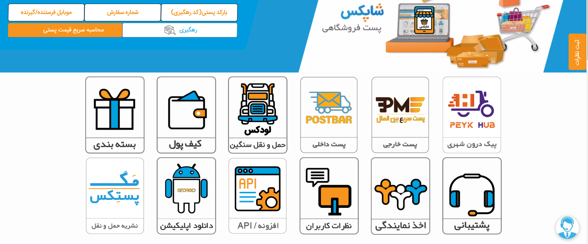
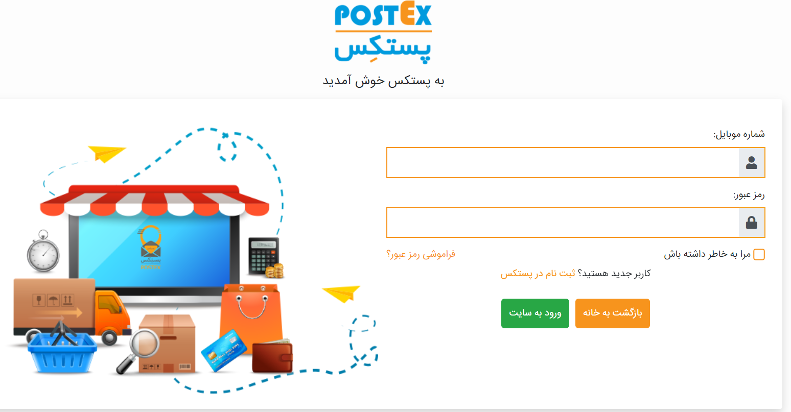
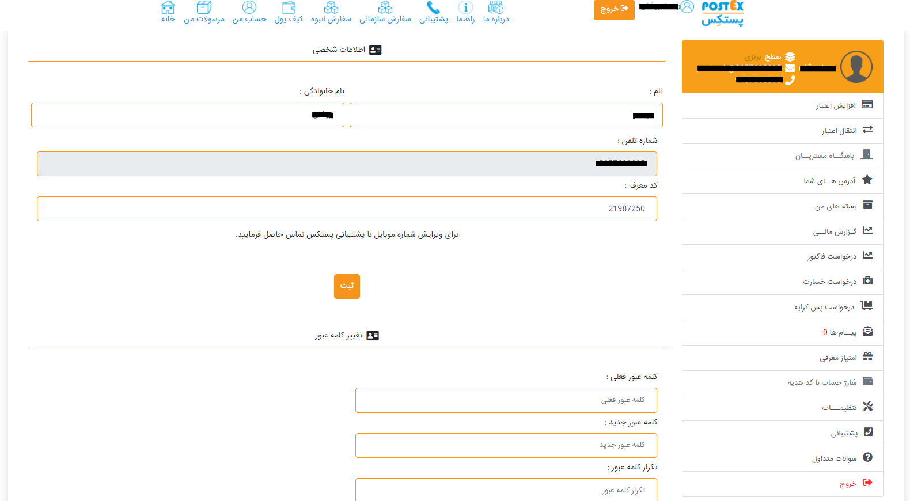

#فهرست مطالب
- مقدمه
- ورود و ثبت نام
  1. [ثبت نام ](#ثبت-نام)
  2. [ورود ](#-ورود)
- ثبت سفارش 
  1. [ثبت سفارش داخلی ](#ثبت-سفارش-داخلی)
  2. [ثبت سفارش پرداخت در محل ](#ثبت-سفارش-cod)
  3. [ثبت سفارش انبوه ](#ثبت-سفارش-انبوه)
  4. [ثبت سفارش سازمانی ](#ثبت-سفارش-سازمانی)
  5. [پرداخت امن ](#پرداخت-امن)
  6. [ثبت سفارش خارجی ](#ثبت-سفارش-خارجی)

- کنسلی سفارش 
  1. [کنسلی سفارش داخلی](#کنسلی-سفارش-داخلی)
  2. [کنسلی سفارش پرداخت در محل  ](#کنسلی-سفارش-cod)
- فرایند های مالی
  1. [فرایند مالی بعد از ثبت سفارش](#فرایند-مالی-بعد-از-ثبت-سفارش)
  2.  [فرایند مالی پرداخت در محل](#فرایند-مالی-cod)
  3. [فرایند مالی نماینده](#فرایند-مالی-نماینده-ها)
   
-  [قرارداد مشتری](#قرارداد-های-مشتری)
- [ارجاع بار به نماینده](#پروسه-ارجاع-بار-به-نماینده-و-جمع-آوری-بار)
- [دستری های های مشتری](#دسترسی-cod) 
- [تخفیفات ](#تخفیفات)
- [تیکت](#تیکت)
- [همکاری در فروش](#همکاری-در-فروش)
- سرویس ها 
  1. Authentication and Roles
  2. service provider
  3. accounting service
  4. notification service
  5. Ticketing 
  6. warehouses
  7. labeling
  8. Backups
  9. I/O
  10. Gateway
  11. parcel-order service
  12. Bulk service 
  13. Agent service 
  14. Product service
  15. Price service
  16. contract service
  17. tracking servicee 
  18. security service
  19. payment service 
  20. address service 
   
---

# مقدمه
 شرکت فنی و مهندسی معماران به طرح با داشتن بالغ بر 20 سال تجربه درخشان و ثبت برند پستکس و پستبار فعالیت شایانی در حوزه لوجستیک و فناوری اطلاعات برداشته است . در ابن نوشتار ما سعی در پیاده سازی نرم افزار پستکس داریم تا بتوانیم خالا موجود در نرم افزار کنونی را پیدا و در تلاش جبران آن برایم 

***
# ثبت نام و ورود 
### ثبت نام 
 در وحله اول برای استفاده از امکانات سیستم شما باید ثبت نام انجام دهید شما بعد از ثبت نام به عنوان کاربر عادی وارد سیستم می شوید و در ادامه میتوانید با استفاده از رول های خاص سطح دسترسی خود را افزایش دهید 
 برای ثبت نام شما نیاز به وارد کردن اطلاعات زیر هستین 
 1. کد ملی (درصورتی که چز دسته اتباع می باشین باید کد اطباع و یا شماره پاسپورت خود را وارد کنید  )
 2. شماره موبایل 
 3. رمز عبور دلخواه 
   بعد از وارد کردن این موارد نیاز به تایید قوانین دارید 
   
   در ادامه ثبت نام کد ارسالی به تلفن همراه شما را باید وارد کنید 
- دیاگرام بخش ثبت نام 
  [دیاگرام ثبت نام](Backend%20diagram/BL1-logIn.drawio)
 
---
### ورود 
برای ورود به حساب کاربری از  شماره همراه و رمز تعیین شده در ثبت نام استفاده میکنیم و وارد پنل کاربری می شویم 

- دیاگرام ورود
  [دیاگرام ورود](Backend%20diagram/BL1-logIn.drawio)

# ثبت سفارش
###   ثبت سفارش داخلی 
### ثبت سفارش COD

### ثبت سفارش انبوه

### ثبت سفارش سازمانی 
### پرداخت امن 
### ثبت سفارش خارجی 

# کنسل سفارشات
## کنسلی سفارش داخلی 
## کنسلی سفارش COD
           
# فرایند مالی
 ## فرایند مالی بعد از ثبت سفارش 
 ## فرایند مالی COD
 ## فرایند مالی نماینده ها 
          
  # قرارداد های مشتری 
  # دسترسی COD
  # پروسه ارجاع بار به نماینده و جمع آوری بار 
  # تولید بارکد 
 # تخفیفات 
 #  تیکت 
 #  همکاری در فروش

