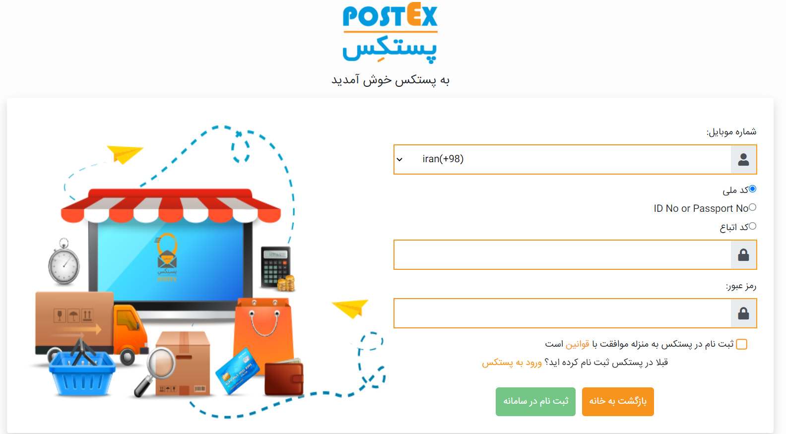
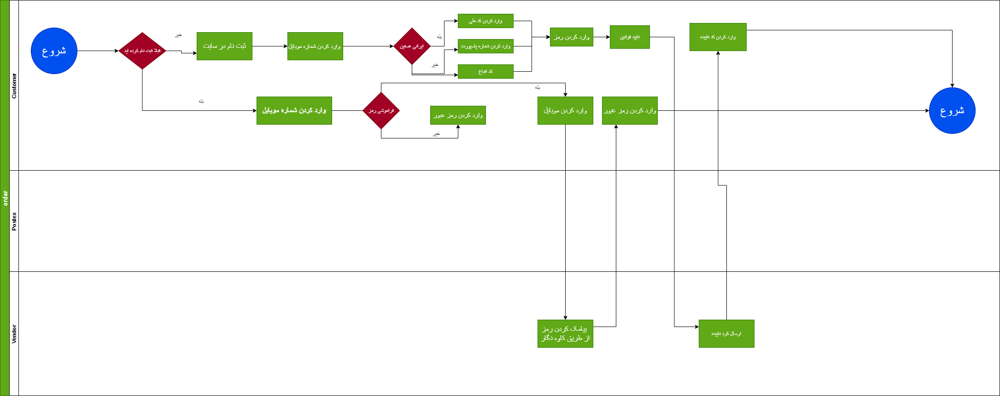
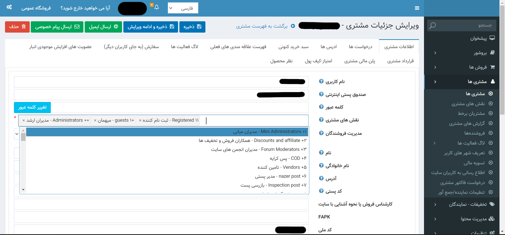
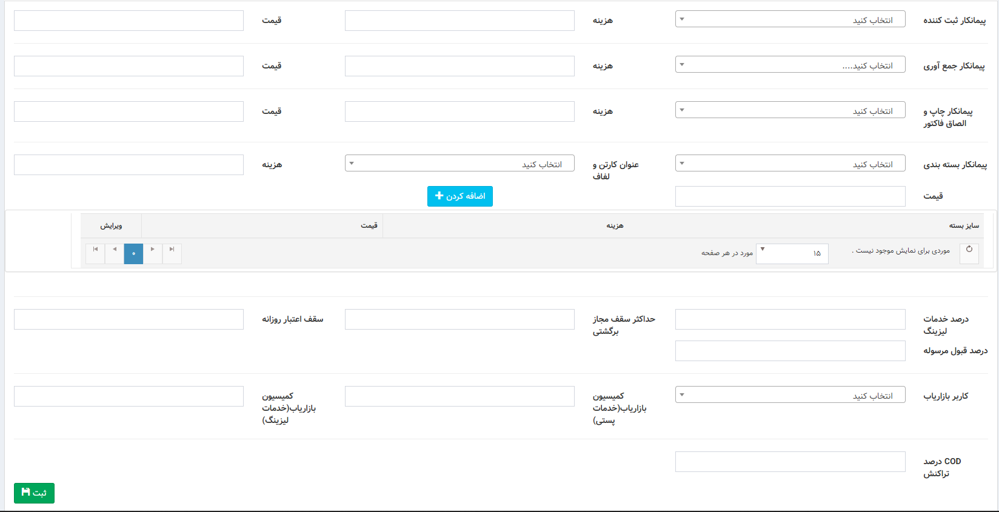
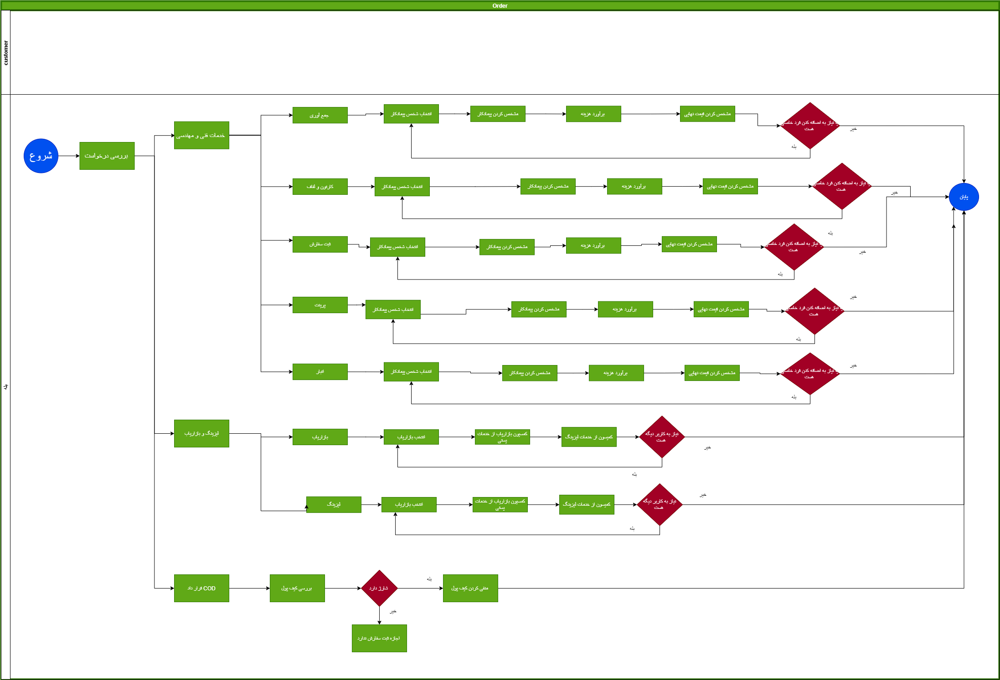

# فهرست مطالب
 مقدمه
1. ورود و ثبت نام [Authentication and Roles](2-Authentication-and-Roles/AuthenticationAndRole.md)
  - [ثبت نام ](#ثبت-نام)
  - [ورود ](#-ورود)
  - [دستری های های مشتری](#دسترسی-cod) 
2. تعریف سرویس ها (Product servise)  
  - [تخفیفات ](#تخفیفات)
  - [همکاری در فروش](#همکاری-در-فروش)
  - قیمت سرویس ها(price service)

3. سرویس دهنده پستی (Service Providers)
  
  - رهگیری مرسولات(Tracking service )

4.  [قرارداد مشتری](#قرارداد-های-مشتری) (contract service )
   
5. ثبت سفارش (Parcel-order service )
  - [ثبت سفارش داخلی ](#ثبت-سفارش-داخلی)
  - [ثبت سفارش پرداخت در محل ](#ثبت-سفارش-cod)
  - [ثبت سفارش انبوه ](#ثبت-سفارش-انبوه)
  - [ثبت سفارش سازمانی ](#ثبت-سفارش-سازمانی)
  - [پرداخت امن ](#پرداخت-امن)
  - [ثبت سفارش خارجی ](#ثبت-سفارش-خارجی)
  - سرویس های انبوه (bulk service)
  - سیستم های ورودی (I/O)

4. مدیریت سفارشات (Agent service)
  - [کنسلی سفارش داخلی](#کنسلی-سفارش-داخلی)
  - [کنسلی سفارش پرداخت در محل  ](#کنسلی-سفارش-cod)
  - [ارجاع بار به نماینده](#پروسه-ارجاع-بار-به-نماینده-و-جمع-آوری-بار)

6.  [تیکت](#تیکت)(Ticketing)
     
 
8. فرایند های مالی(Accounting service)
  - [فرایند مالی بعد از ثبت سفارش](#فرایند-مالی-بعد-از-ثبت-سفارش)
  -  [فرایند مالی پرداخت در محل](#فرایند-مالی-cod)
  - [فرایند مالی نماینده](#فرایند-مالی-نماینده-ها) 

9. گیت وی (Geteway)
10. گزارشات (Reporting)
11. اعلانات (Notification Service) 
12. پشتیبانی گیری (Backup)
13. انبار داری (warehouse)
14. پرداخت ها (payment service)
15. محدوده جغرافیایی(Address service)
16. امنیت (security service - common service)
17. لاگ (Logs)

# مقدمه
 شرکت فنی و مهندسی معماران به طرح با داشتن بالغ بر 20 سال تجربه درخشان و ثبت برند پستکس و پستبار فعالیت شایانی در حوزه لوجستیک و فناوری اطلاعات برداشته است . در ابن نوشتار ما سعی در پیاده سازی نرم افزار پستکس داریم تا بتوانیم خالا موجود در نرم افزار کنونی را پیدا و در تلاش جبران آن برایم 

***
# ثبت نام و ورود 
### موجودیت ها
- Group
-  Roles
- User
- Permissions  
### ثبت نام 
 در وحله اول برای استفاده از امکانات سیستم شما باید ثبت نام انجام دهید شما بعد از ثبت نام به عنوان کاربر عادی وارد سیستم می شوید و در ادامه میتوانید با استفاده از رول های خاص سطح دسترسی خود را افزایش دهید 
 برای ثبت نام شما نیاز به وارد کردن اطلاعات زیر هستین 
 1. کد ملی (درصورتی که چز دسته اتباع می باشین باید کد اطباع و یا شماره پاسپورت خود را وارد کنید  )
 2. شماره موبایل 
 3. رمز عبور دلخواه 
   بعد از وارد کردن این موارد نیاز به تایید قوانین دارید 
   
   در ادامه ثبت نام کد ارسالی به تلفن همراه شما را باید وارد کنید 
- دیاگرام بخش ثبت نام 
  [دیاگرام ثبت نام](2-Authentication-and-Roles/BL1-logIn.drawio)
 
---
### ورود 
برای ورود به حساب کاربری از  شماره همراه و رمز تعیین شده در ثبت نام استفاده میکنیم و وارد پنل کاربری می شویم 

- دیاگرام ورود
  [دیاگرام ورود](2-Authentication-and-Roles/BL1-logIn.drawio)
  
### سطح دسترسی 
در این قسمت شما سطح دسترسی و نقش هر کاربر را تایین می کنید که به کدوم قسمت ها دسترسی داشته باشد یا خیر با این عمل شما می توانید مشتری ها را در سطح های مختلف طبقه بندی کنید 

- دیاگرام سطح دسترسی
  [دیاگرام سطح دسترسی](2-Authentication-and-Roles/BR-%20custumer%20rule.drawio)
  
***
#  قرارداد مشتری 
دراین قسمت شما میتوانید دسترسی خاصی همراه با قرادادی با مشتری ایجاد کنید با این عمل کاربران مدیریت و نقش ها به صورتی در سیستم کار میکند 

[قرارداد مشتری](2-Authentication-and-Roles/BC1-CustumerPlan.drawio)

